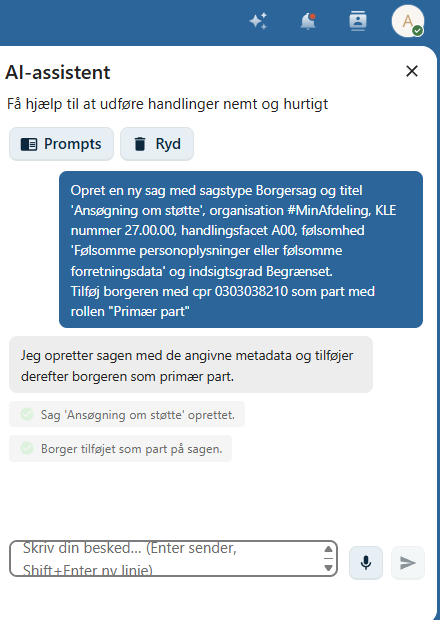
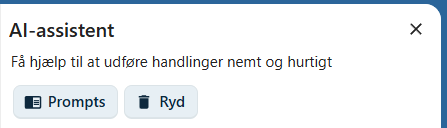
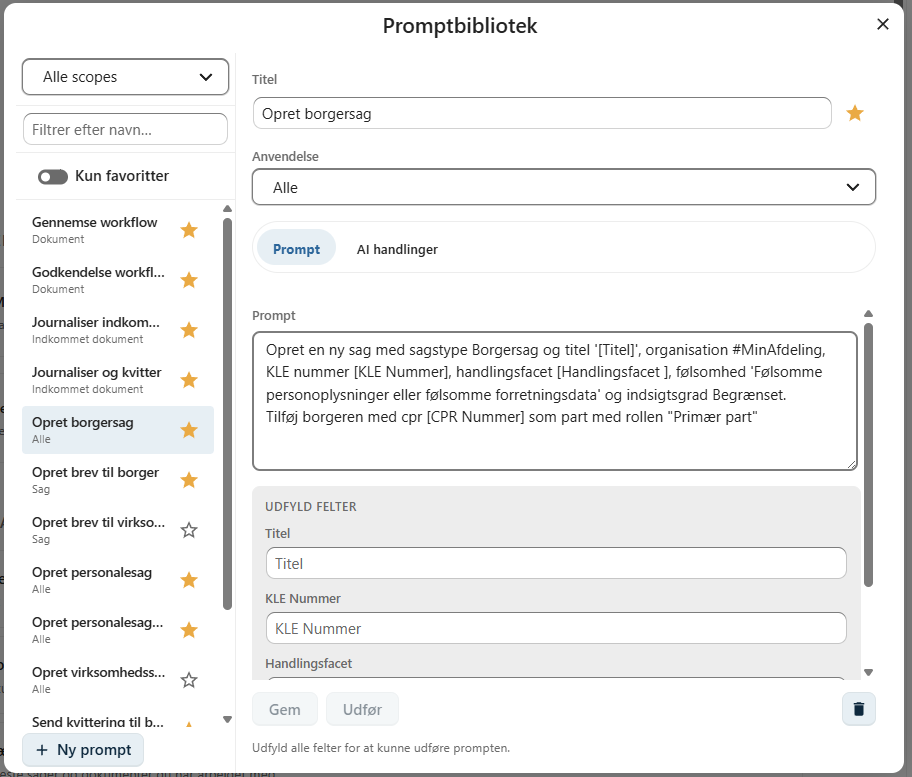
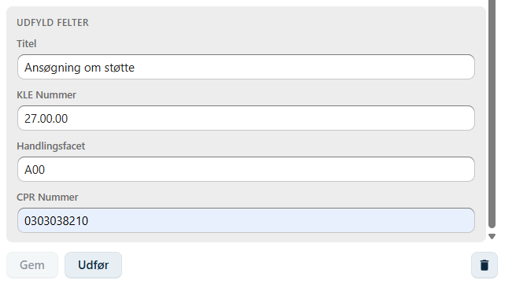

# AI-assistent

OpenCase AI-assistent hjælper dig med at automatisere tilbagevendende arbejdsopgaver.

Ved hjælp af **prompts** kan AI-assistenten udføre en eller flere handlinger i OpenCase, så du slipper for manuelt at gennemføre de samme arbejdsgange igen og igen.

AI-assistenten kan eksempelvis:

- oprette en sag
- oprette et dokument
- oprette en fil fra en skabelon
- registrere parter eller kontakter
- sende Digital Post
- oprette påmindelser
- udføre flere handlinger i én arbejdsgang



---

## Udfør en prompt

Klik på **AI-assistent** og vælg **Prompts** for at åbne **Promptbiblioteket**.



Her vises de prompts, du har adgang til.

Vælg den ønskede prompt og klik **Udfør**.

Hvis prompten indeholder parametre, bliver du bedt om at udfylde de nødvendige oplysninger, inden udførelsen starter.

---

## Promptbibliotek

Promptbiblioteket indeholder alle de prompts, du har adgang til.

Et prompt beskriver en arbejdsgang, som AI-assistenten kan udføre.

Et prompt kan bestå af én enkelt handling eller en længere sekvens af handlinger.

Eksempel:

```text
Opret en ny sag med sagstype Borgersag og titel '[Titel]', organisation #MinAfdeling, KLE nummer [KLE Nummer], handlingsfacet [Handlingsfacet], følsomhed 'Følsomme personoplysninger eller følsomme forretningsdata' og indsigtsgrad Begrænset.

Tilføj borgeren med CPR [CPR Nummer] som part med rollen "Primær part".
```

Ved at gemme arbejdsgangen som et prompt kan den udføres igen og igen uden at skulle skrives på ny.




---

## Parametre

Et prompt kan indeholde **parametre**, som udfyldes, når prompten udføres.

Parametre skrives i firkantede parenteser.

Eksempler:

- `[Titel]`
- `[CPR Nummer]`
- `[KLE Nummer]`
- `[Handlingsfacet]`

Når prompten startes, vises en dialog, hvor du indtaster værdierne.

Det gør det muligt at genbruge det samme prompt til mange forskellige sager og dokumenter.



---

## Automatisk handlingssekvens

Når et prompt oprettes eller ændres, analyserer AI-assistenten prompten og beregner den nødvendige handlingssekvens.

Den beregnede handlingssekvens gemmes sammen med prompten.

Det betyder, at OpenCase normalt ikke behøver at anvende AI hver gang prompten udføres.

!!! info

    AI anvendes ved oprettelse eller ændring af et prompt. Ved senere udførelse benyttes den allerede beregnede handlingssekvens, hvilket giver en hurtigere udførelse og reducerer forbruget af AI-tokens.

---

## Anvendelsesområde (Scope)

Hvert prompt har et **anvendelsesområde (scope)**, som angiver, hvor det kan anvendes.

Eksempler på scope:

- **Globalt** – prompten kan udføres uanset hvor du befinder dig i OpenCase.
- **Sag** – prompten kræver, at en sag er åben.
- **Dokument** – prompten kræver, at et dokument er åbent.

Kun de prompts, der er relevante for den aktuelle situation, vises i Promptbiblioteket.

Dette gør det lettere at finde det rigtige prompt og reducerer risikoen for fejl.

---

## Favoritprompts

Prompts, som anvendes ofte, kan markeres som **favoritter**.

Favoritprompts vises øverst i Promptbiblioteket, så de er hurtige at finde.

Dette er især nyttigt for arbejdsgange, som udføres mange gange i løbet af en arbejdsdag.

---

## Eksempler på prompts

AI-assistenten kan anvendes til mange forskellige arbejdsgange.

Eksempler:

- Opret en borgersag med en primær part.
- Opret et dokument fra en bestemt skabelon.
- Registrér en virksomhed som part.
- Send et dokument med Digital Post.
- Opret en påmindelse på en sag.
- Del et dokument med en kollega.
- Opret en standardsag med de mest anvendte oplysninger.

Flere handlinger kan kombineres i ét prompt, så en hel arbejdsgang udføres automatisk.

---

## Fordele ved AI-assistenten

Ved at anvende AI-assistenten kan du:

- automatisere tilbagevendende opgaver
- spare tid
- sikre ensartede arbejdsgange
- reducere risikoen for fejl
- standardisere sagsbehandlingen

Jo oftere en arbejdsgang udføres, desto større gevinst kan der være ved at oprette et prompt.

---

## God praksis

Det anbefales at:

- oprette prompts til tilbagevendende arbejdsopgaver
- anvende parametre, så prompts kan genbruges
- markere de mest anvendte prompts som favoritter
- give prompts beskrivende navne, så de er lette at finde

---

## Se også

- [Opret en sag](./sager/opret-sag.md)
- [Ny fil fra skabelon](./dokumenter/ny-fil-fra-skabelon.md)
- [Digital post](./dokumenter/digital-post.md)
- [Påmindelser](./dokumenter/paamindelser.md)