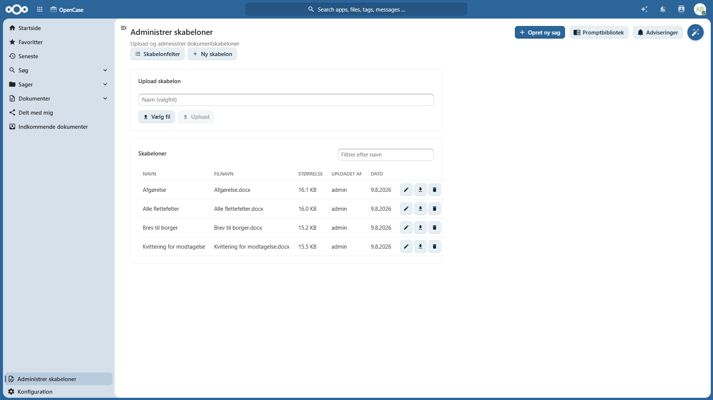
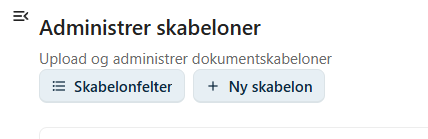
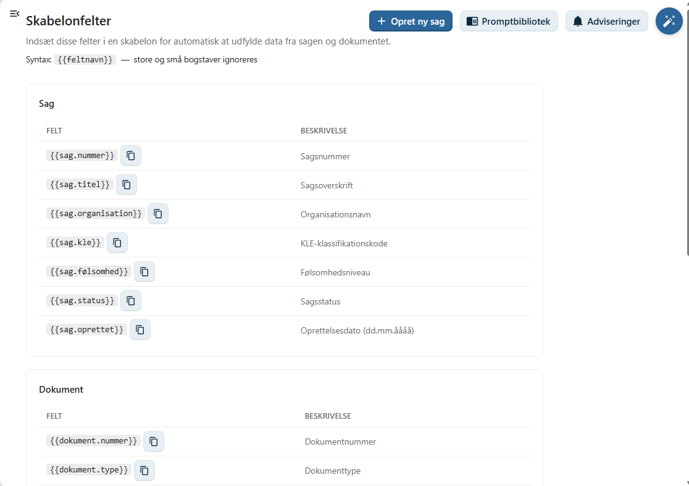
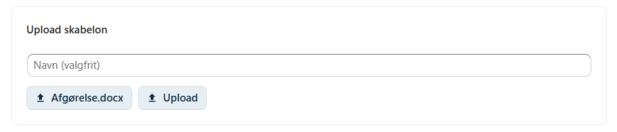
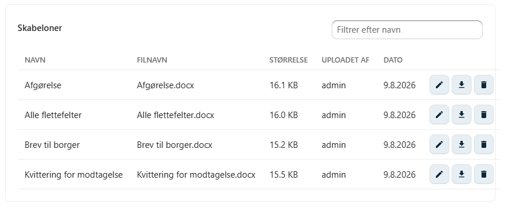

# Administrer skabeloner

OpenCase understøtter dokumentskabeloner, som gør det muligt at oprette ensartede dokumenter med automatisk udfyldelse af oplysninger fra sager og dokumenter.

Skabeloner kan indeholde **flettefelter**, som automatisk erstattes med de relevante oplysninger, når der oprettes en ny fil fra skabelonen.

Kun brugere med rollen **Skabelonadministrator** kan oprette og vedligeholde skabeloner.

---

## Opret en ny skabelon

Klik på **Ny skabelon**.

Angiv et navn på skabelonen.

Når skabelonen er oprettet, åbnes den automatisk i organisationens Office-program, hvor indholdet kan redigeres.

Her kan du:

- skrive standardtekst
- indsætte logoer og grafik
- formatere dokumentet
- indsætte tabeller
- indsætte flettefelter

Når skabelonen gemmes, bliver den tilgængelig for brugerne i OpenCase.

---

## Flettefelter

Klik på **Skabelonfelter** for at få vist en oversigt over de flettefelter, der kan indsættes i skabelonen.

Når en bruger opretter en ny fil fra skabelonen, erstattes felterne automatisk med oplysninger fra den aktuelle sag eller det aktuelle dokument.

### Sag

| Flettefelt | Beskrivelse |
|------------|-------------|
| `{{sag.nummer}}` | Sagsnummer |
| `{{sag.titel}}` | Sagsoverskrift |
| `{{sag.organisation}}` | Organisationsnavn |
| `{{sag.kle}}` | KLE-klassifikationskode |
| `{{sag.følsomhed}}` | Følsomhedsniveau |
| `{{sag.status}}` | Sagsstatus |
| `{{sag.oprettet}}` | Oprettelsesdato (dd.mm.åååå) |

---

### Dokument

| Flettefelt | Beskrivelse |
|------------|-------------|
| `{{dokument.nummer}}` | Dokumentnummer |
| `{{dokument.type}}` | Dokumenttype |
| `{{dokument.titel}}` | Dokumenttitel |
| `{{dokument.oprettet}}` | Oprettelsesdato (dd.mm.åååå) |
| `{{dokument.status}}` | Dokumentstatus |

---

### Adresse

| Flettefelt | Beskrivelse |
|------------|-------------|
| `{{adresse.cpr}}` | CPR-nummer |
| `{{adresse.navn}}` | Navn |
| `{{adresse.vejnavn}}` | Vejnavn |
| `{{adresse.husnummer}}` | Husnummer |
| `{{adresse.etage}}` | Etage |
| `{{adresse.dør}}` | Dør |
| `{{adresse.postnummer}}` | Postnummer |
| `{{adresse.postdistrikt}}` | Postdistrikt |

!!! info

    Flettefelterne erstattes automatisk med de aktuelle oplysninger, når en bruger opretter en ny fil ud fra skabelonen.

---

## Upload en eksisterende skabelon

Hvis du allerede har en Office-skabelon, kan den uploades til OpenCase.

Klik på:

1. **Vælg fil**
2. Vælg den ønskede skabelon fra din computer.
3. Klik **Upload**.

Den uploadede skabelon bliver herefter tilgængelig i skabelonbiblioteket.

---

## Rediger en skabelon

Alle skabeloner vises i skabelonoversigten.

For hver skabelon kan du vælge **Rediger**.

Skabelonen åbnes i Office-programmet, hvor indholdet kan ændres.

Når skabelonen gemmes, bliver ændringerne straks tilgængelige for brugere, der opretter nye dokumenter ud fra skabelonen.

---

## God praksis

For at opnå ensartede dokumenter anbefales det at:

- anvende flettefelter i stedet for at skrive oplysninger manuelt
- give skabeloner beskrivende navne
- holde antallet af skabeloner på et passende niveau
- teste nye skabeloner ved at oprette et dokument, inden de tages i brug

!!! tip

    Brug flettefelter til oplysninger som sagsnummer, dokumenttitel og adresse. Det reducerer risikoen for fejl og sparer tid ved oprettelse af nye dokumenter.

---

## Se også

- [Ny fil fra skabelon](../dokumenter/ny-fil-fra-skabelon.md)
- [Opret dokument](../dokumenter/opret-dokument.md)
- [AI-assistent](../aI-assistent.md)