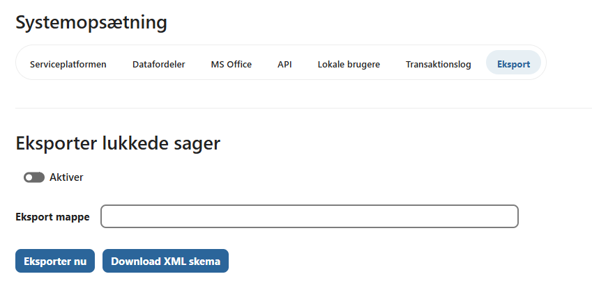
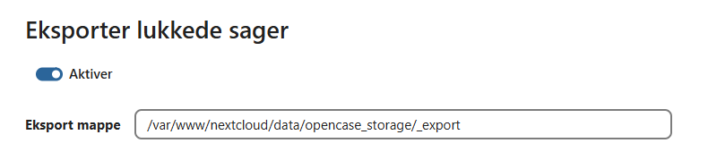

# Eksport af sager

OpenCase kan automatisk eksportere afsluttede sager til et filsystem, så de kan overføres til et arkivsystem eller anvendes til langtidsopbevaring.

Eksporten omfatter både sagens metadata, dokumenternes filer og de tilhørende logoplysninger.

Eksportfunktionen konfigureres på fanen **Eksport**.



---

## Konfiguration

På fanen **Eksport** kan administratoren konfigurere den automatiske eksport.

Der kan angives:

- eksportmappe
- om den automatiske eksport er aktiveret

Når eksportservicen er aktiveret, gennemføres eksporten automatisk én gang i timen.



---

## Manuel eksport

Ud over den automatiske eksport kan administratoren til enhver tid starte en manuel eksport.

Dette kan være nyttigt:

- efter ændringer i konfigurationen
- ved test af eksport
- hvis en eksport ønskes gennemført med det samme

Den manuelle eksport udfører den samme behandling som den automatiske service.

---

## Eksportformat

Hver sag eksporteres til sin egen mappe.

Strukturen ser således ud:

```text
<eksportmappe>/
└── <sagsnummer>/
    ├── case.xml
    ├── files/
    │   ├── <dokument-id>/
    │   │   ├── fil1.docx
    │   │   ├── fil2.pdf
    │   │   └── ...
    └── logs/
        ├── case.xml
        ├── document_123.xml
        ├── document_124.xml
        └── ...
```

---

## Indhold

Eksporten indeholder følgende filer.

| Fil | Indhold |
|------|---------|
| `case.xml` | Metadata for sagen og dens dokumenter. |
| `files/<dokument-id>/` | Dokumenternes tilhørende filer. |
| `logs/case.xml` | Log over handlinger på sagen. |
| `logs/document_<id>.xml` | Log over handlinger på det enkelte dokument. |

Den eksporterede mappe indeholder dermed alle de oplysninger, der er nødvendige for at dokumentere sagens indhold og historik.

---

## XML-skema

Klik på **Download XML-skema** for at hente XML-skemaet (XSD), der beskriver strukturen af de eksporterede XML-filer.

XML-skemaet kan anvendes til:

- validering af eksporterede data
- udvikling af importfunktioner
- integration med arkiv- eller journalsystemer


---

## Arkivering

Når en sag er eksporteret, ændres sagens status automatisk til:

**Arkiveret**

Dette viser, at sagen er eksporteret og klar til videre arkivering eller langtidsopbevaring.

Hvis eksporten ikke gennemføres korrekt, bevarer sagen sin oprindelige status og vil blive forsøgt eksporteret igen ved næste kørsel.

---

## Automatisk eksport

Den automatiske eksportservice:

- kontrollerer én gang i timen, om der findes sager, der skal eksporteres
- eksporterer alle afsluttede sager, som endnu ikke er eksporteret
- markerer sagerne som **Arkiveret**, når eksporten er gennemført

Denne proces kræver ingen manuel indgriben efter den indledende konfiguration.

---

## God praksis

Det anbefales at:

- placere eksportmappen på et stabilt og sikkerhedskopieret filsystem
- kontrollere, at eksportservicen kører regelmæssigt
- verificere de eksporterede XML-filer ved integration med eksterne systemer
- gemme XML-skemaet sammen med integrationsdokumentationen

!!! tip

    Hvis eksporten skal overføres til et arkivsystem, kan det være en fordel at lade et separat integrationssystem overvåge eksportmappen og automatisk hente nye eksporterede sager.

---

## Se også

- [Konfiguration](./konfiguration.md)
- [Fejlfinding](./fejlfinding.md)
- [OCC-kommandoer](./occ-kommandoer.md)