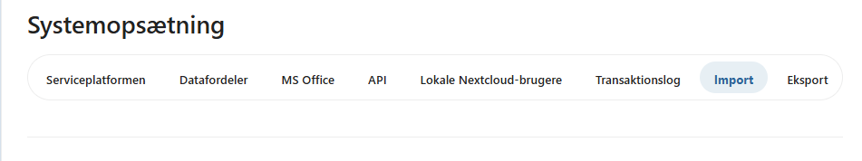
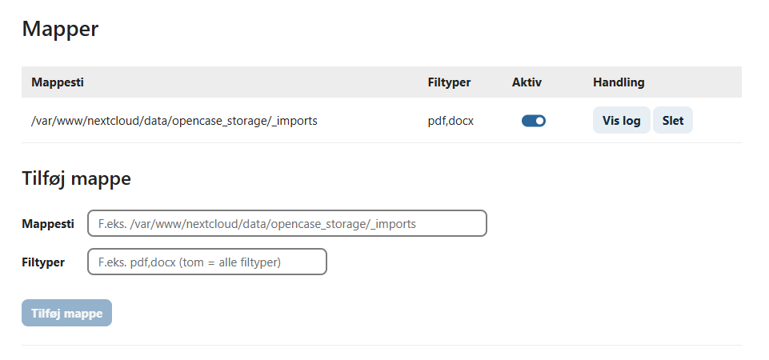
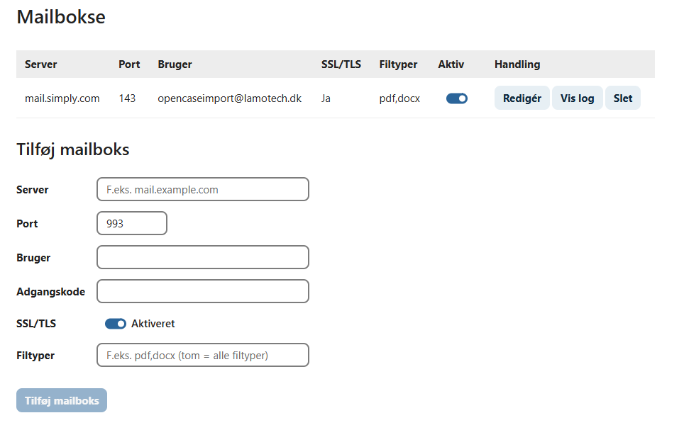

# Import

OpenCase kan automatisk importere filer og oprette dem som dokumenter på nye eller eksisterende sager.

PDF filer kan indeholde separationsark som er QR koder, der opdeler filen i separate dokumenter.

Importfunktionen konfigureres på fanen **Import**.

Filer kan importeres fra en mappe på et fileshare eller en mailboks. Importen kører hvert 5. minut.

---

## Mapper

Under Mapper kan registreres en eller flere mapper hvor filer importeres fra. Her angives fuld sti til mappen og hvilke filtyper der skal importeres. Filer der importeres korrekt flyttes til undermappen **imported**.

---

## Mailbokse

Under Mailbokse kan registreres en eller flere mailbokse hvor vedhæftede filer til mails importeres fra. For hver mailboks angives server, port, bruger, password, om der anvendes SSL/TLS og hvilke filtyper der skal importeres. Mails der importeres korrekt markeres som **læst**.

---

## Se også

- [Konfiguration](./konfiguration.md)
- [Fejlfinding](./fejlfinding.md)
- [OCC-kommandoer](./occ-kommandoer.md)