# Installation – Basic-version

Denne vejledning beskriver installation og grundkonfiguration af **OpenCase Basic**.

Efter installationen vil OpenCase være klar til brug med den fælleskommunale organisationsservice, klassifikation og adgangsstyring.

!!! info

    Installationen forudsætter administratoradgang til Nextcloud-serveren samt adgang til den fælleskommunale Serviceplatform.

---

# Forudsætninger

Inden OpenCase installeres skal følgende komponenter være installeret og konfigureret.

## Nextcloud

OpenCase understøtter:

- Nextcloud **34.x**

Det anbefales, at Nextcloud er opdateret med de seneste sikkerhedsopdateringer.

## Cron jobs

Nextcloud skal være konfigureret til at anvende **Cron** som baggrundsjob.

Cron anvendes blandt andet til:

- synkronisering af organisationsdata
- indeksering af søgning
- afsendelse af notifikationer
- øvrige baggrundsopgaver

Kontrollér under:

> **Systemindstillinger → Grundlæggende indstillinger → Baggrundsjob**

at **Cron** er valgt.

## Elasticsearch

OpenCase anvender Elasticsearch til fuldtekstsøgning.

Installer og konfigurer en understøttet Elasticsearch-instans, inden OpenCase installeres.

## Påkrævede Nextcloud-apps

Følgende apps skal være installeret og aktiveret:

- Teammapper
- Fuldtekstsøgning
- Fuldtekstsøgning – Filer
- Fuldtekstsøgning – Elasticsearch Platform

---

# Installation af OpenCase

Installer OpenCase fra **Nextcloud App Store**.

1. Åbn **Apps**.
2. Søg efter **OpenCase**.
3. Klik **Installer**.
4. Aktiver appen.

Når installationen er gennemført, vises OpenCase i administrationsmenuen.

Åbn:

> **Systemindstillinger → OpenCase**

Øverst vises version og versionsnummer og under Forudsætteninger valideres at påkrævede apps er installeret.

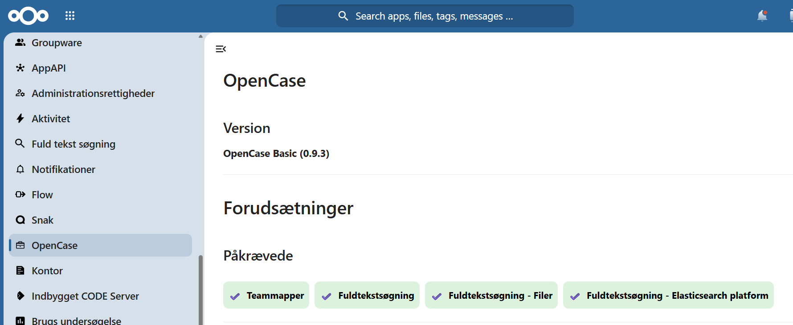


---

# Konfiguration af Organisation

Åbn:

> **Systemindstillinger → OpenCase → Serviceplatformen → Organisation**

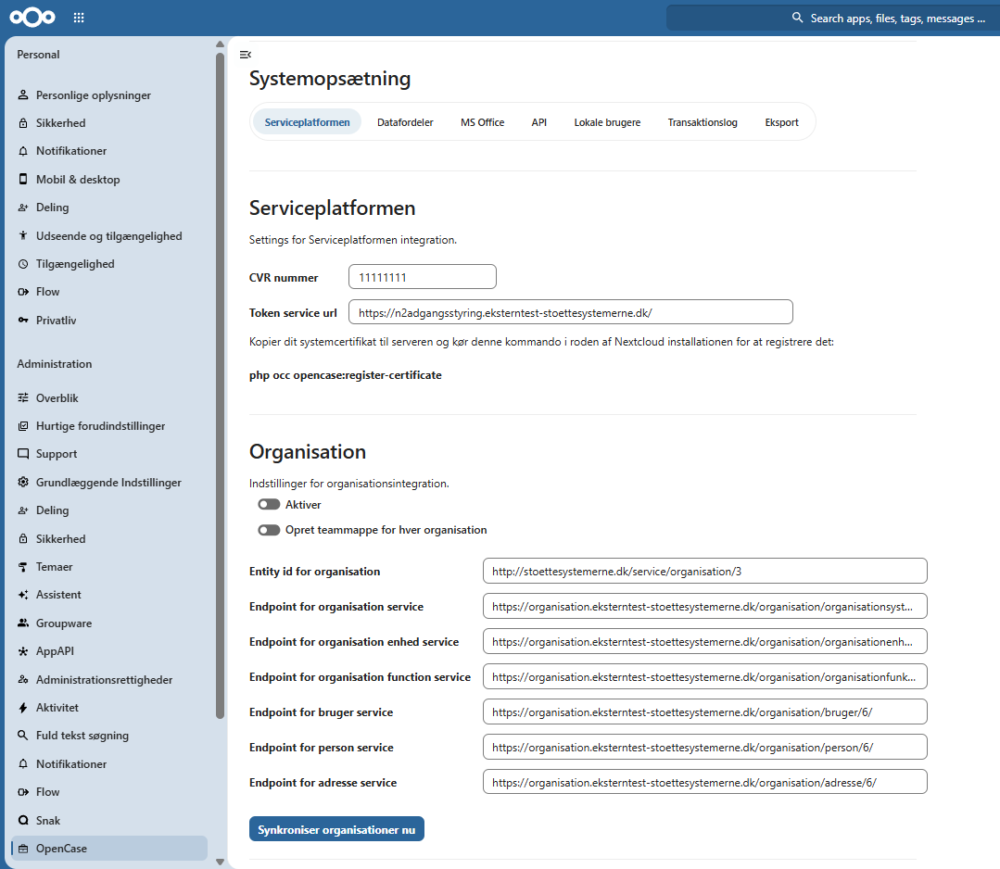

---

## MitID Erhverv

Bestil et **systemcertifikat** til organisationen via MitID Erhverv.

Certifikatet anvendes ved kommunikation med den fælleskommunale Serviceplatform.


---

## Serviceaftale

Opret en serviceaftale i **Fælleskommunal Administrator** for:

**SF1500 – Organisation**

---

## Registrer systemcertifikat

Importer det udstedte systemcertifikat i OpenCase.
Certifikatet anvendes ved alle kald til organisationsservicen.

Kopier certifikatet til en mappe på serveren og kør kommandoen i Nextcloud rod mappen:

```bash
php occ opencase:register-certificate
```

Vælg '0' for Primary og indtast stien til certifikatet samt password.

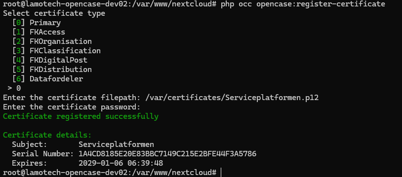

Certifikatet oplysninger kan nu ses i brugergrænsefladen.

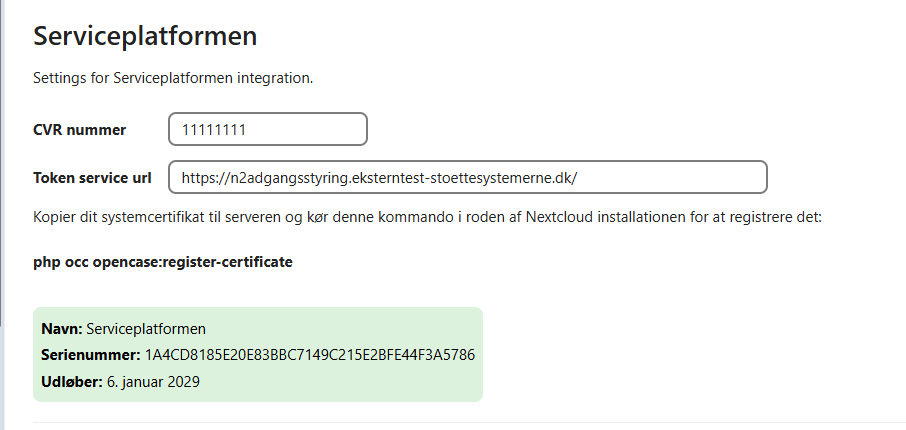

---

## Opret Teammapper

Hvis Teammapper skal oprettes automatisk for nye sager, aktiver:

**Opret Teammapper**

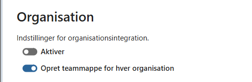
---

## Konfigurer endpoints

Vælg enten test- eller produktionsmiljø.

### Test

| Service | Endpoint |
|---------|----------|
| Organisation | `https://organisation.eksterntest-stoettesystemerne.dk/organisation/organisationsystem/6/` |
| Organisationenhed | `https://organisation.eksterntest-stoettesystemerne.dk/organisation/organisationenhed/6/` |
| Organisationsfunktion | `https://organisation.eksterntest-stoettesystemerne.dk/organisation/organisationfunktion/6/` |
| Bruger | `https://organisation.eksterntest-stoettesystemerne.dk/organisation/bruger/6/` |
| Person | `https://organisation.eksterntest-stoettesystemerne.dk/organisation/person/6/` |
| Adresse | `https://organisation.eksterntest-stoettesystemerne.dk/organisation/adresse/6/` |

### Produktion

| Service | Endpoint |
|---------|----------|
| Organisation | `https://organisation.stoettesystemerne.dk/organisation/organisationsystem/6/` |
| Organisationenhed | `https://organisation.stoettesystemerne.dk/organisation/organisationenhed/6/` |
| Organisationsfunktion | `https://organisation.stoettesystemerne.dk/organisation/organisationfunktion/6/` |
| Bruger | `https://organisation.stoettesystemerne.dk/organisation/bruger/6/` |
| Person | `https://organisation.stoettesystemerne.dk/organisation/person/6/` |
| Adresse | `https://organisation.stoettesystemerne.dk/organisation/adresse/6/` |

---

## Initial synkronisering

Når forbindelsen til organisationsservicen er konfigureret:

Kør en **initial synkronisering**.

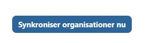

Kontrollér at organisationer importeres korrekt.

---

## Automatisk synkronisering

Aktivér synkroniseringsjobbet.

Det anbefales at synkronisere **én gang i døgnet**.

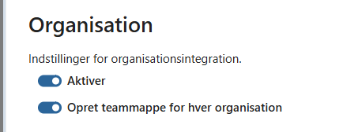

---

# Konfiguration af Klassifikation

Åbn:

> **Systemindstillinger → OpenCase → Serviceplatformen → Klassifikation**

!!! info "Enterprise"
    I Enterprise versionen kan KL emneplan og handlingsfacetter synkroniseres automatisk. I Basic versionen skal CSV filer med emneplan og handlingsfacetter uploades manuelt.

Upload følgende CSV-filer.

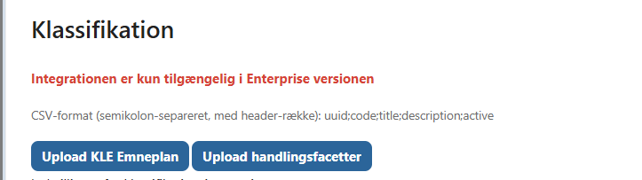


## Emneplan

Format:

```text
uuid;code;title;description;active
```

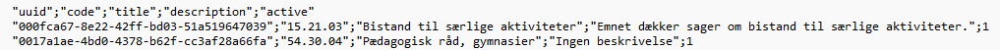


## Handlingsfacetter

Format:

```text
uuid;code;title;description;active
```

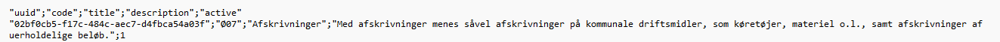

Når filerne er importeret, kan KLE-numre og handlingsfacetter anvendes ved oprettelse af sager.

---

# Konfiguration af Adgangsstyring

Åbn:

> **Systemindstillinger → OpenCase → Serviceplatformen → Adgangsstyring**

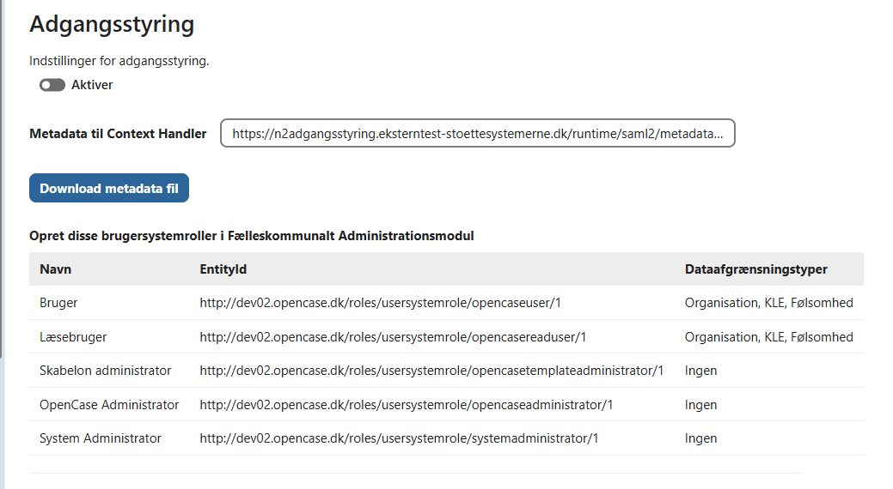

---

## Context Handler

Konfigurer endpoint for metadata til Context Handler.


### Test

```text
https://n2adgangsstyring.eksterntest-stoettesystemerne.dk/runtime/saml2/metadata.idp?samlprofile=nemlogin3
```

### Produktion

```text
https://n2adgangsstyring.stoettesystemerne.dk/runtime/saml2/metadata.idp?samlprofile=nemlogin3
```

---

## SAML Metadata

1. Download SAML Metadata fra OpenCase.
2. Upload metadatafilen i **Fælleskommunal Administrator**.

---

## Opret roller

I Fælleskommunal Administrator:

- Opret brugersystemroller.
- Tildel jobfunktionsroller til brugerne.

---

## Aktivér adgangsstyring

Når konfigurationen er færdig, aktiveres:

**Enable adgangsstyring**

Herefter vil OpenCase anvende den fælleskommunale adgangsstyring ved adgang til sager og dokumenter.

---

# Systemindstillinger af API

Åbn:

> **Administration → OpenCase → API**

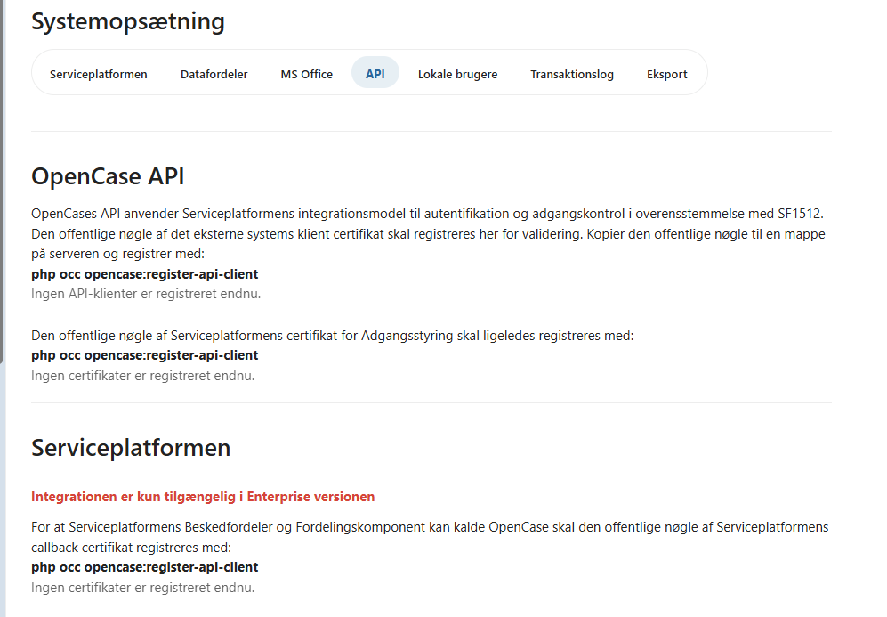


---

## Request header

Hvis API'et anvendes bag Nginx, anbefales følgende konfiguration:

```nginx
client_header_buffer_size 32k;
large_client_header_buffers 4 32k;
```

---

## Certifikat til adgangsstyring

Importer certifikatet:

Kopier den offentlige nøgle fra KOMBIT adgangsstyringscertifikatet til en mappe på serveren og kør kommandoen i Nextcloud rod mappen:

```bash
php occ opencase:register-api-client
```
Indtast navn og sti til certifikatet. Vælg 2 for Adgangsstyring.

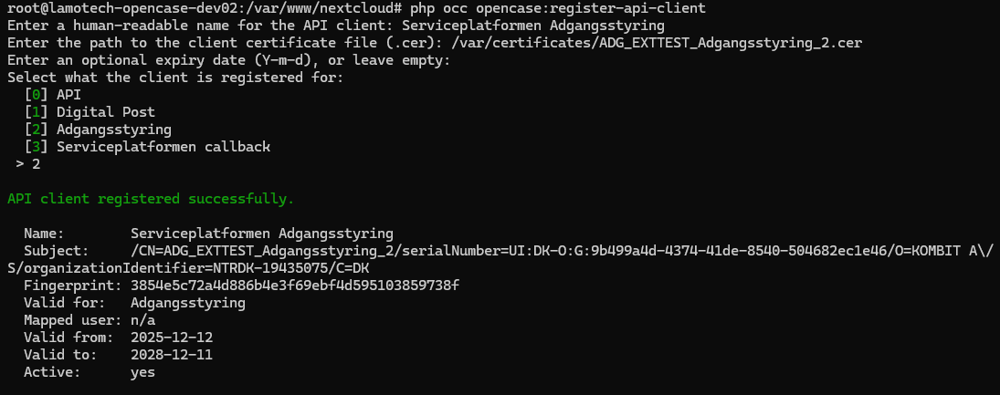


---

## Klientcertifikat

Hvis eksterne systemer skal anvende OpenCase API'et, registreres det relevante klientcertifikat.

Herefter kan klienten autentificere sig mod API'et.

---

# Kontrol

Når installationen er gennemført, anbefales det at kontrollere:

- ✅ OpenCase starter uden fejl.
- ✅ Organisationer er synkroniseret.
- ✅ KLE-emneplan er importeret.
- ✅ Handlingsfacetter er importeret.
- ✅ Adgangsstyring fungerer.
- ✅ Fuldtekstsøgning fungerer.
- ✅ Teammapper oprettes (hvis aktiveret).

Hvis alle punkter er opfyldt, er OpenCase Basic klar til brug.

---

## Næste trin

Efter installationen anbefales det at:

- [Konfigurere indstillinger](./konfiguration.md)
- [Konfigurere dokumentskabeloner](./administrer-skabeloner.md)
