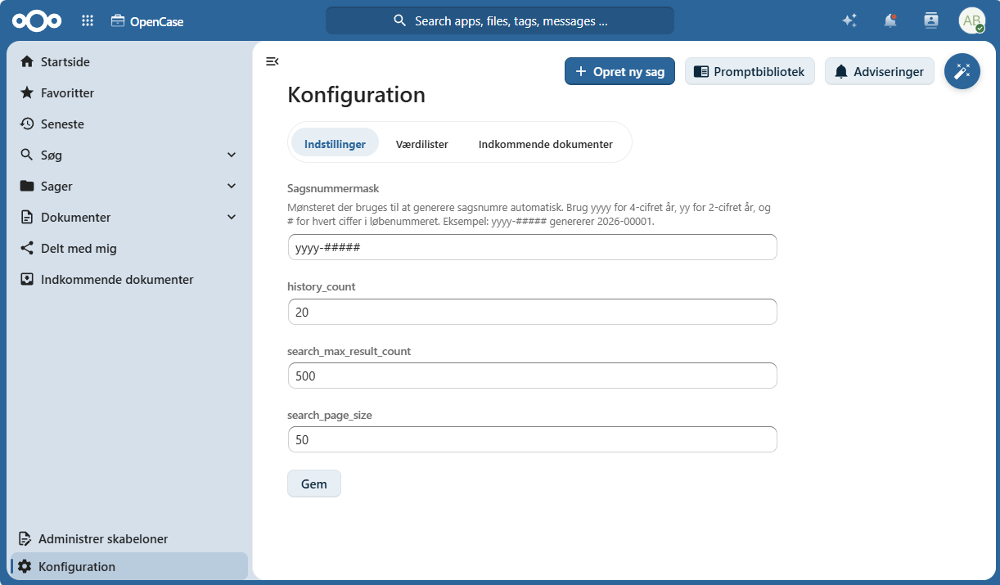
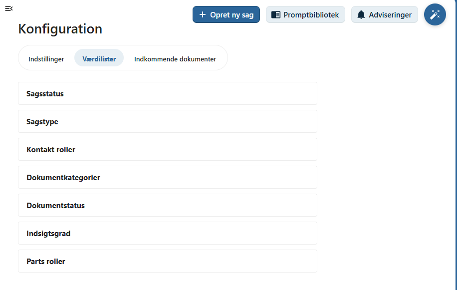
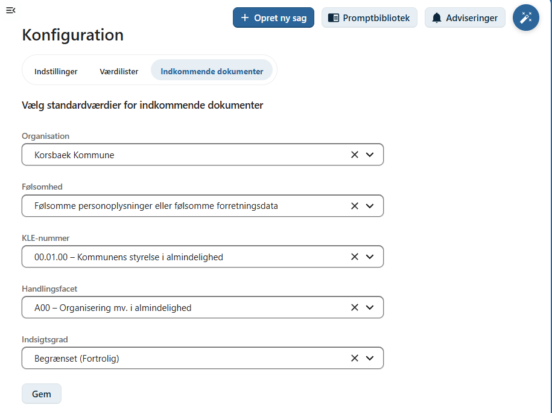
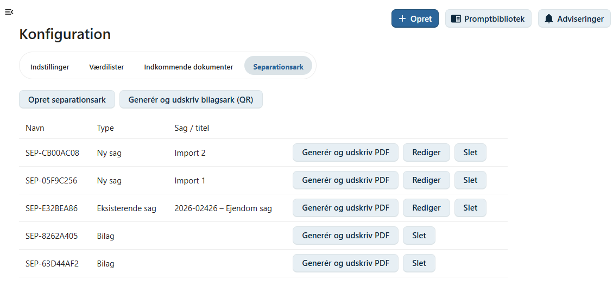
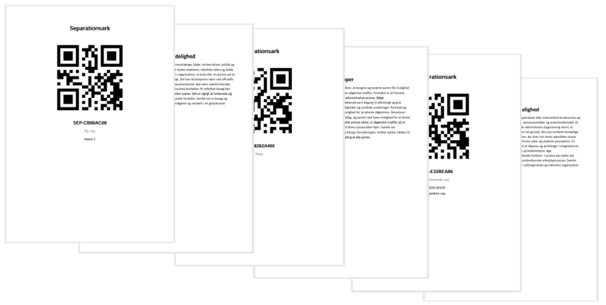
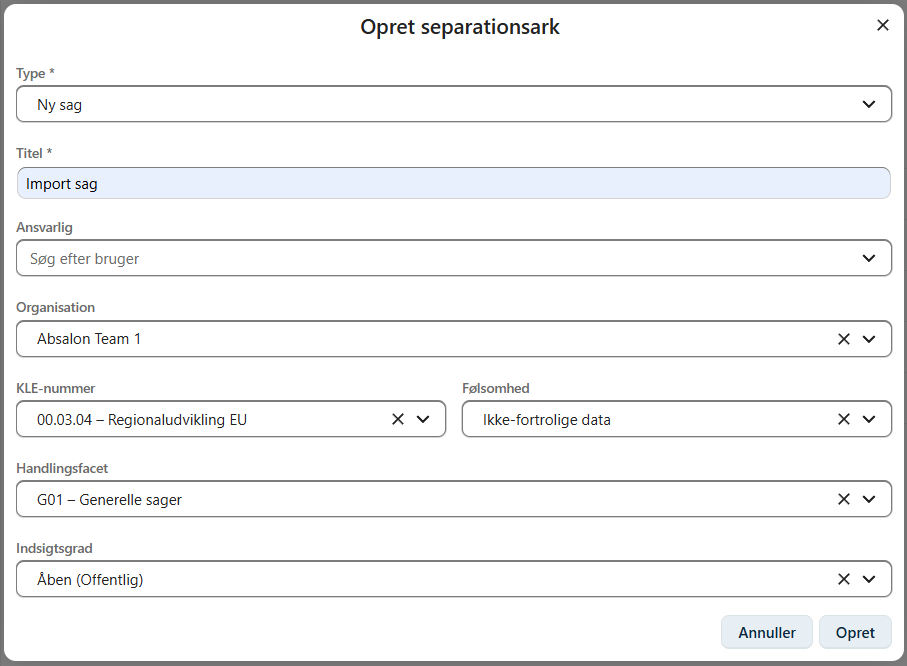

# Konfiguration

OpenCase indeholder en række konfigurationsmuligheder, som gør det muligt at tilpasse systemet til organisationens arbejdsgange.

Kun brugere med rollen **OpenCase administrator** kan ændre konfigurationen.

Konfigurationen er opdelt i faner, som hver styrer forskellige dele af systemet.



---

# Indstillinger

På fanen **Indstillinger** konfigureres de generelle indstillinger for OpenCase.

| Indstilling | Beskrivelse |
|-------------|-------------|
| **Sagsnummermaske** | Mønsteret, der anvendes ved automatisk generering af sagsnumre. |
| **Antal elementer i Seneste** | Antallet af sager og dokumenter, der vises i listerne *Seneste*. |
| **Maksimalt antal søgeresultater** | Det maksimale antal resultater, der kan vises ved søgninger. |
| **Sidevisning – søgeresultater** | Antallet af rækker, der vises pr. side i søgeresultater og sagslister. |

---

## Sagsnummermaske

Sagsnummermasken bestemmer, hvordan nye sagsnumre opbygges.

Der kan anvendes følgende pladsholdere:

| Pladsholder | Betydning |
|-------------|-----------|
| `yyyy` | Firecifret år |
| `yy` | Tocifret år |
| `#` | Ét ciffer i løbenummeret |

Eksempel:

```text
yyyy-#####
```

genererer sagsnumre som:

```text
2026-00001
2026-00002
2026-00003
```

!!! tip

    Vælg en sagsnummermaske, der passer til organisationens journaliseringspraksis.

---

## Antal elementer i Seneste

Angiver hvor mange sager og dokumenter der vises i:

- Seneste sager
- Seneste dokumenter
- Dashboard-widgeten **Seneste**

Et højere antal giver et større overblik, mens et lavere antal giver en mere kompakt visning.

---

## Maksimalt antal søgeresultater

Denne indstilling begrænser det maksimale antal resultater, som OpenCase returnerer ved søgninger.

Indstillingen gælder blandt andet:

- Fritekstsøgning
- Søg efter sager
- Søg efter dokumenter
- Alle sager

Brugeren kan bladre gennem søgeresultaterne op til den konfigurerede grænse.

---

## Sidevisning

Bestemmer hvor mange rækker der vises pr. side i:

- søgeresultater
- sagslister
- dokumentlister

Et passende antal giver en god balance mellem overblik og ydeevne.

---

# Værdilister

På fanen **Værdilister** administreres de værdier, som brugerne kan vælge i OpenCase.

Administrator kan oprette, redigere og deaktivere værdier.

Der kan konfigureres følgende værdilister:

- Sagsstatus
- Sagstyper
- Partsroller
- Kontaktroller
- Dokumentkategorier
- Dokumentstatus
- Indsigtsgrader

Ændringer træder i kraft med det samme og bliver tilgængelige for alle brugere.



!!! info

    Det anbefales kun at ændre værdilister efter aftale med organisationens systemansvarlige, da ændringer kan påvirke eksisterende arbejdsgange.

---

# Indkommende dokumenter

På fanen **Indkommende dokumenter** konfigureres standardværdierne for den **indbakke-sag**, som anvendes til dokumenter, der ikke automatisk kan placeres på en eksisterende sag.

Følgende standardværdier kan angives:

- Organisation
- Følsomhed
- KLE-nummer
- Handlingsfacet
- Indsigtsgrad

Når et indgående dokument modtages uden en kendt sag, oprettes dokumentet automatisk på indbakke-sagen med disse værdier.



Dette sikrer, at alle modtagne dokumenter registreres ensartet og kan behandles efterfølgende.

---

# Separationsark

På fanen **Separationsark** kan man oprette separationsark, som anvendes ved import af filer. Filer kan importeres fra et fileshare eller en mailboks.



Separationsark kan anvendes ved scanning af dokumenter til en pdf fil for at opdelede den samlede pdf i flere separate filer eller bilag.

Separationsark kan definere en ny sag, en eksisterende sag, en indbakke sag eller et bilag.



For oprettelse af en sag kan sagens metadata defineres.



---

# God praksis

Det anbefales at:

- fastlægge organisationens sagsnummermaske inden systemet tages i brug
- begrænse antallet af værdier i værdilisterne til det nødvendige
- anvende ensartede navne på statusser og roller
- gennemgå standardværdierne for indkommende dokumenter, så de passer til organisationens arbejdsgange

!!! tip

    Undgå at ændre eller slette værdier, som allerede anvendes på eksisterende sager og dokumenter. Opret i stedet nye værdier og udfas de gamle over tid.

---

## Se også

- [Administrer skabeloner](./administrer-skabeloner.md)
- [Installation – Basic-version](./installation-basic-version.md)
- [Indkommende dokumenter](../dokumenter/indkommende-dokumenter.md)