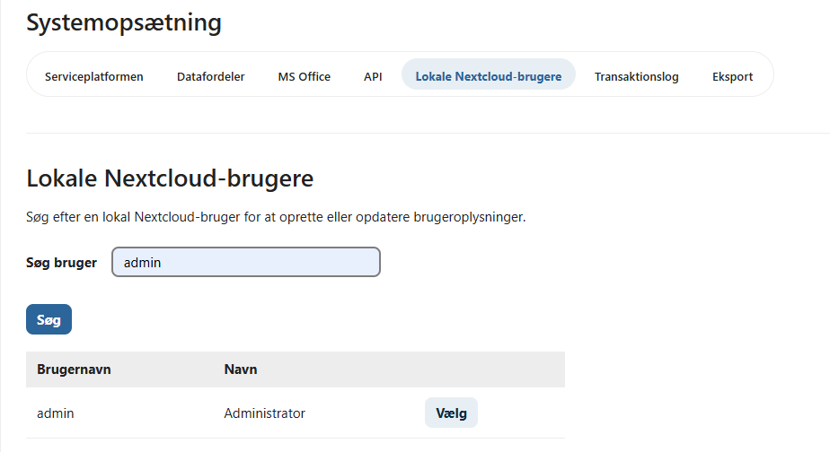
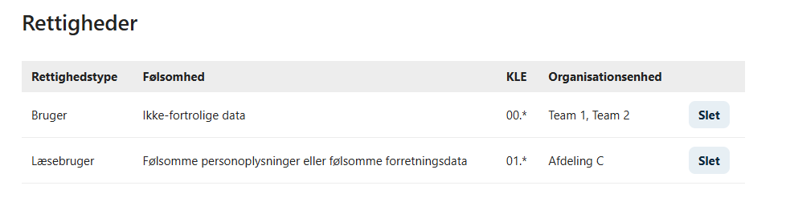
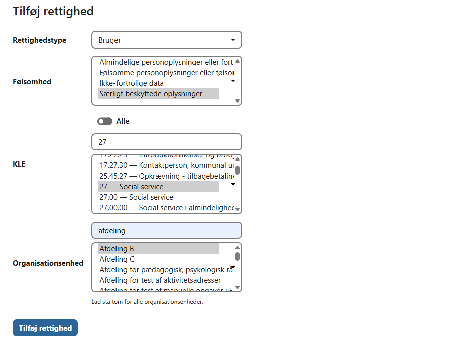

# Lokale Nextcloud-brugere

OpenCase understøtter både den fælleskommunale adgangsstyring og lokale Nextcloud-brugere.

På fanen **Lokale Nextcloud-brugere** kan administratorer tildele roller og adgangsbegrænsninger til brugere, der autentificeres direkte i Nextcloud.

Denne funktion er især nyttig ved:

- test- og udviklingsmiljøer
- mindre installationer uden fælleskommunal adgangsstyring
- eksterne konsulenter
- service- og supportbrugere
- midlertidige brugere



---

## Tildel roller

På fanen **Lokale Nextcloud-brugere** kan du søge efter en eksisterende Nextcloud-bruger.

Når brugeren er valgt, kan der tildeles en eller flere OpenCase-roller.

Eksempler på roller:

- Systemadministrator
- OpenCase Administrator
- Skabelonadministrator
- Bruger
- Læsebruger

Rollerne bestemmer, hvilke funktioner brugeren har adgang til i OpenCase.



---

## Dataafgrænsning

For rollerne **Bruger** og **Læsebruger** kan adgangen begrænses ved hjælp af en dataafgrænsning.

Dataafgrænsningen kan omfatte:

- Organisation
- KLE-klassifikation
- Følsomhed

Brugeren får kun adgang til sager og dokumenter, der matcher den tildelte adgangsprofil.

Dette gør det muligt at begrænse adgangen til bestemte organisatoriske områder eller sagstyper.


---

## Lokale Nextcloud-brugere og fælleskommunal adgangsstyring

Når den fælleskommunale adgangsstyring er aktiveret, logger kommunens almindelige brugere normalt ind via organisationens fælles loginløsning.

Lokale Nextcloud-brugere kan dog fortsat anvendes til særlige formål, eksempelvis:

- systemadministration
- support
- test
- integrationer

De lokale brugere administreres uafhængigt af den fælleskommunale adgangsstyring.

---

## Direkte login

Når den fælleskommunale adgangsstyring er aktiveret, kan lokale Nextcloud-brugere logge ind via den direkte loginadresse:

```text
https://<domæne>/index.php/login?direct=1
```

Denne adresse viser Nextclouds almindelige loginformular i stedet for at viderestille brugeren til den fælleskommunale loginløsning.

!!! tip

    Gem gerne adressen som et bogmærke, hvis lokale administratorer eller supportmedarbejdere ofte logger ind med lokale Nextcloud-konti.

---

## God praksis

Det anbefales at:

- anvende den fælleskommunale adgangsstyring til almindelige brugere
- begrænse antallet af lokale administratorer
- anvende dataafgrænsning for lokale brugere med rollen **Bruger** eller **Læsebruger**
- deaktivere eller slette lokale brugere, der ikke længere anvendes

Lokale brugere bør primært benyttes til administration, support og særlige driftsopgaver.

---

## Se også

- [Konfiguration](konfiguration.md)
- [Adgang](../sager/adgang.md)
- [Installation – Basic-version](./installation-basic-version.md)