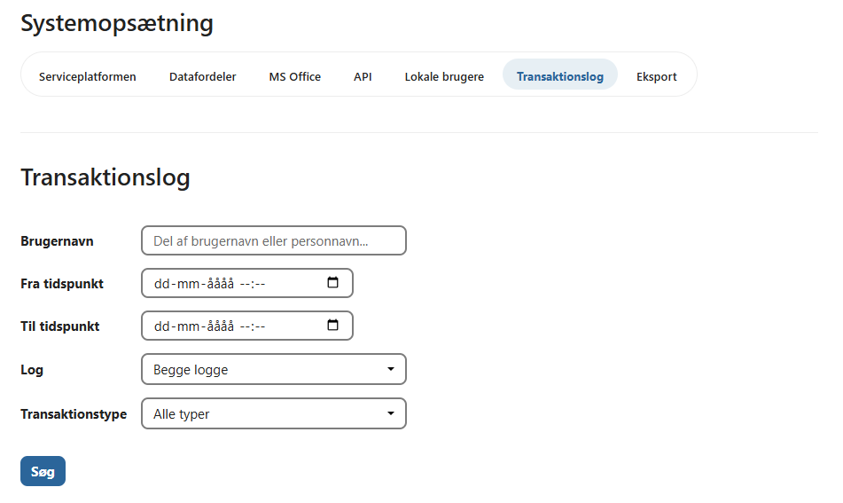
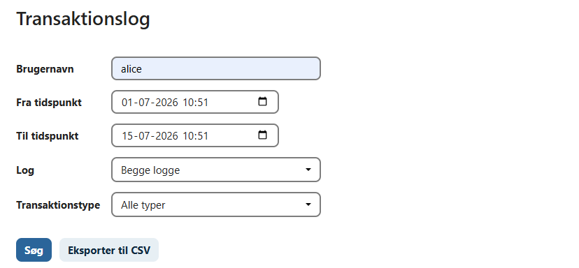
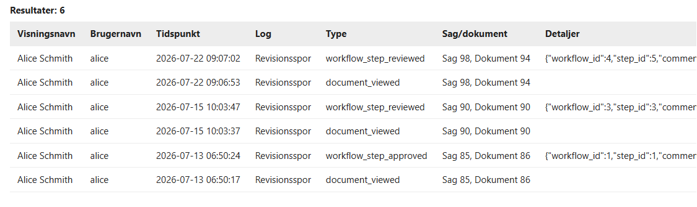

# Transaktionslog

OpenCase registrerer brugerhandlinger i en transaktionslog, som giver administratorer mulighed for at dokumentere og analysere systemets anvendelse.

Transaktionsloggen kan blandt andet anvendes til:

- revision og audit
- sikkerhedskontrol
- undersøgelse af hændelser
- dokumentation af brugeraktivitet
- overholdelse af krav til sporbarhed

Kun brugere med de nødvendige administratorrettigheder har adgang til transaktionsloggen.

---

## Søg i transaktionsloggen

På fanen **Transaktionslog** kan du søge efter registrerede hændelser.

Søgningen kan afgrænses ved hjælp af forskellige kriterier.

Eksempelvis:

- fra-dato
- til-dato
- loghændelse (event type)

Dette gør det muligt hurtigt at finde de relevante hændelser.

---

## Loghændelser

Der kan søges på en eller flere typer af hændelser.

Eksempler på loghændelser:

- Set en sag
- Oprettet en sag
- Redigeret en sag
- Set et dokument
- Oprettet et dokument
- Uploadet en fil
- Downloadet en fil
- Søgt efter en borger
- Søgt efter en virksomhed
- Givet adgang til en sag

De tilgængelige hændelser afhænger af den installerede version af OpenCase.

---

## Søgeresultat

Resultatet vises som en liste over de hændelser, der matcher søgekriterierne.

For hver hændelse vises typisk:

- tidspunkt
- bruger
- hændelsestype
- objekt (sag, dokument eller anden ressource)
- beskrivelse af handlingen

Klik på en hændelse for at få vist flere detaljer, hvis funktionen er tilgængelig.

---

## Eksport til CSV

Søgeresultatet kan eksporteres til en CSV-fil.

Klik på **Eksporter CSV**.

Den eksporterede fil indeholder de samme oplysninger som vises i resultatlisten og kan åbnes i eksempelvis Microsoft Excel eller LibreOffice Calc.

Eksportfunktionen kan blandt andet anvendes til:

- revision
- dokumentation
- analyse
- videre behandling af logdata

---

## Anvendelsesområder

Transaktionsloggen kan anvendes til mange forskellige formål.

Eksempler:

- dokumentere hvem der har åbnet en sag
- undersøge hvem der har set et dokument
- kontrollere søgninger efter borgere eller virksomheder
- analysere brugeraktivitet
- understøtte interne eller eksterne revisioner

Transaktionsloggen giver dermed et samlet overblik over brugeraktiviteten i OpenCase.

---

## God praksis

Det anbefales at:

- begrænse adgangen til transaktionsloggen til administratorer
- anvende datofiltre ved søgninger over længere perioder
- eksportere relevante hændelser til CSV ved revision eller sikkerhedsundersøgelser
- opbevare eksporterede logfiler sikkert, da de kan indeholde personoplysninger

!!! info

    Transaktionsloggen er et vigtigt værktøj til dokumentation og sporbarhed og kan hjælpe med at opfylde organisationens krav til revision, informationssikkerhed og databeskyttelse.

---

## Se også

- [Sagslog](../sager/sagslog.md)
- [Dokumentlog](../dokumenter/dokumentlog.md)
- [Fejlfinding](./fejlfinding.md)