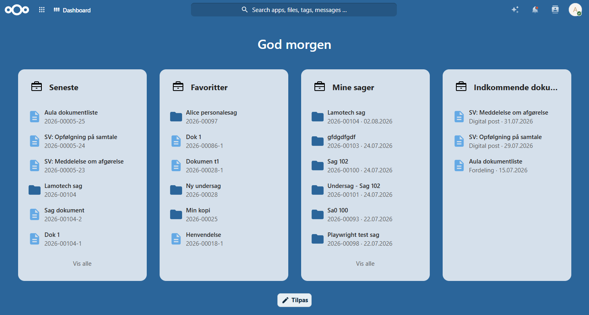
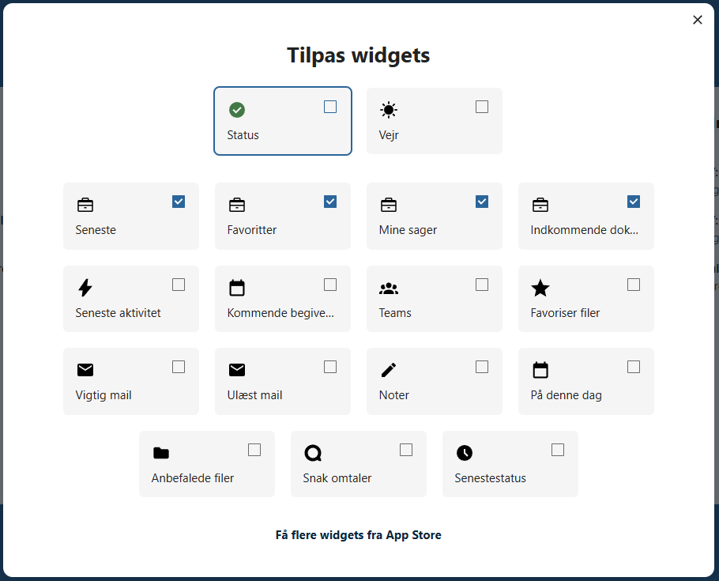
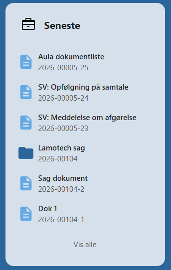
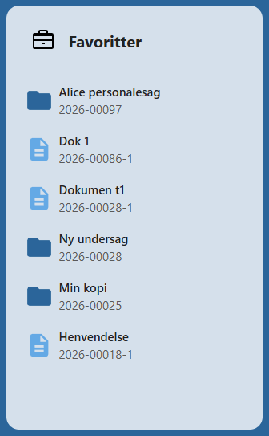
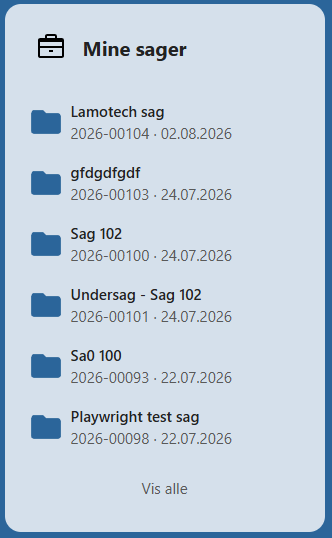
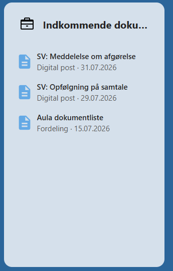

# Dashboard-widgets

OpenCase indeholder en række widgets, som kan tilføjes til **Nextcloud Dashboard**.

Widgets giver et hurtigt overblik over dine vigtigste sager og dokumenter, så du kan fortsætte arbejdet direkte fra dashboardet, når du logger ind i Nextcloud.

---

## Tilføj en widget

Widgets tilføjes fra Nextcloud Dashboard.

Klik på **Tilpas**, og vælg de OpenCase-widgets, du ønsker at vise.

Widgets kan frit flyttes rundt på dashboardet og kombineres med andre Nextcloud-widgets.

---

## Seneste

Widgeten **Seneste** viser de sager og dokumenter, du senest har arbejdet med.

Listen opdateres automatisk, når du åbner eller redigerer en sag eller et dokument.

Widgeten gør det nemt hurtigt at vende tilbage til det arbejde, du senest har været i gang med.

---

## Favoritter

Widgeten **Favoritter** viser de sager og dokumenter, du selv har markeret som favoritter.

Herfra kan du åbne dine mest anvendte sager og dokumenter med ét klik.

Listen opdateres automatisk, når du tilføjer eller fjerner favoritter.

Læs mere i afsnittet [Favoritter](favoritter.md).

---

## Mine sager

Widgeten **Mine sager** viser de åbne sager, hvor du er registreret som **ansvarlig sagsbehandler**.

Listen giver et hurtigt overblik over dine aktuelle sager og gør det nemt at fortsætte sagsbehandlingen.

Kun åbne sager vises.

---

## Indkommende dokumenter

Widgeten **Indkommende dokumenter** viser de dokumenter, som endnu ikke automatisk er blevet placeret på en sag.

Widgeten gør det nemt hurtigt at se, om der er nye dokumenter, som kræver manuel behandling.

Herfra kan dokumenterne åbnes og tilknyttes den korrekte sag.

Læs mere i afsnittet [Indkommende dokumenter](./dokumenter/indkommende-dokumenter.md).

---

## Fordele ved dashboard-widgets

Dashboard-widgets giver et samlet overblik over dit daglige arbejde.

De kan blandt andet hjælpe dig med at:

- fortsætte arbejdet med de seneste sager og dokumenter
- få hurtig adgang til dine favoritter
- holde overblik over dine åbne sager
- opdage nye indkommende dokumenter, der kræver behandling

Ved at tilpasse dashboardet kan du samle de oplysninger, du bruger mest, på én side.

---

## Se også

- [Favoritter](favoritter.md)
- [Indkommende dokumenter](./dokumenter/indkommende-dokumenter.md)
- [Sager](./sager/index.md)
- [Dokumenter](./dokumenter/index.md)