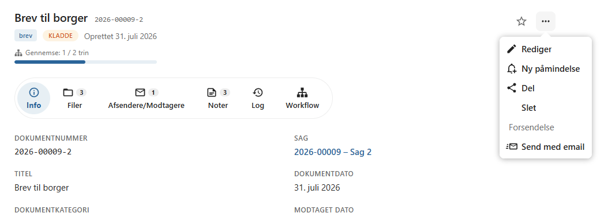
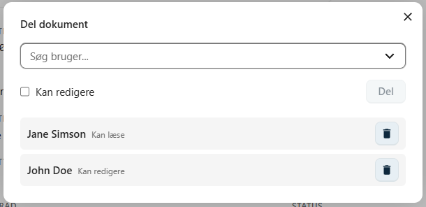
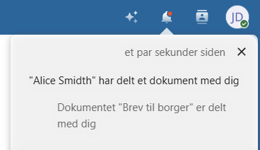
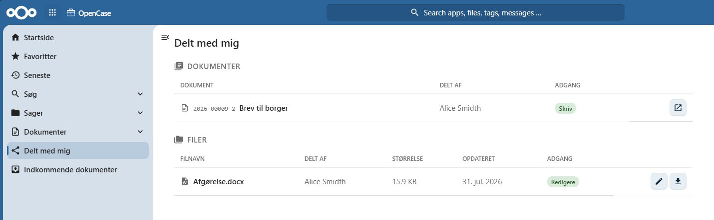

# Del et dokument

Et dokument kan deles med en anden bruger, hvis vedkommende skal have adgang til dokumentets indhold.

Når et dokument deles, får brugeren adgang til hele dokumentet, herunder alle tilknyttede oplysninger og filer.

Dokumentdeling gør det nemt at samarbejde om et dokument uden at give adgang til hele sagen.

!!! info

    | Funktion | Giver adgang til |
    |----------|------------------|
    | **Del fil** | Den valgte fil. |
    | **Del dokument** | Hele dokumentet med alle dets filer, kontakter, noter, workflow og øvrige oplysninger. |   
---

## Del et dokument

Åbn dokumentets **kontekstmenu** og vælg **Del**.

Der åbnes en dialog, hvor du kan vælge, hvem dokumentet skal deles med.

---

## Vælg bruger

Begynd at skrive navnet på den bruger, du ønsker at dele dokumentet med, og vælg brugeren på listen.

Du kan dele dokumentet med én eller flere brugere.

---

## Vælg adgang

Når dokumentet deles, kan du vælge, hvilken adgang brugeren skal have.

### Læseadgang

Brugeren kan:

- åbne dokumentet
- se dokumentets oplysninger
- læse alle tilknyttede filer
- se kontakter, noter og workflow
- downloade dokumentets filer

Brugeren kan ikke ændre dokumentet eller dets indhold.

### Skriveadgang

Brugeren kan:

- redigere dokumentets oplysninger
- redigere og oprette filer
- registrere kontakter
- oprette og redigere noter
- arbejde med dokumentets workflow

Ændringer af dokumentets filer gemmes automatisk som nye **filversioner**.

!!! info

    Brugere med skriveadgang kan arbejde med dokumentet på samme måde som andre brugere med redigeringsadgang.

---

## Hvad deles?

Når et dokument deles, får brugeren adgang til hele dokumentet.

| Funktion | Giver adgang til |
|----------|------------------|
| **Del fil** | Den valgte fil. |
| **Del dokument** | Hele dokumentet med alle dets filer, kontakter, noter, workflow og øvrige oplysninger. |

---

## Notifikation

Når dokumentet deles, modtager brugeren automatisk en notifikation i Nextcloud.

Notifikationen indeholder et link, så dokumentet kan åbnes direkte.

---

## Delt med mig

Dokumenter, som andre brugere har delt med dig, vises automatisk i listen **Delt med mig** i Nextcloud.

Herfra kan dokumentet åbnes direkte uden først at finde sagen eller dokumentet.

---

## Hvornår bør et dokument deles?

Dokumentdeling er velegnet, når en kollega skal arbejde med hele dokumentet.

Eksempler:

- fælles udarbejdelse af et dokument
- faglig sparring
- kvalitetssikring
- midlertidig redigeringsadgang

Hvis brugeren kun skal have adgang til én enkelt fil, kan det være mere hensigtsmæssigt at benytte **Del fil**.

!!! tip

    Del kun dokumenter med de brugere, der har behov for adgang. Det gør det lettere at bevare overblikket over dokumentets adgangsforhold.

---

## Se også

- [Del fil](../dokumenter/del-fil.md)
- [Workflow](../dokumenter/workflow.md)
- [Rediger fil](../dokumenter/rediger-fil.md)