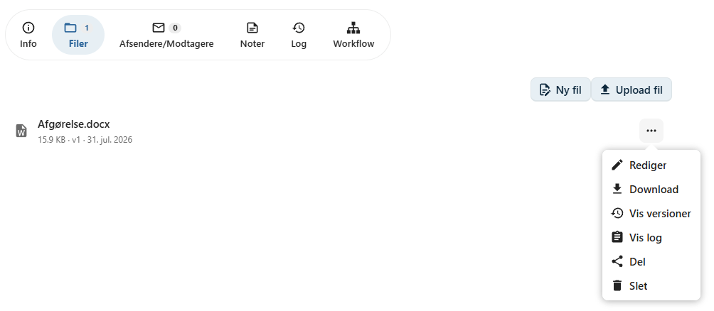
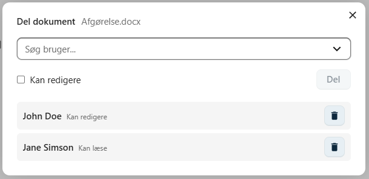
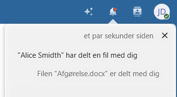
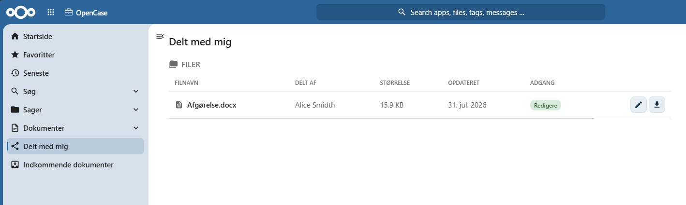

# Del en fil

En fil kan deles direkte med en anden bruger, hvis vedkommende skal læse eller redigere filen uden at få adgang til hele dokumentet.

Fildeling gør det nemt at samarbejde om en enkelt fil, samtidig med at adgangen begrænses til netop den delte fil.

!!! info

    | Funktion | Giver adgang til |
    |----------|------------------|
    | **Del fil** | Den valgte fil. |
    | **Del dokument** | Hele dokumentet med alle dets filer, kontakter, noter, workflow og øvrige oplysninger. |

---

## Del en fil

Gå til dokumentets **Filer**-fane.

Klik på filens **kontekstmenu** og vælg **Del**.

Der åbnes en dialog, hvor du kan vælge, hvem filen skal deles med.

---

## Vælg bruger

Begynd at skrive navnet på den bruger, du ønsker at dele filen med, og vælg brugeren på listen.

Du kan dele filen med én eller flere brugere.

---

## Vælg adgang

Når du deler en fil, kan du vælge, hvilken adgang modtageren skal have.

### Læseadgang

Brugeren kan:

- åbne filen
- læse indholdet
- downloade filen

Brugeren kan ikke ændre filens indhold.

### Skriveadgang

Brugeren kan:

- åbne filen
- redigere indholdet
- gemme ændringer

Ændringer, som brugeren foretager, gemmes som nye **filversioner**.

!!! info

    Giver du en bruger skriveadgang, kan vedkommende redigere filen på samme måde som dokumentets øvrige redaktører.

---

## Notifikation

Når filen deles, modtager brugeren automatisk en notifikation i Nextcloud.

Notifikationen indeholder et link, så brugeren hurtigt kan åbne den delte fil.

---

## Delt med mig

Filer, som andre brugere har delt med dig, vises automatisk i listen **Delt med mig** i Nextcloud.

Herfra kan du åbne filen direkte uden først at navigere til sagen eller dokumentet.

Dette gør det nemt at finde de filer, du skal arbejde med.

---

## Hvornår bør en fil deles?

Fildeling er velegnet, når en kollega kun skal have adgang til en enkelt fil.

Eksempler:

- korrekturlæsning af et brev
- faglig sparring om et dokument
- fælles redigering af en rapport
- midlertidig adgang til en fil

Hvis brugeren derimod skal arbejde med hele dokumentet eller sagen, bør vedkommende i stedet tildeles adgang til dokumentet eller sagen.

!!! tip

    Del kun filer med de brugere, der har behov for adgang. Det gør det lettere at bevare overblikket over, hvem der har adgang til hvilke oplysninger.

---

## Se også

- [Del dokument](../dokumenter/del-dokument.md)
- [Rediger fil](../dokumenter/rediger-fil.md)
- [Filversioner](../dokumenter/filversioner.md)