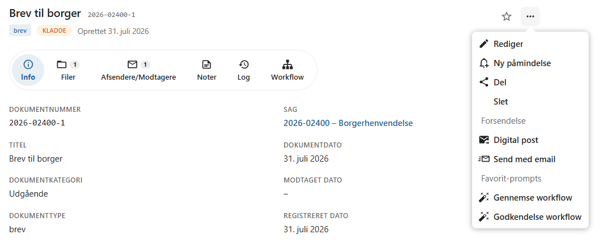
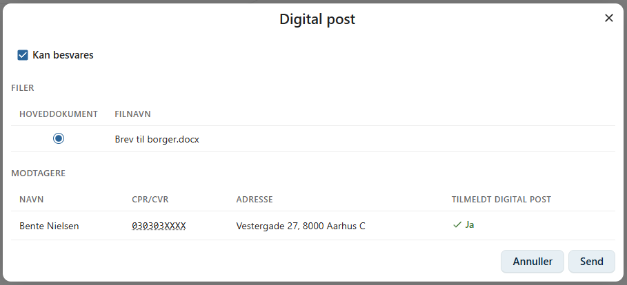
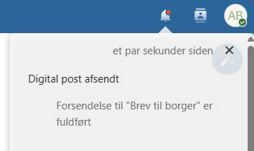

# Send Digital post

!!! info "Enterprise"
    I Enterprise-versionen kan dokumenter sendes som **Digital Post** til borgere og virksomheder.

    Digital Post gør det muligt at sende dokumenter direkte fra OpenCase uden at forlade systemet. Dokumentet bliver leveret til modtagerens digitale postkasse eller som fysisk post, hvis modtageren ikke er tilmeldt Digital Post.

    ---

    ## Send et dokument

    Åbn dokumentets **kontekstmenu** og vælg **Digital post**.

    

    Der åbnes en dialog, hvor afsendelsen kan konfigureres.

    

    ---

    ## Modtagere

    Dokumentets registrerede modtagere anvendes automatisk som modtagere af den digitale post.

    Hvis dokumentet har flere modtagere, vises de alle i dialogen.

    For hver modtager kan du se, om dokumentet bliver leveret som:

    - **Digital Post**
    - **Fysisk post**

    Hvis modtageren ikke er tilmeldt Digital Post, sørger løsningen automatisk for, at brevet sendes som fysisk post.

    !!! info

        Leveringsformen bestemmes automatisk ud fra modtagerens registrering i Digital Post.

    ---

    ## Vælg hoveddokument

    Hvis dokumentet indeholder flere filer, kan du vælge, hvilken fil der skal være **hoveddokument**.

    Den valgte fil vises som den primære del af den digitale forsendelse, mens de øvrige filer vedlægges som bilag.

    ---

    ## Tillad besvarelse

    Du kan vælge, om modtageren skal have mulighed for at besvare den digitale post.

    Når besvarelse er tilladt, kan modtageren sende sit svar direkte fra sin digitale postkasse.

    ---

    ## Afsendelse

    Klik på **Send** for at afsende dokumentet.

    Dokumentet sendes ikke øjeblikkeligt, men lægges først i en afsendelseskø.

    Inden afsendelsen:

    - konverteres dokumentets filer til PDF
    - klargøres forsendelsen
    - kontrolleres modtageroplysningerne

    Når afsendelsen er gennemført, modtager du en notifikation i Nextcloud.

    

    !!! info

        Du kan fortsætte dit arbejde i OpenCase, mens dokumentet behandles og afsendes.

    ---

    ## Modtagelse

    Når afsendelsen er gennemført, modtager borgeren eller virksomheden dokumentet i sin digitale postkasse.

    Afhængigt af modtagerens forhold kan dokumentet modtages via:

    - e-Boks
    - borger.dk
    - fysisk post (hvis modtageren ikke er tilmeldt Digital Post)

    ---

    ## Besvarelser

    Hvis modtageren besvarer den digitale post, modtages svaret automatisk i OpenCase.

    Besvarelsen oprettes som et **nyt indgående dokument** på den tilhørende sag.

    Det gør det nemt at bevare hele korrespondancen samlet på sagen.

    ---

    ## Indkommende dokumenter

    I enkelte tilfælde kan en modtaget besvarelse ikke automatisk knyttes til en sag.

    Sådanne dokumenter vises i **Indkommende dokumenter**, hvor de kan gennemgås og efterfølgende tilknyttes den korrekte sag.

    Læs mere i afsnittet [Indkommende dokumenter](../dokumenter//indkommende-dokumenter.md).

    !!! tip

        Registrér altid de korrekte modtagere på dokumentet, inden du sender Digital Post. Det sikrer, at dokumentet bliver leveret til de rigtige modtagere og at eventuelle besvarelser kan knyttes til den korrekte sag.

    ---

## Se også

- [Afsendere og modtagere](../dokumenter/kontakter.md)
- [Indkommende dokumenter](../dokumenter/indkommende-dokumenter.md)
- [Dokumentlog](../dokumenter/dokumentlog.md)