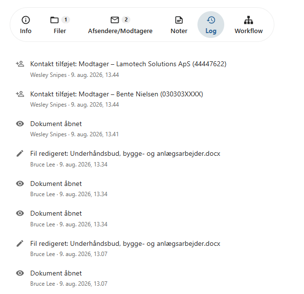

# Dokumentlog

Alle væsentlige handlinger på et dokument registreres automatisk i dokumentets log.

Dokumentloggen giver et overblik over, hvad der er sket med dokumentet, hvornår handlingerne er udført, og hvem der har udført dem.

Loggen oprettes automatisk og kræver ingen manuel registrering.

---

## Vis dokumentloggen

Du kan se dokumentets log på fanen **Dokumentlog**.

Her vises handlingerne i kronologisk rækkefølge, så det er nemt at følge dokumentets historik.

---

## Registrerede handlinger

Dokumentloggen registrerer blandt andet:

- Dokument oprettet
- Dokument vist
- Fil uploadet
- Fil oprettet fra skabelon
- Fil redigeret
- Filversion oprettet
- Fil downloadet
- Afsender eller modtager tilføjet
- Note oprettet eller ændret
- Workflow oprettet
- Workflow gennemført
- Dokument delt

Afhængigt af organisationens konfiguration kan der registreres yderligere handlinger.

---

## Oplysninger i loggen

For hver hændelse kan du blandt andet se:

- hvilken handling der er udført
- dato og tidspunkt
- hvilken bruger der udførte handlingen

Det gør det muligt at følge dokumentets behandling gennem hele dets levetid.

!!! info

    Dokumentloggen opdateres automatisk, hver gang der udføres en handling på dokumentet.

---

## Sporbarhed

Dokumentloggen bidrager til fuld sporbarhed i dokumentbehandlingen.

Det gør det muligt at:

- dokumentere dokumentets historik
- se hvem der har udført bestemte handlinger
- undersøge hændelsesforløb
- understøtte interne kontroller og revision

Loggen kan ikke ændres af almindelige brugere.

---

## Administratorfunktioner

I administratormodulet har administratorer adgang til udvidede logfunktioner.

Her kan en administrator søge efter en brugers handlinger på tværs af alle sager og dokumenter.

Det gør det muligt at:

- undersøge konkrete hændelser
- følge en brugers aktivitet
- dokumentere adgang og anvendelse
- understøtte krav om sporbarhed og revision

!!! tip

    Den centrale log gør det hurtigt at finde relevante hændelser, uden at administratoren behøver at gennemgå hver enkelt sag eller hvert enkelt dokument.

---

## Se også

- [Workflow](../dokumenter/workflow.md)
- [Filversioner](../dokumenter/filversioner.md)
- [Sagslog](../sager/sagslog.md)