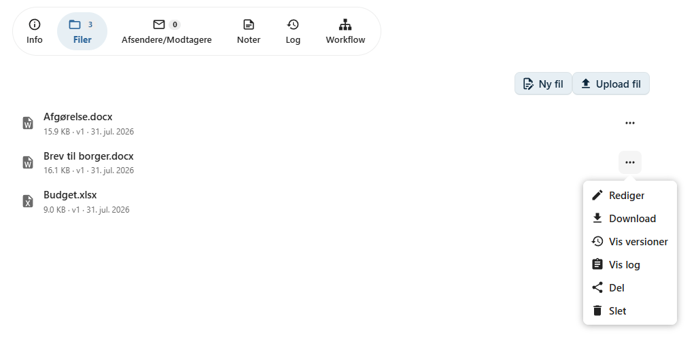
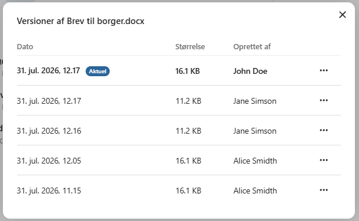

# Filversioner

OpenCase gemmer automatisk tidligere versioner af en fil, når den ændres.

Versioneringen gør det muligt at følge dokumentets udvikling over tid og gendanne en tidligere version, hvis det bliver nødvendigt.

Tidligere versioner bevares, selv om filen redigeres flere gange.

---

## Vis filversioner

For at se en fils versioner skal du gå til dokumentets **Filer**-fane.

Klik på filens **kontekstmenu** og vælg **Filversioner**.

Der åbnes en oversigt over alle gemte versioner af filen.

---

## Oplysninger om en version

For hver filversion kan du blandt andet se:

- dato og tidspunkt
- hvilken bruger der har oprettet versionen

Disse oplysninger gør det nemt at følge, hvordan dokumentet har udviklet sig over tid.

---

## Åbn en tidligere version

En tidligere version kan åbnes direkte fra oversigten.

Det giver mulighed for at gennemgå indholdet uden at påvirke den aktuelle version af filen.

---

## Download en tidligere version

Hvis du ønsker en lokal kopi af en tidligere version, kan du vælge **Download**.

Den valgte version downloades til din computer, uden at den aktuelle version ændres.

---

## Gendan en tidligere version

Hvis du ønsker at vende tilbage til en tidligere udgave af filen, kan du vælge **Gendan**.

Den valgte version bliver herefter den **aktive version** af filen.

Den version, der tidligere var aktiv, slettes ikke, men bevares som en tidligere version i historikken.

!!! warning "Gendan version"

    Når du gendanner en tidligere version, bliver den den aktuelle version af filen. Tidligere versioner bevares dog fortsat, så historikken ikke går tabt.

---

## Hvornår er filversioner nyttige?

Filversioner kan blandt andet anvendes, hvis:

- en ændring skal fortrydes
- et tidligere indhold skal dokumenteres
- man ønsker at se, hvordan dokumentet har udviklet sig
- flere brugere samarbejder om den samme fil

Versioneringen giver tryghed, fordi tidligere udgaver altid kan findes igen.

---

## Se også

- [Rediger fil](../dokumenter/rediger-fil.md)
- [Upload fil](../dokumenter/upload-fil.md)