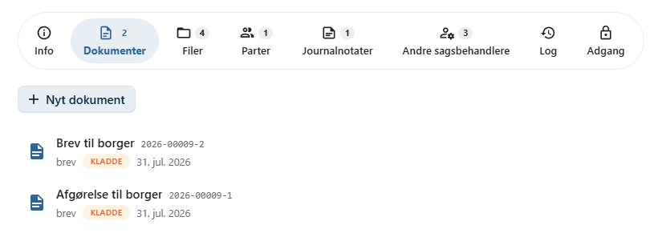

# Dokumenter

Et dokument samler alle oplysninger om en bestemt henvendelse, afgørelse eller korrespondance på en sag.

Et dokument kan indeholde én eller flere filer samt oplysninger om afsendere og modtagere, noter, workflow, påmindelser og dokumentets historik.

Alle dokumenter hører til en sag og bliver en del af sagens samlede dokumentation.

---

## Et dokument består af

Et dokument kan blandt andet indeholde:

| Element | Beskrivelse |
|---------|-------------|
| **Filer** | En eller flere filer med dokumentets indhold. |
| **Afsendere og modtagere** | Borgere og virksomheder, som dokumentet er sendt fra eller til. |
| **Noter** | Interne bemærkninger om dokumentet. |
| **Workflow** | Gennemgang eller godkendelse af dokumentet. |
| **Påmindelser** | Opgaver og frister knyttet til dokumentet. |
| **Dokumentlog** | Historik over handlinger på dokumentet. |

---

## Typisk arbejdsgang

Et dokument oprettes og behandles typisk i følgende rækkefølge:

1. Opret dokumentet.
2. Upload en fil eller opret en ny fil fra en skabelon.
3. Rediger dokumentets filer.
4. Registrér afsendere og modtagere.
5. Tilføj eventuelle noter.
6. Opret workflow eller påmindelser efter behov.
7. Send dokumentet med Digital Post eller e-mail.
8. Følg dokumentets historik i dokumentloggen.

Arbejdsgangen kan variere afhængigt af organisationens procedurer.

---

## Dokumenter og filer

I OpenCase skelnes der mellem **dokumenter** og **filer**.

Et dokument er den journaliserede enhed, mens filerne indeholder selve dokumentets indhold.

Et dokument kan derfor indeholde:

- flere filer
- flere filversioner
- forskellige typer oplysninger om dokumentets behandling

!!! info

    Når en fil redigeres, oprettes der automatisk en ny **filversion**. Dokumentet forbliver det samme, mens filens historik bevares.

---

## Deling og samarbejde

Dokumenter kan deles med andre brugere.

Du kan vælge at:

- dele en enkelt fil
- dele hele dokumentet

Flere brugere kan samtidig arbejde på de samme filer, og dokumentets workflow gør det muligt at styre gennemgang og godkendelse.

---

## Historik og sporbarhed

Alle væsentlige handlinger på dokumentet registreres automatisk.

Det giver et komplet overblik over dokumentets behandling og understøtter krav til sporbarhed og revision.

---

## Sider i dette afsnit

Dette afsnit beskriver alle funktioner, der vedrører dokumenter.

| Emne | Beskrivelse |
|------|-------------|
| [Opret dokument](opret-dokument/) | Opret et nyt dokument på en sag. |
| [Upload fil](upload-fil/) | Upload en eller flere filer til dokumentet. |
| [Ny fil fra skabelon](ny-fil-fra-skabelon/) | Opret en fil ud fra en dokumentskabelon. |
| [Rediger fil](rediger-fil/) | Rediger filer direkte i browseren. |
| [Filversioner](filversioner/) | Se og gendan tidligere versioner af filer. |
| [Afsendere og modtagere](kontakter/) | Registrér dokumentets kontakter. |
| [Noter](noter/) | Opret interne noter på dokumentet. |
| [Workflow](workflow/) | Send dokumentet til gennemgang eller godkendelse. |
| [Påmindelser](paamindelser/) | Opret opgaver og frister på dokumentet. |
| [Del fil](del-fil/) | Del en enkelt fil med andre brugere. |
| [Del dokument](del-dokument/) | Del hele dokumentet med andre brugere. |
| [Digital post](digital-post/) | Send dokumentet via Digital Post. |
| [Send med e-mail](send-med-email/) | Send dokumentets filer som e-mail. |
| [Dokumentlog](dokumentlog/) | Se dokumentets historik og loggede handlinger. |

---

## Se også

- [Sager](../sager/)
- [Søgning](../soegning/)
- [Indkommende dokumenter](../indkommende-dokumenter/)