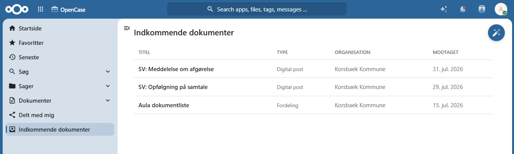

# Indkommende dokumenter

OpenCase kan modtage dokumenter fra flere forskellige kilder.

Hvis et modtaget dokument ikke automatisk kan knyttes til en eksisterende sag, placeres det i listen **Indkommende dokumenter**.

Listen fungerer som en indbakke, hvor dokumenterne kan gennemgås og efterfølgende tilknyttes den korrekte sag.

---

## Kilder til indkommende dokumenter

Dokumenter kan modtages fra forskellige kilder, eksempelvis:

- Digital Post
- E-mail
- Integrationer med andre systemer
- Automatiske importfunktioner

Hvis OpenCase kan identificere den tilhørende sag, bliver dokumentet automatisk oprettet på sagen.

Hvis dette ikke er muligt, placeres dokumentet i **Indkommende dokumenter**.

---

## Oversigt

Listen **Indkommende dokumenter** viser alle dokumenter, der afventer behandling.

For hvert dokument kan du blandt andet se:

- titel
- modtagelsesdato
- dokumenttype

Herfra kan dokumentet åbnes og behandles.

---

## Opret dokument på en sag

Når du har identificeret, hvilken sag dokumentet tilhører, kan dokumentet oprettes på den ønskede sag.

Herefter bliver dokumentet en del af sagens dokumenter og kan behandles på samme måde som øvrige dokumenter.

Hvis sagen endnu ikke findes, kan du først oprette en ny sag og derefter tilknytte dokumentet.

---

## Indbakke

Dokumenter, som ikke automatisk kan knyttes til en eksisterende sag, oprettes på en særlig **indbakke-sag**.

Indbakke-sagen fungerer som en midlertidig placering, indtil dokumentet kan flyttes til den korrekte sag.

Når dokumentet er blevet behandlet, kan det oprettes på den relevante sag og fortsætte den normale sagsbehandling.

!!! info "Administrator"

    En OpenCase-administrator kan konfigurere standardværdier for indbakke-sagen, f.eks. organisation, Følsomhed, KLE-nummer, Handlingsfacet og Indsigtsgrad. Disse værdier anvendes automatisk, når nye dokumenter modtages i indbakken.

---

## God praksis

Det anbefales løbende at gennemgå listen **Indkommende dokumenter**.

På den måde sikres det, at:

- nye dokumenter hurtigt bliver behandlet
- dokumenter bliver knyttet til den korrekte sag
- ingen dokumenter bliver overset

---

## Se også

- [Opret dokument](./dokumenter/opret-dokument.md)
- [Digital post](./dokumenter/digital-post.md)
- [Sager](./sager/index.md)