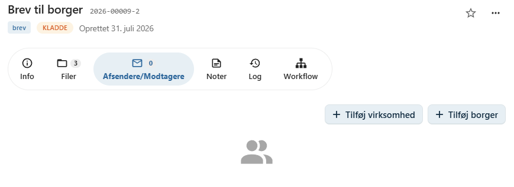
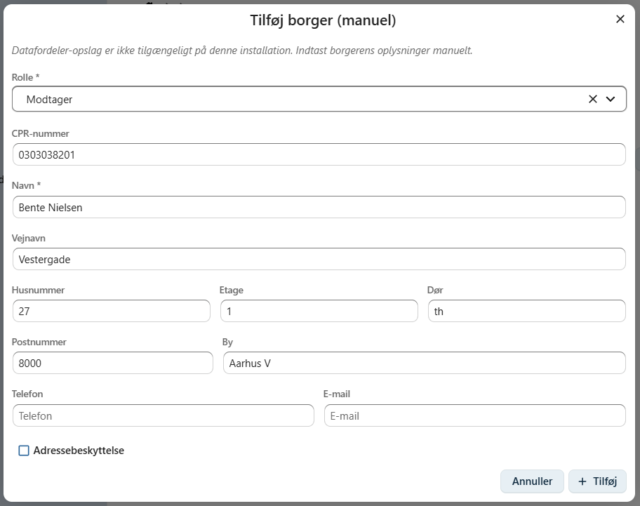
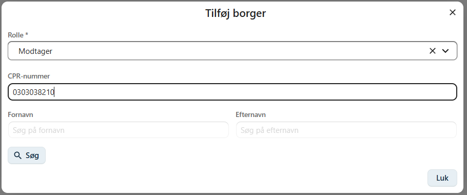
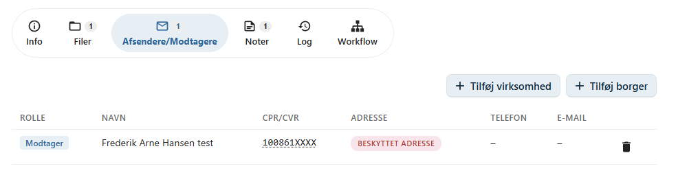
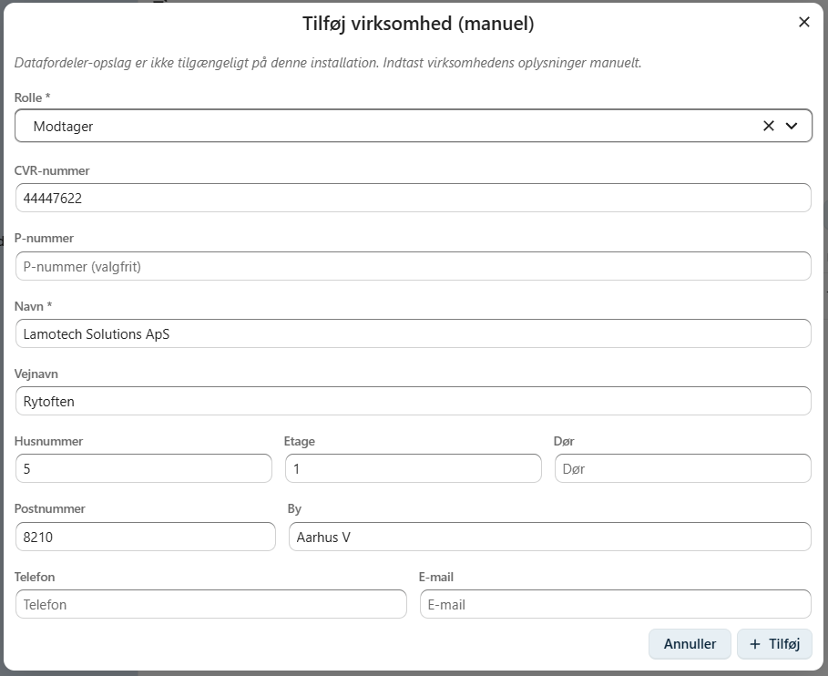
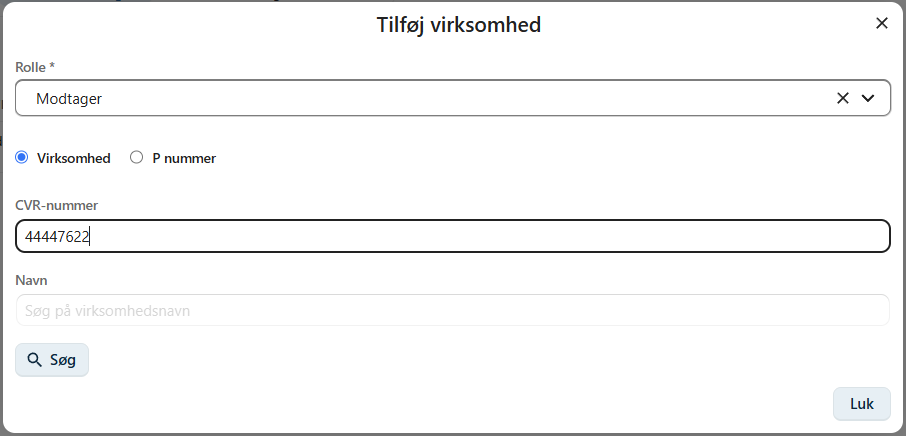

# Afsendere og modtagere

På fanen **Afsendere/modtagere** registreres de personer og virksomheder, som et dokument er sendt fra eller til.

Registreringen gør det muligt at dokumentere dokumentets afsendere og modtagere og gør det lettere at søge og finde dokumenter senere.

En kontakt kan være:

- En borger
- En virksomhed

Et dokument kan have én eller flere afsendere og modtagere.

---

## Tilføj en borger

Klik på **Tilføj borger** for at registrere en borger som afsender eller modtager.

I dialogen skal du vælge kontaktens **rolle** og registrere borgerens oplysninger.

### Roller

En borger kan eksempelvis registreres som:

- Afsender
- Modtager

Afhængigt af organisationens konfiguration kan der være yderligere roller.

### Oplysninger

Du kan registrere blandt andet:

- CPR-nummer
- Navn
- Adresse

!!! info "Enterprise"

    I Enterprise-versionen kan borgere fremsøges direkte i det centrale personregister ved hjælp af **CPR-nummer** eller **navn**.

    Når borgeren vælges, udfyldes oplysningerne automatisk.

    

    Hvis borgeren har **adressebeskyttelse**, registreres dette automatisk.

    

---

## Tilføj en virksomhed

Klik på **Tilføj virksomhed** for at registrere en virksomhed som afsender eller modtager.

I dialogen skal du vælge kontaktens **rolle** og registrere virksomhedens oplysninger.

### Roller

En virksomhed kan registreres som:

- Afsender
- Modtager

### Oplysninger

Du kan registrere:

- CVR-nummer
- Virksomhedsnavn
- Adresse

!!! info "Enterprise"

    I Enterprise-versionen kan virksomheder fremsøges direkte i det centrale virksomhedsregister.

    Du kan søge efter virksomheden ved hjælp af:

    - CVR-nummer
    - P-nummer
    - Virksomhedsnavn

    Når virksomheden vælges, udfyldes oplysningerne automatisk.

    

---

## Flere kontakter

Et dokument kan have flere afsendere og modtagere.

Dette kan eksempelvis være relevant, hvis:

- et brev er sendt til flere modtagere
- et dokument er modtaget fra flere afsendere
- både borgere og virksomheder er involveret i dokumentet

Alle registrerede kontakter vises på fanen **Afsendere/modtagere**.

---

## Se også

- [Opret et dokument](../dokumenter/opret-dokument.md)
- [Upload fil](../dokumenter/upload-fil.md)
- [Workflow](../dokumenter/workflow.md)