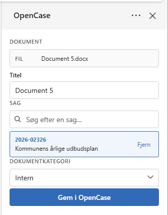
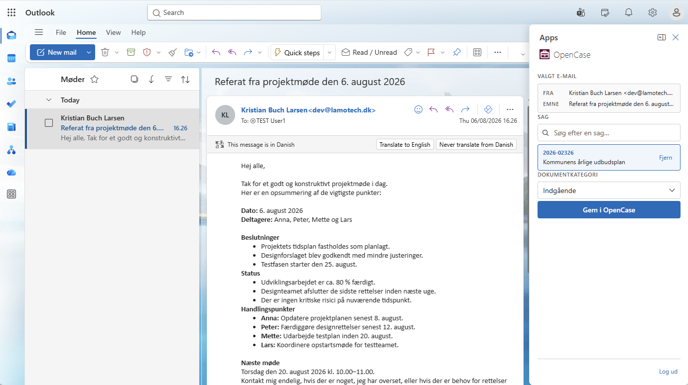
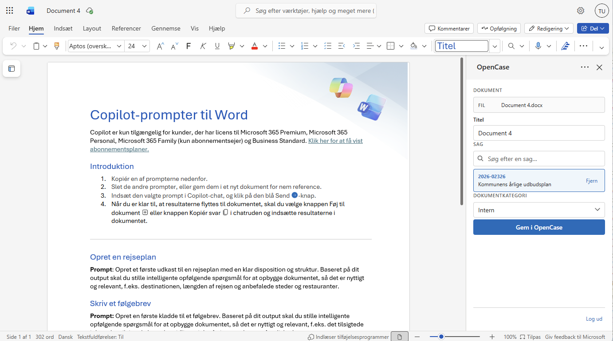
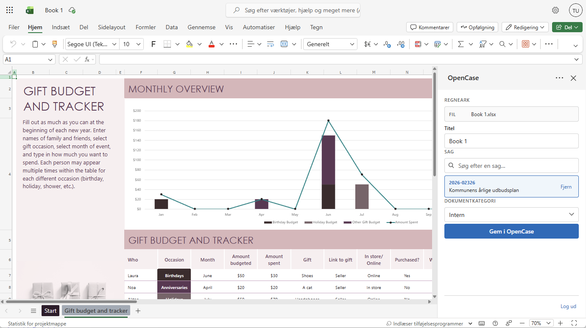
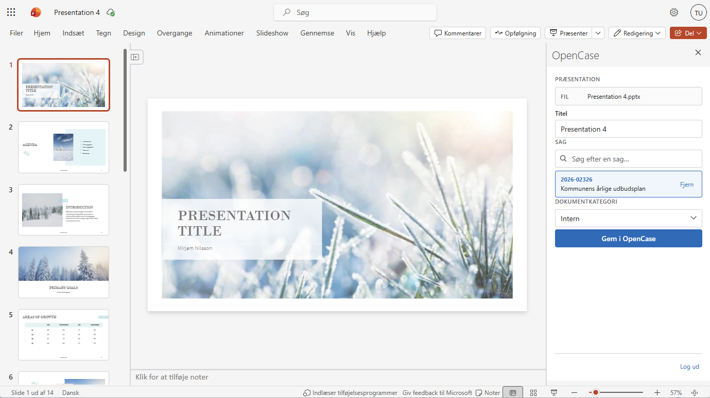

# Microsoft Office

OpenCase integrerer med både **Nextcloud Office** og **Microsoft Office**, så brugerne kan arbejde i de programmer, de allerede kender.

Som standard anvender OpenCase **Nextcloud Office** til redigering af dokumenter direkte i browseren.

!!! info "Enterprise"
    I **OpenCase Enterprise** kan brugerne desuden arbejde direkte fra Microsoft Outlook, Word, Excel og PowerPoint ved hjælp af OpenCase Office-apps.

---

# Nextcloud Office

OpenCase benytter **Nextcloud Office** til online redigering af dokumenter.

Nextcloud Office understøtter blandt andet:

- Collabora Online
- EU Office

Dokumenter åbnes direkte fra OpenCase og redigeres i browseren uden at skulle downloades.

Flere brugere kan arbejde i den samme fil samtidig, og ændringer gemmes automatisk som nye filversioner.

---

# Microsoft Office (Enterprise)

!!! info "Enterprise"

    Integrationen med Microsoft Office er en Enterprise-funktion.

    Den giver mulighed for at gemme dokumenter direkte på sager i OpenCase uden først at åbne OpenCase i browseren.

    Appsene tilføjer et **OpenCase-taskpanel**, som kan åbnes direkte i Office-programmerne - både i browser og desktop.

    Herfra kan brugeren:

    - søge efter sager
    - oprette nye sager
    - gemme dokumenter direkte på en sag
    - oprette nye dokumenter

    

    ---

    # Microsoft Outlook

    I Microsoft Outlook kan OpenCase-taskpanelet åbnes for den valgte e-mail.

    Brugeren kan herefter:

    - søge efter en eksisterende sag
    - oprette en ny sag
    - gemme e-mailen som et dokument på sagen

    Når e-mailen gemmes, registreres afsenderen automatisk som kontakt på dokumentet.

    Dette gør det hurtigt at journalisere indgående og udgående e-mails uden at forlade Outlook.

    

    ---

    # Microsoft Word

    Fra Microsoft Word kan det dokument, der arbejdes på, gemmes direkte i OpenCase.

    Brugeren kan vælge at:

    - gemme dokumentet på en eksisterende sag
    - oprette en ny sag og gemme dokumentet her
    - oprette et nyt dokument på sagen

    OpenCase registrerer automatisk dokumentet og opretter den nødvendige dokumentmetadata.

    

    ---

    # Microsoft Excel

    Fra Microsoft Excel kan regneark gemmes direkte på en sag i OpenCase.

    Brugeren kan:

    - vælge en eksisterende sag
    - oprette en ny sag
    - gemme regnearket som et nyt dokument

    Dette gør det nemt at arkivere budgetter, beregninger og øvrige regneark sammen med sagens øvrige dokumenter.

    

    ---

    # Microsoft PowerPoint

    Præsentationer kan ligeledes gemmes direkte fra Microsoft PowerPoint.

    Brugeren kan:

    - vælge en eksisterende sag
    - oprette en ny sag
    - gemme præsentationen som et dokument i OpenCase

    Dermed bliver præsentationen en del af sagens samlede dokumentation.

    

    ---

# Fordele

Integrationen med Office gør det muligt at arbejde i de programmer, brugerne allerede anvender i det daglige.

Det giver blandt andet:

- hurtigere journalisering
- færre manuelle arbejdsgange
- automatisk registrering af dokumenter
- ensartet dokumenthåndtering
- mindre behov for at skifte mellem forskellige systemer

---

# God praksis

Det anbefales at:

- anvende Nextcloud Office til samarbejde om dokumenter i browseren
- anvende Microsoft Office-integrationerne til brugere, der arbejder primært i Office-programmerne
- gemme dokumenter direkte på sagen frem for først at gemme dem lokalt

!!! tip

    Ved at gemme dokumenter direkte fra Office sikres det, at dokumenterne straks bliver journaliseret og versionsstyret i OpenCase.

---

## Se også

- [Opret dokument](../dokumenter/opret-dokument.md)
- [Rediger fil](../dokumenter/rediger-fil.md)
- [Filversioner](../dokumenter/filversioner.md)
- [Administrer skabeloner](../administrator/administrer-skabeloner.md)