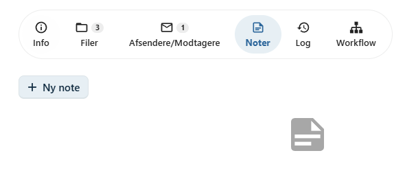
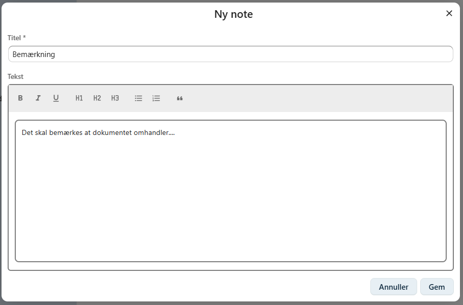
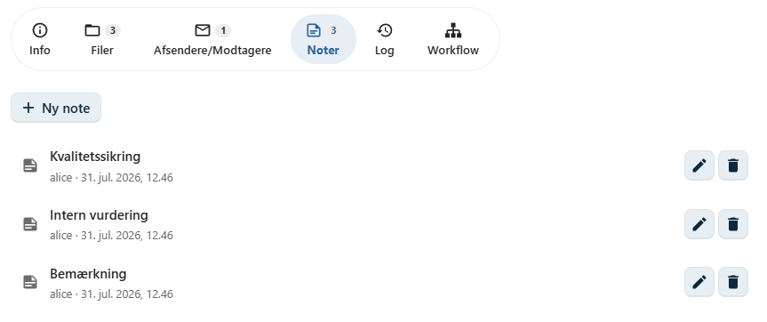

# Noter

På fanen **Noter** kan du oprette interne noter, som er knyttet til dokumentet.

Noter kan bruges til at registrere oplysninger, der er relevante for dokumentets behandling, men som ikke er en del af selve dokumentets indhold.

Eksempler på anvendelse:

- interne bemærkninger
- opfølgningspunkter
- aftaler
- vurderinger
- supplerende oplysninger om dokumentet

Noter er en del af dokumentet og kan ses af brugere, der har adgang til dokumentet.

---

## Opret en note

Noter oprettes på fanen **Noter**.

Klik på **Opret note** for at oprette en ny note.

En note består af:

- **Titel** – en kort beskrivelse af notens indhold.
- **Indhold** – selve noten.

---

## Titel

Titlen bør kort beskrive, hvad noten handler om.

Eksempler:

- Telefonisk aftale
- Afventer svar
- Intern vurdering
- Møde med borger
- Kvalitetssikring

En beskrivende titel gør det lettere at finde den relevante note senere.

---

## Indhold

Indholdsfeltet anvendes til at beskrive de oplysninger, der skal gemmes.

Noten kan indeholde almindelig tekst og bør være kort, præcis og relevant for dokumentets behandling.

!!! tip "God praksis"

    Skriv noter objektivt og præcist. Hvis noten beskriver en hændelse eller en aftale, bør dato og relevante detaljer fremgå tydeligt.

---

## Oversigt over noter

Alle noter vises på fanen **Noter**.

Her kan du hurtigt få et overblik over dokumentets noter og åbne dem for at læse eller redigere indholdet.

---

## Rediger en note

En note kan redigeres, hvis oplysningerne skal opdateres eller suppleres.

Ændringer gemmes på dokumentet og bliver straks tilgængelige for andre brugere med adgang til dokumentet.

---

## Hvornår skal jeg bruge noter?

Noter er velegnede til oplysninger, som vedrører dokumentets behandling, men som ikke hører hjemme i selve dokumentet.

Hvis oplysningerne i stedet beskriver sagens behandling eller sagens forløb, bør de registreres som et **journalnotat** på sagen.

---

## Se også

- [Journalnotater](../sager/journalnotater.md)
- [Workflow](../dokumenter/workflow.md)
- [Dokumentlog](../dokumenter/dokumentlog.md)