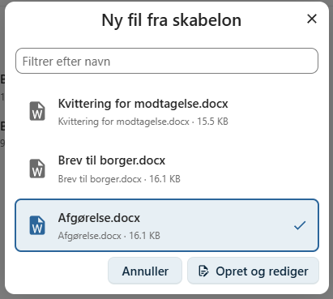

# Ny fil fra skabelon

OpenCase gør det muligt at oprette nye dokumenter ud fra skabeloner.

Ved at anvende skabeloner sikres en ensartet udformning af dokumenter, samtidig med at relevante oplysninger fra sagen og dokumentet automatisk indsættes i filen.

Nye filer oprettes på fanen **Filer** ved at klikke på **Ny fil fra skabelon**.

---

## Vælg en skabelon

Når du vælger **Ny fil fra skabelon**, vises en liste over de skabeloner, du har adgang til.

Hvilke skabeloner der er tilgængelige, afhænger af organisationens konfiguration.

Eksempler på skabeloner kan være:

- Brev
- Afgørelse
- Referat
- Notat
- Kontrakt

Vælg den ønskede skabelon for at oprette en ny fil.

---

## Automatisk udfyldelse

Når filen oprettes, indsætter OpenCase automatisk oplysninger fra sagen og dokumentet i de flettefelter, der er defineret i skabelonen.

Eksempler på oplysninger, der kan udfyldes automatisk, er:

- Sagens titel
- Sagsnummer
- Dokumentets titel
- Dokumentdato
- Organisation
- Ansvarlig sagsbehandler

Hvilke oplysninger der indsættes, afhænger af den valgte skabelon.

!!! info "Flettefelter"

    Skabeloner kan indeholde flettefelter, som automatisk erstattes med de relevante oplysninger fra OpenCase, når filen oprettes.

---

## Rediger filen

Når filen er oprettet, åbnes den i organisationens standardprogram til redigering af dokumenter.

Du kan herefter tilføje eller ændre indholdet, inden dokumentet gemmes.

Den oprettede fil bliver automatisk tilknyttet dokumentet.

---

## Fordele ved skabeloner

Brugen af skabeloner giver en række fordele:

- Ensartet layout og opbygning.
- Automatisk udfyldelse af kendte oplysninger.
- Mindre risiko for fejl.
- Hurtigere oprettelse af dokumenter.
- Ensartet kvalitet på tværs af organisationen.

---

## Administration af skabeloner

Skabeloner administreres af organisationens administrator.

Hvis du mangler en skabelon eller ønsker ændringer til en eksisterende skabelon, skal du kontakte din OpenCase-administrator.

Læs mere i **Administratorvejledningen** under **Administrer skabeloner**.

---

## Se også

- [Administrer skabeloner](../administrator/administrer-skabeloner.md)
- [Upload fil](../dokumenter/upload-fil.md)
- [Rediger fil](../dokumenter/rediger-fil.md)
- [Filversioner](../dokumenter/filversioner.md)