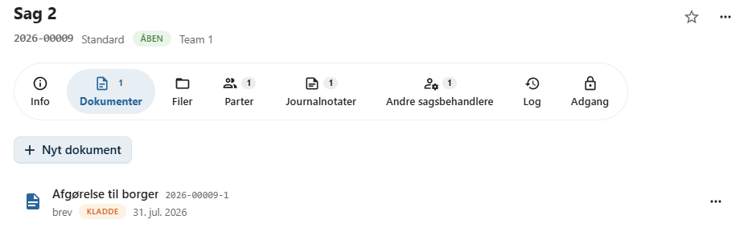
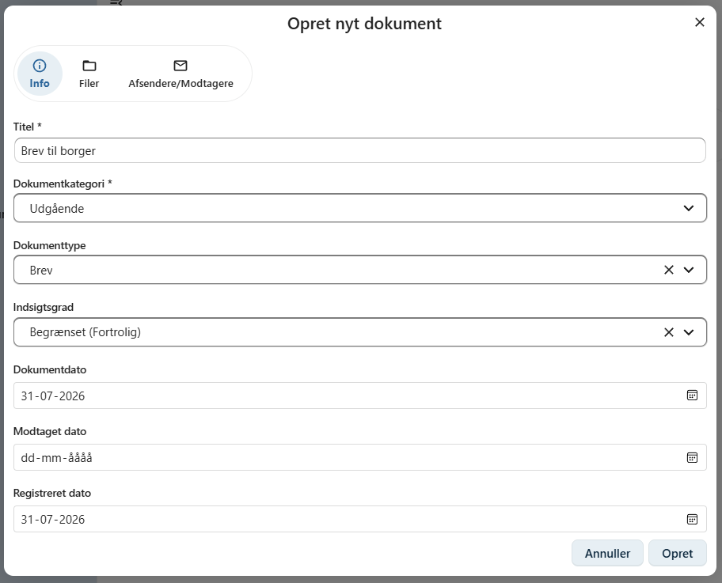
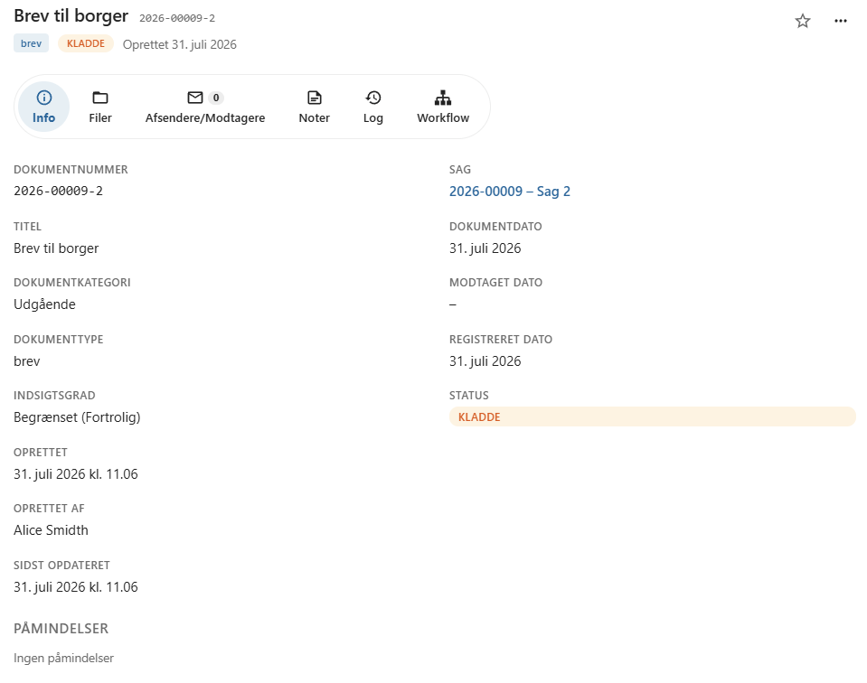

# Opret et dokument

Alle dokumenter i OpenCase tilknyttes en sag.

Et nyt dokument oprettes fra fanen **Dokumenter** på den ønskede sag ved at klikke på **Opret dokument**.

Når dokumentet er oprettet, kan der efterfølgende uploades en fil, oprettes en fil fra en skabelon eller tilføjes flere filer til dokumentet.

---

## Obligatoriske oplysninger

Følgende oplysninger skal udfyldes, før dokumentet kan oprettes.

### Titel

Angiv en kort og beskrivende titel.

Titlen bør gøre det nemt at identificere dokumentet både på sagen og i søgeresultater.

### Dokumentkategori

Vælg den kategori, som bedst beskriver dokumentets rolle i sagen.

Der kan vælges mellem:

| Dokumentkategori | Beskrivelse |
|------------------|-------------|
| **Indgående** | Dokumenter modtaget udefra, f.eks. breve, e-mails eller ansøgninger. |
| **Udgående** | Dokumenter, der sendes fra organisationen til borgere, virksomheder eller andre modtagere. |
| **Intern** | Dokumenter, der udelukkende anvendes internt i organisationen. |

Dokumentkategorien anvendes blandt andet til journalisering og registrering.

---

## Øvrige oplysninger

### Dokumenttype

Dokumenttypen bruges til at klassificere dokumentet yderligere.

Hvilke dokumenttyper der kan vælges, afhænger af organisationens konfiguration.

Eksempler kan være:

- Brev
- Notat
- Kontrakt
- Referat
- Afgørelse

### Indsigtsgrad

Indsigtsgraden angiver, hvor fortroligt dokumentet er.

Der kan vælges mellem:

| Indsigtsgrad | Beskrivelse |
|--------------|-------------|
| **Åben** | Dokumentet er offentligt. |
| **Intern** | Dokumentet er kun til internt brug. |
| **Begrænset** | Dokumentet er fortroligt og adgangen er begrænset. |
| **Lukket** | Dokumentet indeholder stærkt fortrolige eller personlige oplysninger. |

Vælg den indsigtsgrad, der passer til dokumentets indhold og organisationens retningslinjer.

### Dokumentdato

Angiver dokumentets dato.

Feltet udfyldes automatisk med dags dato, men kan ændres efter behov.

### Registreret dato

Angiver, hvornår dokumentet er registreret i OpenCase.

Feltet udfyldes automatisk med dags dato.

### Modtaget dato

For **indgående dokumenter** kan du angive den dato, hvor dokumentet blev modtaget.

Dette felt anvendes normalt ikke for udgående eller interne dokumenter.

---

## Når dokumentet er oprettet

Når dokumentet er oprettet, kan du blandt andet:

- uploade en eksisterende fil
- oprette en ny fil fra en skabelon
- redigere dokumentets oplysninger
- tilføje kontakter
- registrere noter
- starte et workflow
- dele dokumentet

Dokumentet kan desuden indeholde flere filversioner, hvis dokumentet ændres over tid.

---

## Dokumentets opbygning

Når dokumentet er oprettet, åbnes dokumentets oversigt.

Dokumentets oplysninger er opdelt på en række faner, som gør det nemt at arbejde med dokumentets indhold og følge dets historik. Hver fane samler de funktioner og oplysninger, der hører til dokumentet.

Afhængigt af dokumenttype og organisationens konfiguration kan følgende faner være tilgængelige:

| Fane | Beskrivelse |
|-------|-------------|
| **Filer** | Vis, upload og administrer de filer, der hører til dokumentet, herunder filversioner. |
| **Afsendere/modtagere** | Registrer dokumentets afsendere og modtagere, f.eks. borgere, virksomheder eller myndigheder. |
| **Noter** | Tilføj interne noter vedrørende dokumentet. |
| **Workflow** | Følg dokumentets workflow og udfør de handlinger, der indgår i processen. |
| **Dokumentlog** | Se historikken over handlinger, der er udført på dokumentet. |

De enkelte faner beskrives nærmere i de følgende afsnit af brugervejledningen.

---

## God praksis

Det anbefales at:

- anvende en beskrivende titel
- vælge den korrekte dokumentkategori
- kontrollere dokumentets indsigtsgrad
- registrere relevante datoer

Korrekt registrering gør det lettere at finde dokumentet senere og sikrer en ensartet journalisering.

---

## Se også

- [Upload fil](../dokumenter/upload-fil.md)
- [Ny fil fra skabelon](../dokumenter/ny-fil-fra-skabelon.md)
- [Filversioner](../dokumenter/filversioner.md)
- [Workflow](../dokumenter/workflow.md)