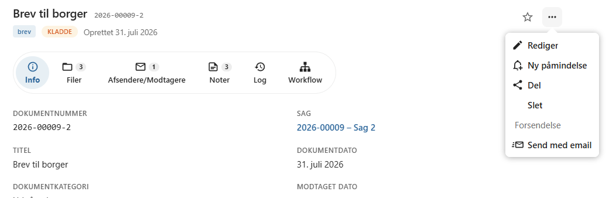
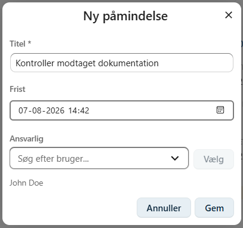
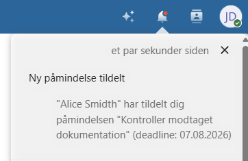
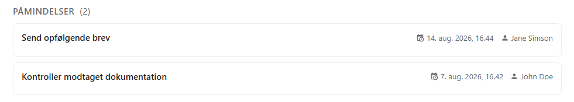
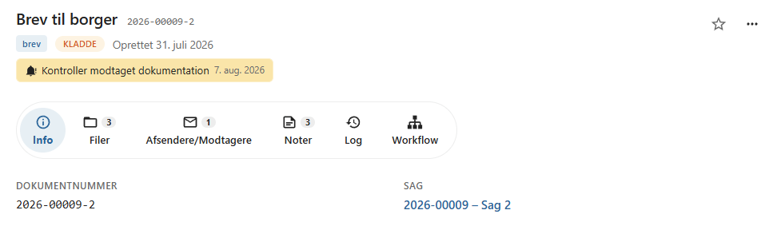
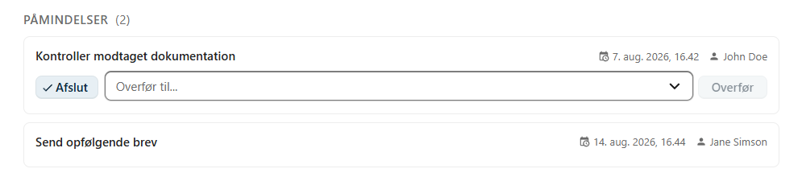

# Påmindelser

Påmindelser gør det muligt at følge op på et dokument på et bestemt tidspunkt.

En påmindelse kan tildeles en bruger med en frist, så det er tydeligt, hvem der har ansvaret for den næste handling.

Påmindelser er velegnede til opgaver som eksempelvis opfølgning på henvendelser, manglende svar eller kommende deadlines.

---

## Opret en påmindelse

Åbn dokumentets **kontekstmenu** og vælg **Ny påmindelse**.

Der åbnes en dialog, hvor påmindelsen oprettes.

---

## Oplysninger

Ved oprettelse af en påmindelse angives følgende oplysninger:

- **Titel** – en kort beskrivelse af opgaven.
- **Frist** – datoen, hvor opgaven skal være udført.
- **Ansvarlig bruger** – den bruger, som skal følge op på påmindelsen.

Titlen bør kort beskrive, hvilken handling der skal udføres.

Eksempler:

- Ring til borger
- Afvent svar
- Send opfølgende brev
- Kontroller modtaget dokumentation

---

## Notifikation

Når påmindelsen oprettes, modtager den ansvarlige bruger automatisk en notifikation i Nextcloud.

Notifikationen gør det nemt at åbne dokumentet og udføre den opgave, som påmindelsen vedrører.

---

## Oversigt over påmindelser

Alle aktive påmindelser kan ses på dokumentets **Info**-fane.

Her vises en oversigt over dokumentets kommende påmindelser.

Den påmindelse med den nærmeste frist vises desuden direkte i dokumentets header, så den er synlig, når dokumentet åbnes.

---

## Afslut en påmindelse

Når opgaven er udført, kan den ansvarlige bruger vælge **Afslut**.

Den afsluttede påmindelse markeres som gennemført og indgår ikke længere blandt dokumentets aktive påmindelser.

---

## Overdrag en påmindelse

Hvis en anden bruger skal overtage opgaven, kan påmindelsen **overdrages**.

Den nye ansvarlige bruger modtager herefter en notifikation i Nextcloud og bliver ansvarlig for den videre opfølgning.

---

## God praksis

Påmindelser kan blandt andet bruges til:

- opfølgning på henvendelser
- kontrol af manglende svar
- opfølgning på aftaler
- overholdelse af interne frister
- planlægning af næste trin i sagsbehandlingen

!!! tip

    Giv påmindelser en beskrivende titel og en realistisk frist. Det gør det lettere for den ansvarlige bruger at prioritere sine opgaver.

---

## Se også

- [Workflow](../dokumenter/workflow.md)
- [Noter](../dokumenter/noter.md)
- [Dokumentlog](../dokumenter/dokumentlog.md)