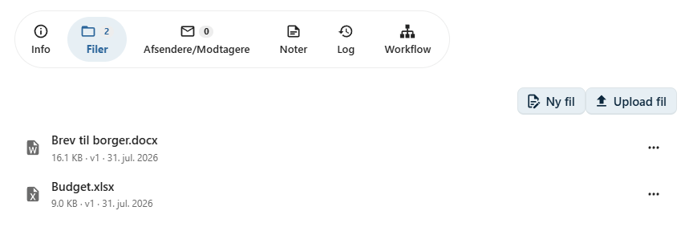
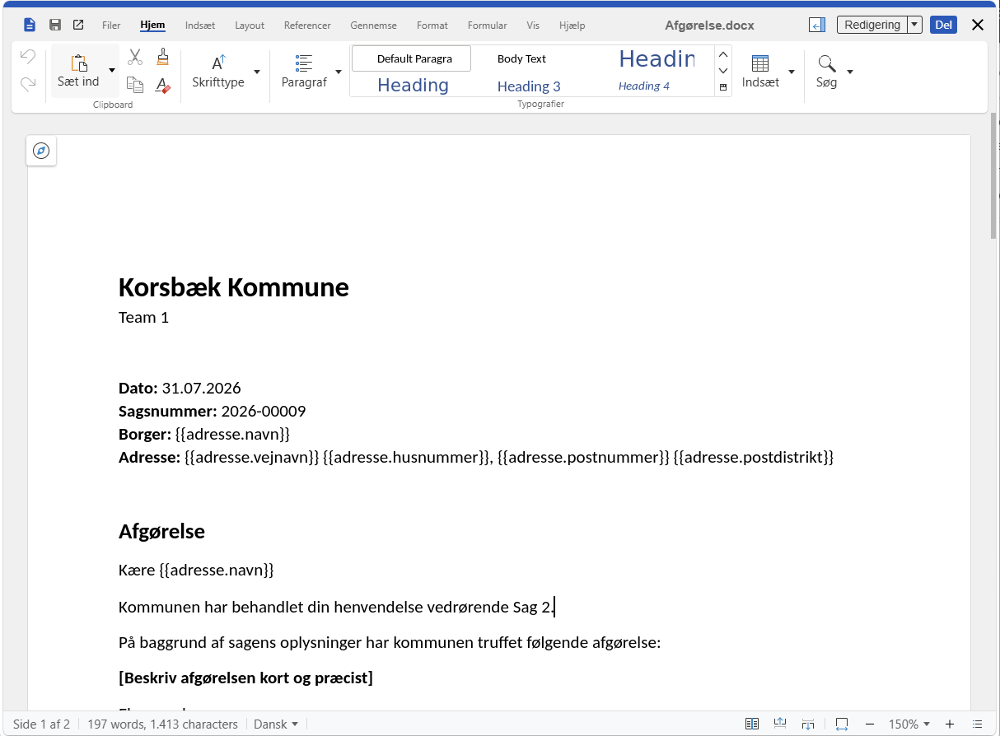

# Rediger en fil

Filer, der er tilknyttet et dokument, kan redigeres direkte i browseren.

For at åbne en fil skal du gå til dokumentets **Filer**-fane og klikke på den ønskede fil.

Filen åbnes i organisationens Office-program i browseren, hvor indholdet kan redigeres uden at downloade filen til din computer.

---

## Rediger i browseren

Når filen er åbnet, kan du arbejde med den på samme måde som i et almindeligt tekstbehandlings- eller regnearksprogram.

Du kan blandt andet:

- skrive og redigere tekst
- formatere indhold
- indsætte tabeller og billeder
- gemme ændringer

Ændringer gemmes løbende, så du normalt ikke behøver at gemme dokumentet manuelt.

---

## Samtidig redigering

Flere brugere kan redigere den samme fil samtidig.

Alle brugere arbejder i den samme version af dokumentet, og ændringer bliver løbende synlige for de øvrige brugere.

Dette gør det nemt at samarbejde om eksempelvis:

- breve
- referater
- notater
- afgørelser

!!! info "Samarbejde i realtid"

    Når flere brugere redigerer den samme fil samtidig, vises ændringerne løbende, så alle arbejder i det samme dokument.

---

## Filversioner

Hver gang en fil ændres, gemmes ændringerne som en **ny filversion**.

Det betyder, at tidligere versioner af filen bevares og kan vises eller gendannes efter behov.

Versioneringen gør det muligt at:

- se dokumentets udvikling
- sammenligne tidligere versioner
- gendanne en tidligere version, hvis det bliver nødvendigt

Læs mere i afsnittet [Filversioner](../dokumenter/filversioner.md).

---

## Låsning under redigering

Hvis en anden bruger allerede har filen åben, kan du som udgangspunkt stadig åbne og redigere den.

OpenCase understøtter samtidig redigering, så flere brugere kan arbejde i den samme fil uden at oprette kopier.

---

## God praksis

Ved samarbejde om dokumenter anbefales det at:

- aftale ansvarsfordelingen mellem sagsbehandlerne
- gennemgå dokumentet, inden det sendes eller afsluttes
- benytte filversioner, hvis der foretages større ændringer

Det gør det lettere at bevare overblikket over dokumentets udvikling.

---

## Se også

- [Upload fil](../dokumenter/upload-fil.md)
- [Ny fil fra skabelon](../dokumenter/ny-fil-fra-skabelon.md)
- [Filversioner](../dokumenter/filversioner.md)