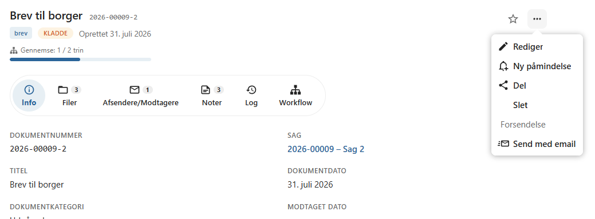
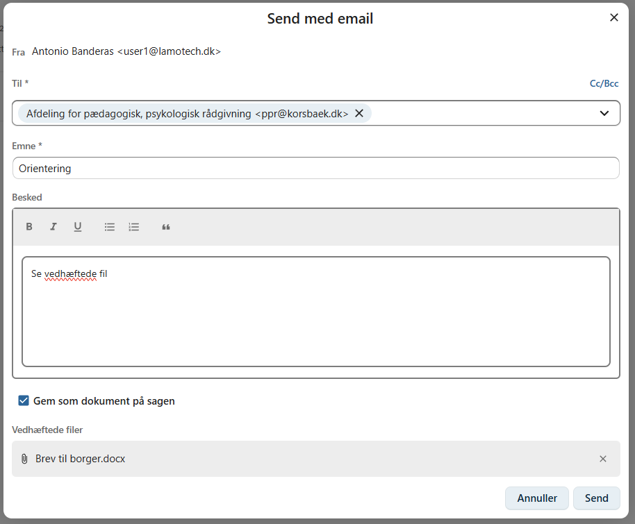

# Send med e-mail

Et dokument kan sendes som e-mail direkte fra OpenCase.

Når du sender et dokument med e-mail, vedhæftes dokumentets filer automatisk, så de kan sendes til en eller flere modtagere.

---

## Send et dokument

Åbn dokumentets **kontekstmenu** og vælg **Send med e-mail**.

Der åbnes en dialog, hvor e-mailen kan udfyldes.

---

## Modtagere

Tilføj én eller flere modtagere ved at indtaste deres e-mailadresse.

Du kan tilføje flere adresser, hvis e-mailen skal sendes til flere personer eller organisationer.

---

## Emne

Angiv e-mailens emne.

Et tydeligt emne gør det lettere for modtageren at identificere indholdet.

Eksempel:

- Vedrørende din ansøgning
- Referat fra møde
- Afgørelse i din sag

---

## Besked

Skriv den tekst, som skal vises i selve e-mailen.

Her kan du eksempelvis:

- præsentere de vedhæftede dokumenter
- give modtageren en kort forklaring
- oplyse om eventuelle frister
- angive kontaktoplysninger

---

## Vedhæftede filer

Dokumentets filer vedhæftes automatisk e-mailen.

Hvis dokumentet indeholder flere filer, vedhæftes de alle.

Du behøver derfor ikke manuelt at vælge de filer, der skal sendes.

!!! info

    De vedhæftede filer sendes som de filer, der er tilknyttet dokumentet på afsendelsestidspunktet.

---

## Gem e-mailen på sagen

Du kan vælge, om den afsendte e-mail skal gemmes som et **nyt dokument** på sagen.

Når denne funktion er valgt:

- gemmes e-mailens emne og indhold
- de afsendte vedhæftede filer registreres
- e-mailen bliver en del af sagens dokumentation

Dette gør det nemt at dokumentere al udgående korrespondance.

!!! tip

    Det anbefales at gemme afsendte e-mails på sagen, hvis de indgår i sagsbehandlingen eller kan få betydning senere.

---

## Send e-mailen

Når oplysningerne er udfyldt, klikker du på **Send**.

OpenCase sender e-mailen med de vedhæftede filer til de angivne modtagere.

---

## Hvornår bør e-mail anvendes?

E-mail er velegnet, når dokumenter skal sendes til modtagere, som ikke modtager Digital Post, eller når kommunikationen ikke kræver afsendelse via Digital Post.

Hvis dokumentet skal sendes til en borger eller virksomhed via den offentlige Digital Post-løsning, bør du i stedet anvende **Digital post**.

---

## Se også

- [Digital post](../dokumenter/digital-post.md)
- [Afsendere og modtagere](../dokumenter/kontakter.md)
- [Dokumentlog](../dokumenter/dokumentlog.md)