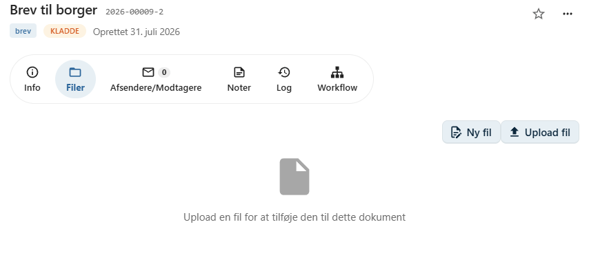

# Upload en fil

Et dokument i OpenCase kan indeholde én eller flere filer.

Filer uploades på fanen **Filer** på dokumentet ved at klikke på **Upload fil**.

Når filen er uploadet, bliver den tilknyttet dokumentet og kan efterfølgende åbnes, redigeres og deles med andre brugere, afhængigt af deres rettigheder.

---

## Upload en fil

Klik på **Upload fil** for at vælge en fil fra din computer.

Vælg den ønskede fil, og bekræft uploaden.

Den uploadede fil bliver herefter tilknyttet dokumentet og vises på fanen **Filer**.

---

## Flere filer på samme dokument

Et dokument kan have **flere filer** tilknyttet.

Det kan eksempelvis være relevant, hvis dokumentet består af:

- et hoveddokument
- bilag
- billeder
- tegninger
- regneark
- øvrige tilhørende filer

Alle filer samles under det samme dokument, så de er nemme at finde.

---

## Oversigt over filer

Fanen **Filer** viser alle filer, der er tilknyttet dokumentet.

For hver fil kan du blandt andet se:

- filnavn
- filtype
- størrelse
- seneste ændring

Herfra kan du også åbne eller hente filerne, afhængigt af dine rettigheder.

---

## Filversioner

Hvis en fil ændres, kan der oprettes en ny version uden at miste de tidligere versioner.

Det gør det muligt at følge dokumentets udvikling over tid og om nødvendigt vende tilbage til en tidligere version.

Læs mere i afsnittet [Filversioner](../dokumenter/filversioner.md).

---

## God praksis

For at gøre dokumenter nemme at administrere anbefales det at:

- anvende sigende filnavne
- samle alle relevante bilag under det samme dokument
- undgå at oprette flere dokumenter, hvis filerne naturligt hører sammen

Det giver et bedre overblik og gør det lettere at finde de relevante oplysninger senere.

---

## Se også

- [Ny fil fra skabelon](../dokumenter/ny-fil-fra-skabelon.md)
- [Filversioner](../dokumenter/filversioner.md)
- [Rediger fil](../dokumenter/rediger-fil.md)