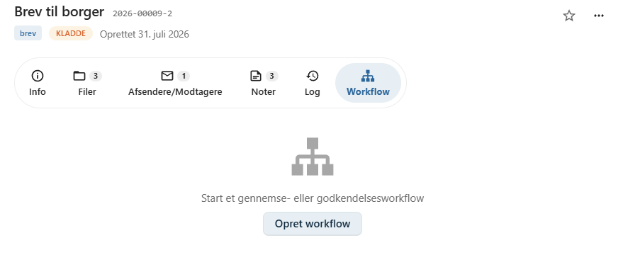
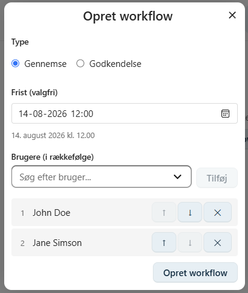
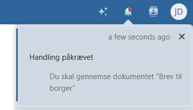
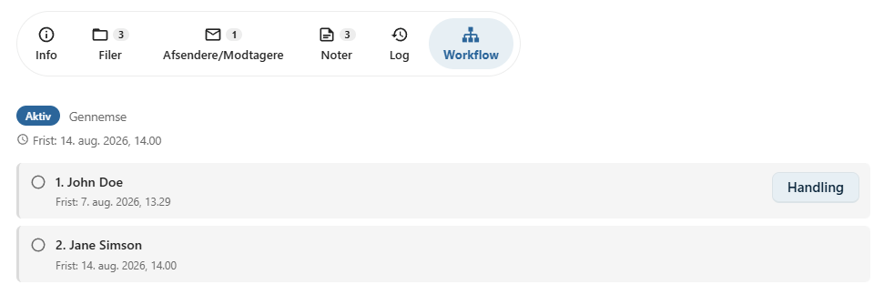
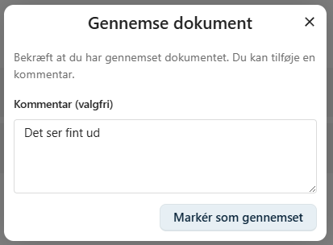
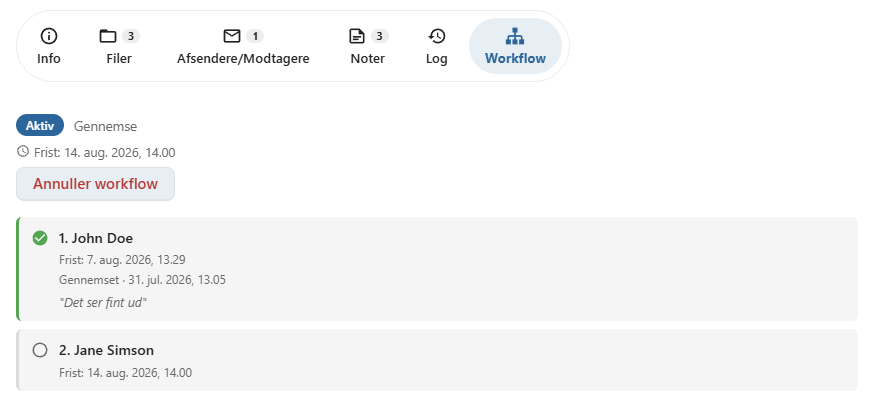

# Workflow

På fanen **Workflow** kan du oprette et workflow for et dokument.

Et workflow bruges til at sende dokumentet gennem en fastlagt proces, hvor en eller flere brugere gennemser eller godkender dokumentet, inden det færdiggøres.

Workflowet hjælper med at sikre, at dokumenter bliver behandlet i den ønskede rækkefølge, og at de relevante personer involveres.

---

## Opret et workflow

Åbn dokumentets **Workflow**-fane og vælg **Opret workflow**.

Herefter vælges workflowets type og de brugere, som skal behandle dokumentet.

---

## Workflowtyper

Der findes to typer workflow.

### Gennemse

Et **Gennemse**-workflow anvendes, når dokumentet skal læses eller kommenteres, inden arbejdet fortsætter.

Typiske anvendelser er:

- faglig gennemgang
- kvalitetssikring
- korrekturlæsning
- intern sparring

### Godkendelse

Et **Godkendelse**-workflow anvendes, når dokumentet skal godkendes, før det kan sendes eller færdiggøres.

Dette bruges eksempelvis ved:

- ledelsesgodkendelse
- juridisk godkendelse
- endelig kvalitetssikring

---

## Tilføj deltagere

Du kan tilføje én eller flere brugere til workflowet.

Brugerne behandles **i den rækkefølge**, de er angivet.

Når en bruger har afsluttet sin behandling, sendes workflowet automatisk videre til den næste bruger.

!!! info

    Brugere, der tilføjes til et workflow, får automatisk adgang til dokumentet, så de kan udføre deres opgave.

---

## Notifikationer

Når det bliver en brugers tur til at behandle dokumentet, modtager vedkommende automatisk en notifikation i Nextcloud.

Notifikationen gør det nemt at åbne dokumentet og fortsætte workflowet.

Ved at klikke på Handling knappen kan brugeren markere dokumentet som gennemlæst eller godkendt/afvist.

Det er også muligt at skrive en kommentar

---

## Frist for workflow

Der kan angives en samlet frist for, hvornår workflowet skal være afsluttet.

OpenCase fordeler automatisk den tilgængelige tid mellem workflowets deltagere.

Hver bruger får derfor sin egen individuelle frist, som beregnes ud fra en forholdsmæssig del af den samlede tidsperiode.

Eksempel:

| Samlet frist | Deltagere | Individuel frist |
|--------------|-----------|------------------|
| 6 dage | 3 brugere | Ca. 2 dage pr. bruger |
| 8 dage | 4 brugere | Ca. 2 dage pr. bruger |

Den enkelte bruger kan derfor se, hvornår vedkommendes behandling senest bør være afsluttet.

!!! tip

    Angiv en realistisk samlet frist, så alle deltagere får tilstrækkelig tid til at behandle dokumentet.

---

## Workflowets status

På fanen **Workflow** kan du følge workflowets aktuelle status.

Her kan du blandt andet se:

- hvilken type workflow der er oprettet
- hvilke brugere der deltager
- hvem der aktuelt behandler dokumentet
- hvilke trin der er gennemført
- den samlede frist

Det giver et hurtigt overblik over dokumentets behandlingsforløb.

---

## Hvornår bør workflow anvendes?

Workflow er særligt nyttigt, når dokumenter skal behandles af flere personer, eller når organisationen har faste procedurer for gennemgang eller godkendelse.

Eksempler:

- Et brev skal kvalitetssikres af en kollega.
- En afgørelse skal godkendes af en leder.
- Et notat skal gennemlæses af flere fagpersoner, inden det færdiggøres.

---

## Se også

- [Rediger fil](../dokumenter/rediger-fil.md)
- [Noter](../dokumenter/noter.md)
- [Dokumentlog](../dokumenter/dokumentlog.md)