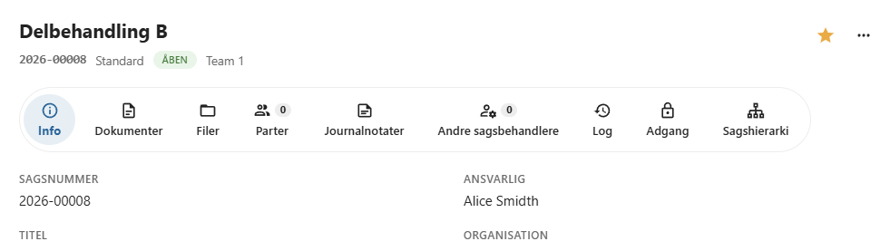
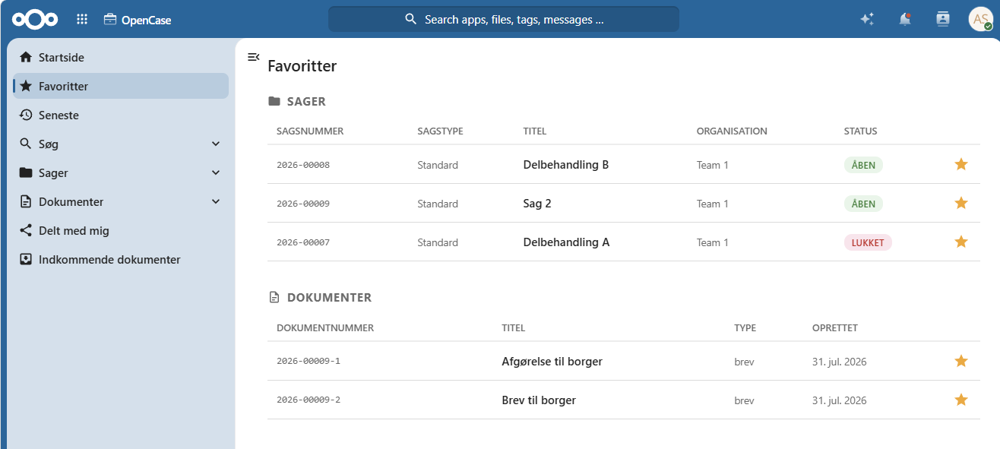

# Favoritter

Favoritter gør det nemt at finde de sager og dokumenter, du arbejder med ofte.

Ved at markere en sag eller et dokument som favorit kan du hurtigt åbne det igen uden først at skulle søge efter det.

Favoritter er personlige og er kun synlige for dig.

---

## Tilføj en favorit

Du kan tilføje både **sager** og **dokumenter** til dine favoritter.

Åbn den ønskede sag eller det ønskede dokument, og klik på **favoritstjernen** i detaljevisningen.

Når stjernen er markeret, er sagen eller dokumentet tilføjet til dine favoritter.

---

## Vis favoritter

Alle dine favoritter vises i menuen **Favoritter**.

Her finder du en samlet liste over de sager og dokumenter, du har markeret som favoritter.

Du kan åbne en sag eller et dokument direkte fra listen.

---

## Fjern en favorit

Hvis du ikke længere ønsker at gemme en sag eller et dokument som favorit, klikker du igen på **favoritstjernen**.

Elementet fjernes straks fra dine favoritter.

Du kan altid tilføje det igen senere.

---

## Personlige favoritter

Favoritter er knyttet til den enkelte bruger.

Det betyder, at:

- dine favoritter kun er synlige for dig
- andre brugeres favoritter påvirkes ikke
- du frit kan tilføje og fjerne favoritter efter behov

!!! tip

    Tilføj de sager og dokumenter, du arbejder mest med, som favoritter. Det gør det hurtigere at vende tilbage til dem i det daglige arbejde.

---

## Hvornår er favoritter nyttige?

Favoritter kan blandt andet bruges til:

- aktive sager
- dokumenter, der redigeres ofte
- sager, der afventer opfølgning
- dokumenter, der skal følges over en længere periode

---

## Se også

- [Sager](./sager/index.md)
- [Dokumenter](./dokumenter/index.md)
- [Søgning](./soegning/index.md)