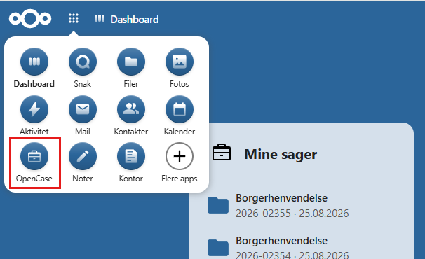
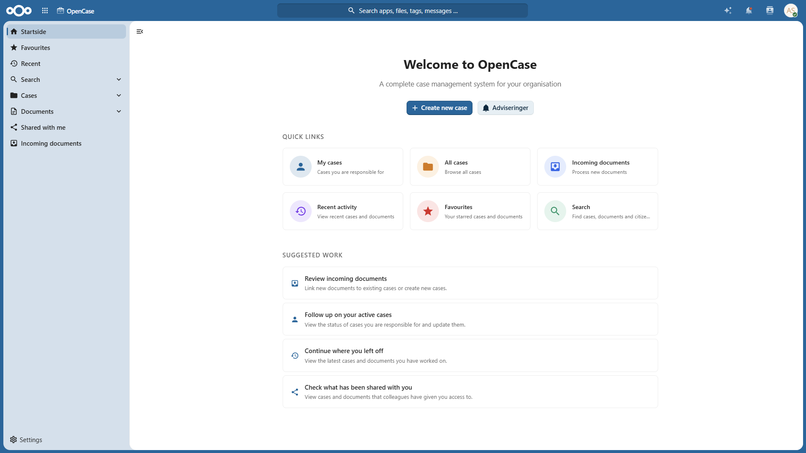

# Kom godt i gang

Velkommen til **OpenCase**.

OpenCase er et sags- og dokumenthåndteringssystem, der er udviklet som en app til Nextcloud. Systemet gør det nemt at samle sager, dokumenter og kommunikation ét sted, så information er let at finde og dele.

Denne vejledning beskriver de funktioner, som almindelige brugere anvender i det daglige. Installation og konfiguration af OpenCase er beskrevet i **Administratorvejledningen**.

---

## OpenCases opbygning

OpenCase består af nogle få centrale elementer, som hænger tæt sammen.

### Sager

En sag er udgangspunktet for arbejdet i OpenCase.

En sag kan f.eks. omhandle:

- En administrativ opgave
- En borger
- En virksomhed
- En medarbejder

En sag samler alle relevante oplysninger ét sted.

Typisk vil en sag indeholde:

- Dokumenter
- Journalnotater
- Parter
- Andre sagsbehandlere
- Påmindelser

---

### Dokumenter

Alle dokumenter knyttes til en sag.

Typisk vil et dokument indeholde:

- Filer
- Kontakter
- Noter

Filerne på dokumentet versionsstyres og kan deles med andre brugere

---

### Kontakter

Kontakter kan være borgere eller virksomheder.

En kontakt kan tilknyttes én eller flere sager og dokumenter.

---

### Søgning

OpenCase indeholder en omfattende søgefunktion, så du hurtigt kan finde:

- Sager
- Dokumenter
- Filindhold
- Borgere
- Virksomheder

---

### Startsiden

Startsiden giver et overblik over dine aktuelle aktiviteter:

- Mine sager
- Egne opgaver
- Påmindelser
- Favoritter

---

## En typisk arbejdsgang

En almindelig arbejdsgang kan se således ud:

1. Opret en ny sag.
2. Tilføj relevante parter.
3. Opret dokumenter og tilknyt filer.
4. Registrer journalnotater under sagens behandling.
5. Del dokumenter eller send digital post efter behov.
6. Afslut sagen, når arbejdet er færdigt.

---

## Roller og rettigheder

De funktioner, du har adgang til, afhænger af de rettigheder, som administratoren har tildelt dig.

Hvis du mangler adgang til en funktion eller en sag, skal du kontakte din OpenCase-administrator.

---

## Hjælp

Denne dokumentation er opdelt efter funktioner.

Hvis du vil lære mere om et bestemt emne, kan du fortsætte til:

- [Sager](./sager/index.md)
- [Dokumenter](./dokumenter/index.md)
- [Favoritter](./favoritter.md)
- [Søgning](./soegning/index.md)
- [Indkommende dokumenter](./dokumenter/indkommende-dokumenter.md)
- [AI-assistent](./aI-assistent.md)