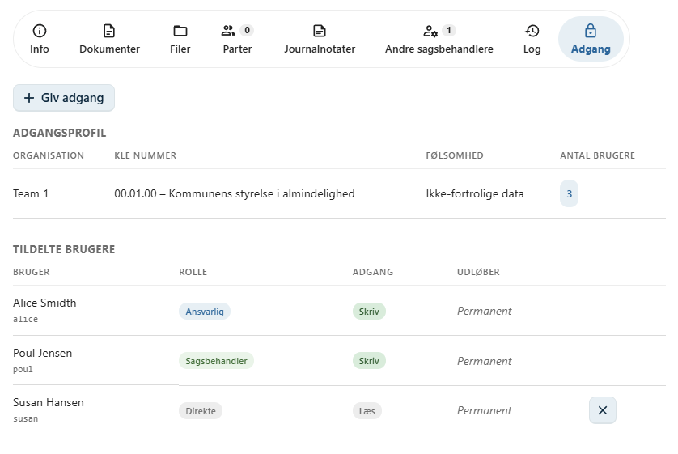
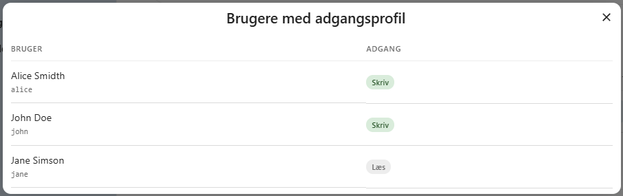
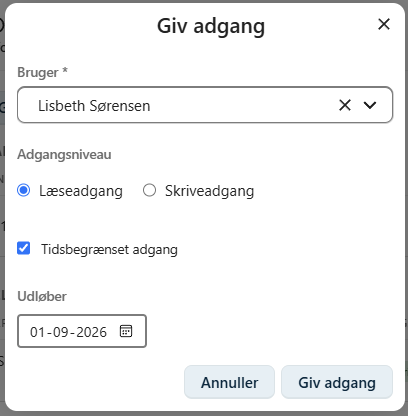

# Adgang

Adgangen til sager og dokumenter i OpenCase styres via den **fælleskommunale adgangsstyring**.

Hvem der har adgang til en sag afhænger af brugerens tildelte jobfunktionsroller samt sagens adgangsprofil.

Adgangsprofilen bestemmes af en kombination af:

- Organisation
- KLE-nummer
- Følsomhed

Denne model sikrer, at brugere kun får adgang til de sager, som de har behov for i deres arbejde.

---

## Sagens adgangsprofil

På fanen **Adgang** kan du se sagens adgangsprofil.

Adgangsprofilen består af:

- **Organisation** – den organisation sagen tilhører.
- **KLE-nummer** – sagens klassifikation.
- **Følsomhed** – sagens højeste klassificering af oplysninger.

Disse oplysninger anvendes af adgangsstyringen til at afgøre, hvilke brugere der automatisk har adgang til sagen.

---

## Se hvem der har adgang

Klik på sagens **adgangsprofil** for at åbne en oversigt over de brugere, som har adgang til sagen.

Dialogen viser de brugere, der har adgang via den fælleskommunale adgangsstyring på baggrund af sagens adgangsprofil.

Denne oversigt gør det nemt at kontrollere, hvilke brugere der automatisk har adgang til sagen.

---

## Giv midlertidig adgang

Hvis en bruger skal have adgang til en sag uden at opfylde adgangsprofilens kriterier, kan der gives en individuel adgang.

Klik på **Giv adgang**.

Herefter kan du:

1. Søge efter den ønskede bruger.
2. Vælge adgangsniveau.
3. Eventuelt angive en udløbsdato.

### Adgangsniveau

Der kan gives:

- **Læseadgang** – brugeren kan se sagen og dens dokumenter.
- **Skriveadgang** – brugeren kan både se og redigere sagen samt dens dokumenter, afhængigt af øvrige rettigheder.

### Tidsbegrænset adgang

Du kan vælge en dato, hvor den midlertidige adgang automatisk udløber.

Dette er nyttigt, hvis en bruger kun skal have adgang til sagen i en begrænset periode, eksempelvis:

- under ferieafløsning
- ved midlertidig sagsbehandling
- ved bistand fra en specialist
- ved intern kvalitetssikring

!!! tip "Anbefaling"

    Giv om muligt en udløbsdato, når der oprettes midlertidig adgang. Det hjælper med at sikre, at adgangen automatisk fjernes, når den ikke længere er nødvendig.

---

## Andre sagsbehandlere

Brugere, der tilføjes som **andre sagsbehandlere**, får automatisk **skriveadgang** til sagen.

Det er derfor ikke nødvendigt at give disse brugere adgang manuelt.

Hvis en sagsbehandler fjernes fra sagen, bortfalder den automatiske adgang igen.

Læs mere i afsnittet [Andre sagsbehandlere](../sager/andre-sagsbehandlere.md).

---

## God praksis

Det anbefales, at adgang til sager gives efter princippet om **mindst mulige nødvendige adgang**.

Overvej derfor altid:

- om brugeren har behov for adgang
- om læseadgang er tilstrækkelig
- om adgangen bør tidsbegrænses

Dette bidrager til en sikker håndtering af sager og personoplysninger.

---

## Se også

- [Andre sagsbehandlere](../sager/andre-sagsbehandlere.md)
- [Parter](../sager/parter.md)
- [Opret en sag](../sager/opret-sag.md)