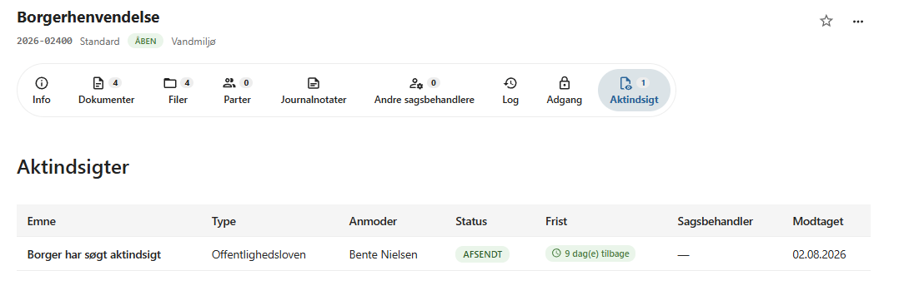
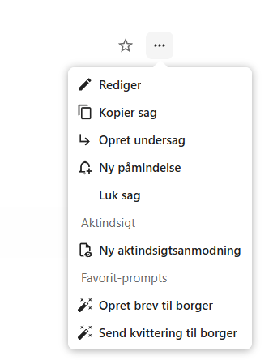
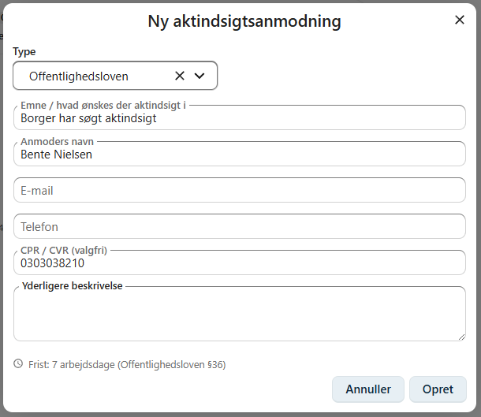
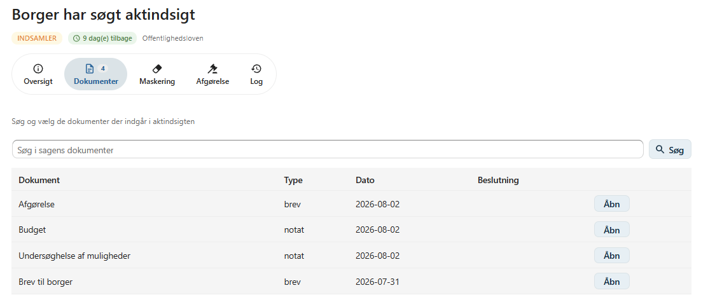
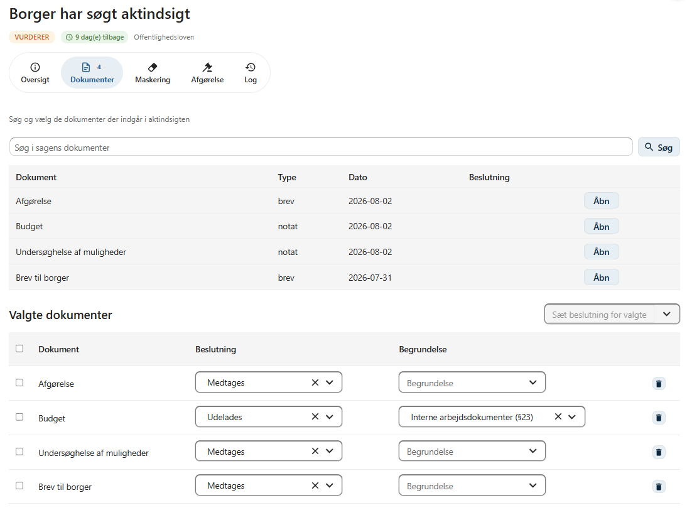
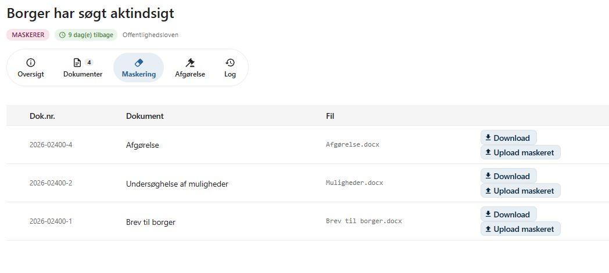
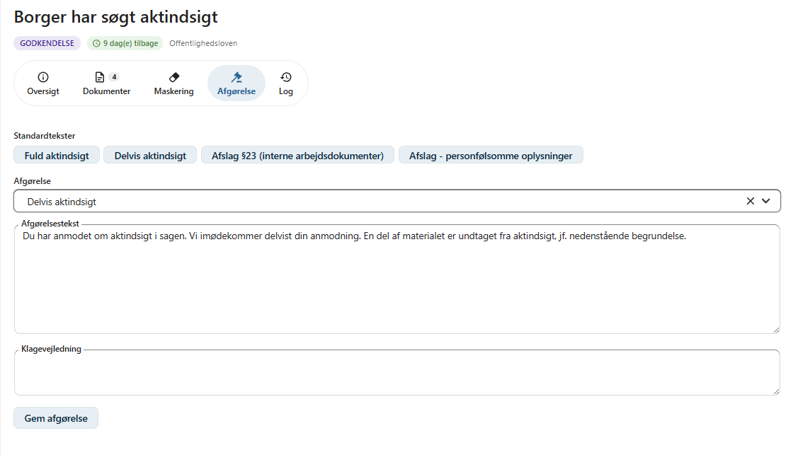
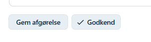
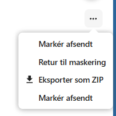
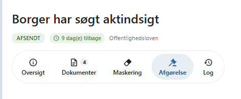

# Aktindsigt

OpenCase understøtter behandling af aktindsigtsanmodninger efter de gældende regler.

En aktindsigtsanmodning behandles på den sag, som anmodningen vedrører. OpenCase understøtter hele processen fra registrering af anmodningen til udvælgelse af dokumenter, vurdering, maskering og udarbejdelse af den endelige aktindsigtspakke.

På sagens **Aktindsigt**-fane kan du se alle aktindsigtsanmodninger, der er registreret på sagen.

---

## Opret en aktindsigtsanmodning

Vælg **Ny aktindsigtsanmodning** i sagens kontekstmenu.

Ved oprettelsen registreres:

- typen af aktindsigt
- oplysninger om anmoder

### Type

Der kan vælges mellem:

- **Offentlighedsloven**
- **Forvaltningsloven**
- **GDPR**

Valget afgør, hvilket regelsæt der danner grundlag for behandlingen af anmodningen.

### Anmoder

Registrér oplysninger om den person eller organisation, der har anmodet om aktindsigt.

Eksempelvis:

- navn
- adresse
- e-mail
- telefonnummer

---

## Behandlingsstatus

En aktindsigtsanmodning gennemgår en række statusser.

Status ændres fra aktindsigtsanmodningens **kontekstmenu**.

| Status | Beskrivelse |
|---------|-------------|
| **Modtaget** | Anmodningen er registreret. |
| **Start indsamling** | Udvælg de dokumenter, der skal indgå i vurderingen. |
| **Start vurdering** | Vurder hvert dokument og beslut, om det skal udleveres. |
| **Start maskering** | Maskér fortrolige oplysninger i dokumenterne. |
| **Send til godkendelse** | Udarbejd afgørelsen og afslut behandlingen. |
| **Afsendt** | Aktindsigten er sendt til anmoder. |

Status giver et hurtigt overblik over, hvor langt behandlingen er.

---

## Indsamling af dokumenter

Når status ændres til **Start indsamling**, udvælges de dokumenter, der er relevante for aktindsigtsanmodningen.

Kun de udvalgte dokumenter indgår i den videre behandling.

---

## Vurdering

Når alle relevante dokumenter er udvalgt, ændres status til **Start vurdering**.

For hvert dokument skal det vurderes, om dokumentet:

- skal medtages i aktindsigten
- skal udelades

Hvis et dokument udelades, kan der angives en begrundelse.

Eksempler på begrundelser kan være:

- Dokumentet er undtaget efter lovgivningen.
- Dokumentet indeholder fortrolige oplysninger.
- Dokumentet er ikke omfattet af anmodningen.

Alle vurderinger registreres som en del af behandlingen.

---

## Maskering

Hvis et dokument indeholder fortrolige oplysninger, kan oplysningerne maskeres, inden dokumentet udleveres.

Eksempler på oplysninger, der ofte maskeres:

- CPR-numre
- kontonumre
- personfølsomme oplysninger
- andre fortrolige oplysninger

Maskering foretages ved at:

1. downloade dokumentets fil
2. maskere de relevante oplysninger
3. uploade den maskerede version

Den maskerede fil anvendes herefter i aktindsigten.

!!! warning

    Kontroller altid den maskerede fil, inden aktindsigten sendes. Maskeringen skal være permanent og må ikke kunne fjernes af modtageren.

---

## Godkendelse

Når dokumenterne er vurderet og eventuelt maskeret, ændres status til **Send til godkendelse**.

I forbindelse med godkendelsen registreres afgørelsen.

Der kan vælges mellem:

- **Fuld aktindsigt**
- **Delvis aktindsigt**
- **Afslag**

Der kan samtidig skrives en begrundelse eller afgørelsestekst, som indgår i den endelige afgørelse.

Når afgørelsen er godkendt, er aktindsigten klar til afsendelse.

---

## Aktindsigtspakke

Efter godkendelsen kan der dannes en ZIP-fil med hele aktindsigten.

Pakken indeholder:

- de dokumenter, der skal udleveres
- en aktliste
- afgørelsen

ZIP-filen kan herefter sendes til anmoder via organisationens normale kommunikationskanaler.

---

## Afsendelse

Når aktindsigten er sendt til anmoder, ændres status til **Afsendt**.

Aktindsigtsanmodningen forbliver registreret på sagen, så hele behandlingsforløbet kan dokumenteres senere.

---

## Oversigt over aktindsigtsanmodninger

På sagens **Aktindsigt**-fane vises alle aktindsigtsanmodninger, der er registreret på sagen.

Herfra kan du blandt andet:

- se den aktuelle status
- åbne en aktindsigtsanmodning
- fortsætte behandlingen
- hente den færdige aktindsigtspakke

Det giver et samlet overblik over alle aktindsigtsforløb på sagen.

---

## God praksis

Det anbefales at:

- udvælge alle relevante dokumenter, inden vurderingen påbegyndes
- dokumentere begrundelsen for udeladte dokumenter
- kontrollere maskerede dokumenter grundigt
- gennemlæse afgørelsen inden godkendelse
- gemme den endelige aktindsigtspakke som dokumentation for det gennemførte forløb

---

## Se også

- [Dokumenter](../dokumenter/index.md)
- [Sagslog](../sager/sagslog.md)
- [Digital post](../dokumenter/digital-post.md)