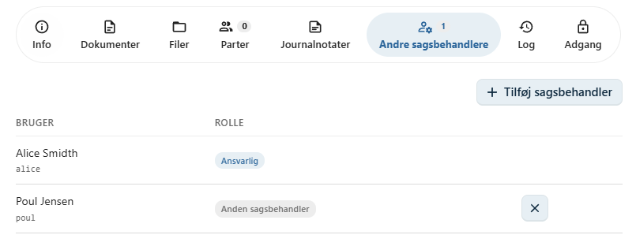

# Andre sagsbehandlere

Hver sag har en **ansvarlig sagsbehandler**, som har det overordnede ansvar for sagens behandling.

Hvis flere medarbejdere skal arbejde på den samme sag, kan de tilføjes som **andre sagsbehandlere**.

Dette gør det muligt at samarbejde om en sag, samtidig med at den ansvarlige sagsbehandler bevares.

---

## Tilføj en sagsbehandler

Yderligere sagsbehandlere tilføjes på fanen **Andre sagsbehandlere** på sagen.

Klik på **Tilføj sagsbehandler** for at vælge en medarbejder.

Når sagsbehandleren er valgt og gemt, bliver vedkommende tilføjet til sagen.

---

## Adgang til sagen

Når en bruger tilføjes som sagsbehandler, får vedkommende automatisk adgang til sagen og dens dokumenter.

Det er derfor ikke nødvendigt at give sagsbehandleren adgang manuelt.

!!! info "Automatisk adgang"

    OpenCase sørger automatisk for at give de nødvendige adgangsrettigheder, når en sagsbehandler tilføjes til sagen.

---

## Den ansvarlige sagsbehandler

Den ansvarlige sagsbehandler har det overordnede ansvar for sagens behandling.

Den ansvarlige sagsbehandler fremgår af sagens oplysninger og kan om nødvendigt ændres af brugere med de nødvendige rettigheder.

Der kan kun være **én ansvarlig sagsbehandler** pr. sag, men der kan tilføjes et vilkårligt antal øvrige sagsbehandlere.

---

## Fjern en sagsbehandler

En sagsbehandler kan fjernes fra sagen, hvis vedkommende ikke længere skal deltage i sagsbehandlingen.

Når en sagsbehandler fjernes:

- mister brugeren adgangen til sagen
- mister brugeren adgangen til sagens dokumenter
- bevares sagens historik uændret

!!! warning "Vær opmærksom"

    Fjern kun en sagsbehandler, hvis vedkommende ikke længere skal have adgang til sagen.

---

## Samarbejde om en sag

Ved at tilføje flere sagsbehandlere kan arbejdet fordeles mellem flere medarbejdere.

Det kan eksempelvis være relevant, hvis:

- flere fagområder skal bidrage til sagen
- en kollega skal overtage sagen midlertidigt
- en specialist skal bistå med en del af sagsbehandlingen
- sagen behandles af et projekt- eller tværfagligt team

Alle tilføjede sagsbehandlere arbejder på den samme sag og har adgang til de samme oplysninger i henhold til deres rettigheder.

---

## Næste skridt

Du kan også administrere, hvem der har adgang til sagen, under **Adgang**.

- [Adgang](../sager/adgang.md)
- [Parter](../sager/parter.md)
- [Journalnotater](../sager/journalnotater.md)