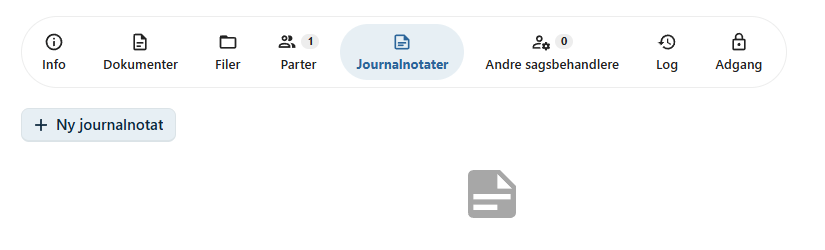
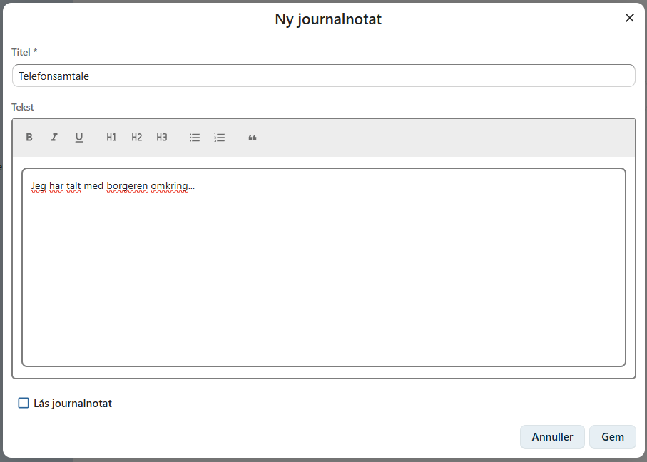
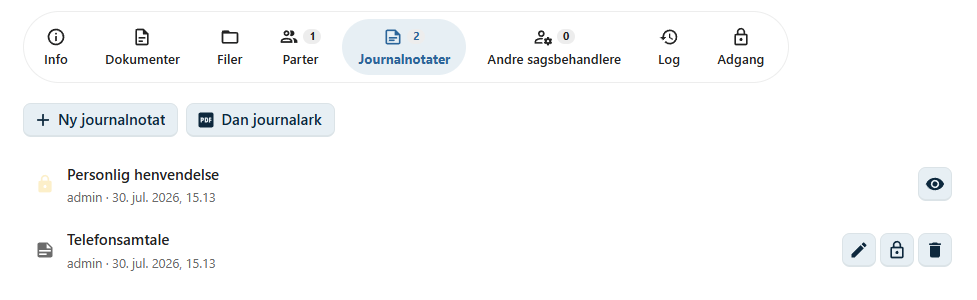
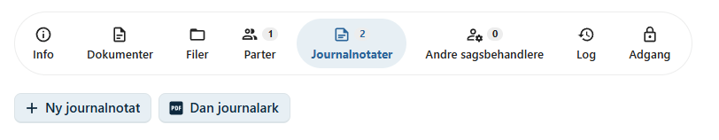
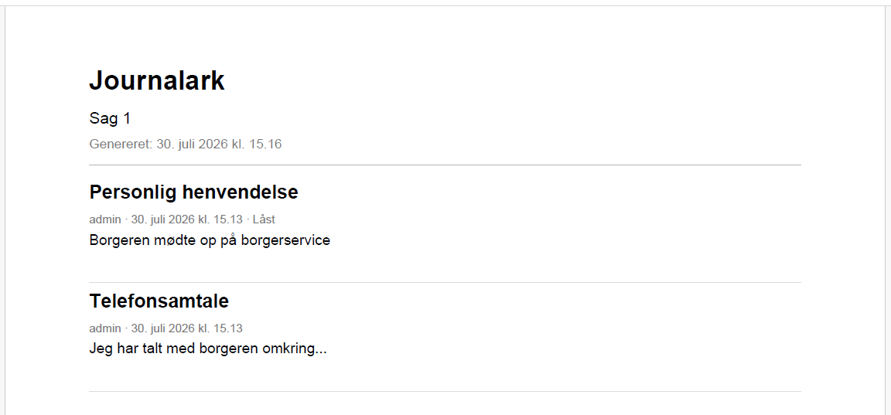

# Journalnotater

Journalnotater anvendes til at dokumentere hændelser, samtaler og beslutninger i forbindelse med en sag.

Et journalnotat kan eksempelvis bruges til at registrere:

- Samtaler med en borger eller virksomhed.
- Telefonopkald.
- Møder.
- Interne notater.
- Beslutninger og vurderinger.
- Andre hændelser, som er relevante for sagens behandling.

Journalnotater bliver en del af sagens historik og gør det muligt at dokumentere sagsforløbet.

---

## Opret et journalnotat

Journalnotater oprettes på fanen **Journalnotater** på sagen.

Klik på **Opret journalnotat** for at oprette et nyt notat.

Et journalnotat består af:

- **Titel** – en kort beskrivelse af notatet.
- **Indhold** – selve journalnotatet.

Indholdet kan skrives som almindelig tekst og bør beskrive hændelsen så præcist som muligt.

---

## Rediger et journalnotat

Et journalnotat kan redigeres, så længe det ikke er låst.

Hvis der sker ændringer i sagen, kan notatet opdateres med yderligere oplysninger.

!!! tip "God praksis"

    Skriv journalnotater så objektivt og præcist som muligt. Beskriv faktiske hændelser og undgå personlige vurderinger, medmindre de er relevante for sagens behandling.

---

## Lås et journalnotat

Når et journalnotat er færdigt, kan det **låses**.

Et låst journalnotat kan:

- ikke redigeres
- ikke slettes

Dette sikrer, at notatet bevares uændret som dokumentation for sagens forløb.

!!! warning "Låste journalnotater"

    Når et journalnotat er låst, kan det ikke længere ændres. Kontroller derfor indholdet, inden notatet låses.

---

## Oversigt over journalnotater

Fanen **Journalnotater** viser en liste over alle notater på sagen.

For hvert journalnotat kan du blandt andet se:

- Titel
- Oprettelsesdato
- Oprettet af
- Om notatet er **låst** eller stadig kan redigeres

Det gør det nemt at se, hvilke journalnotater der stadig er under redigering, og hvilke der er afsluttet.

---

## Dan journalark

Med knappen **Dan journalark** kan du oprette en PDF med alle journalnotater på sagen.

PDF'en samler journalnotaterne i kronologisk rækkefølge og kan eksempelvis anvendes til:

- Arkivering.
- Udskrivning.
- Fremsendelse.
- Dokumentation af sagens historik.

---

## Næste skridt

Når journalnotaterne er registreret, kan du fortsætte arbejdet med sagen ved eksempelvis at:

- tilføje dokumenter
- administrere sagens parter
- invitere andre sagsbehandlere
- styre adgangen til sagen

Se også:

- [Dokumenter](../dokumenter/index.md)
- [Parter](../sager/parter.md)
- [Adgang](../sager/adgang.md)