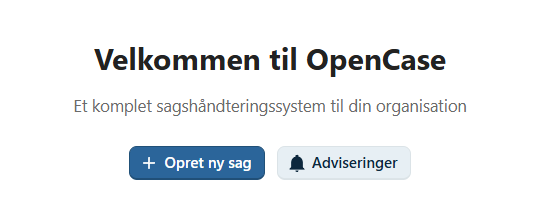
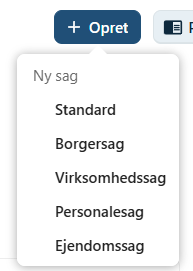
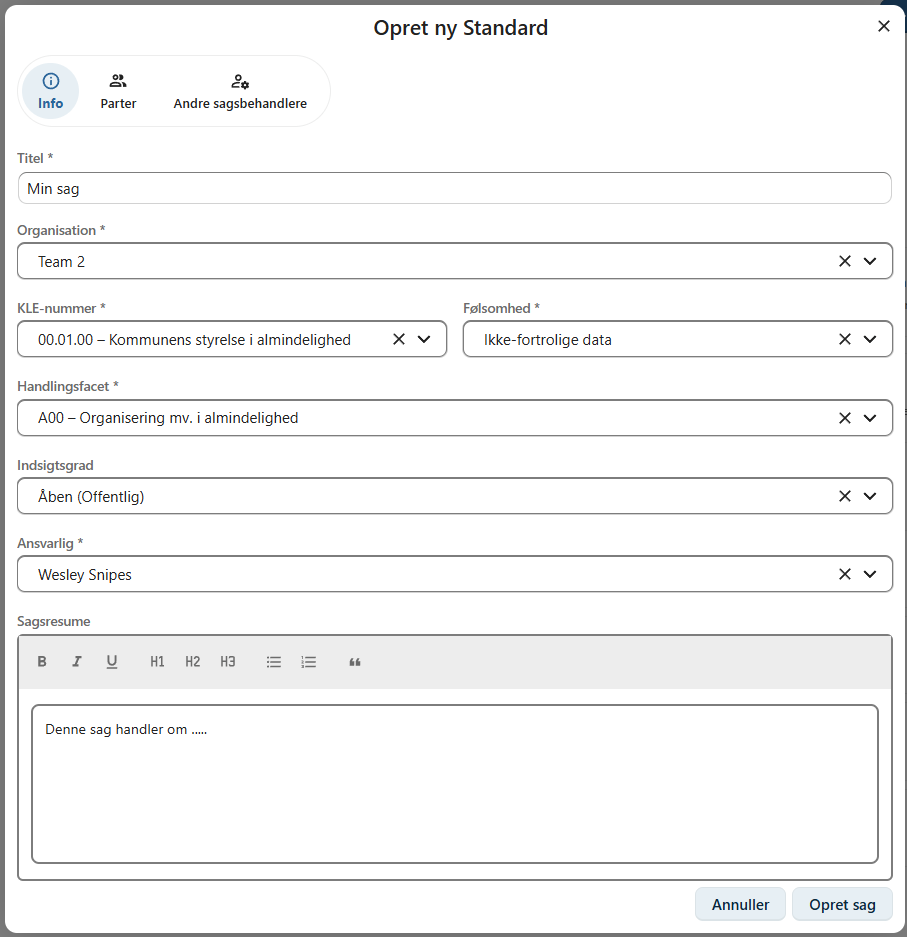
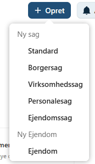
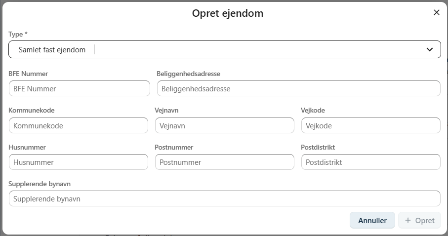
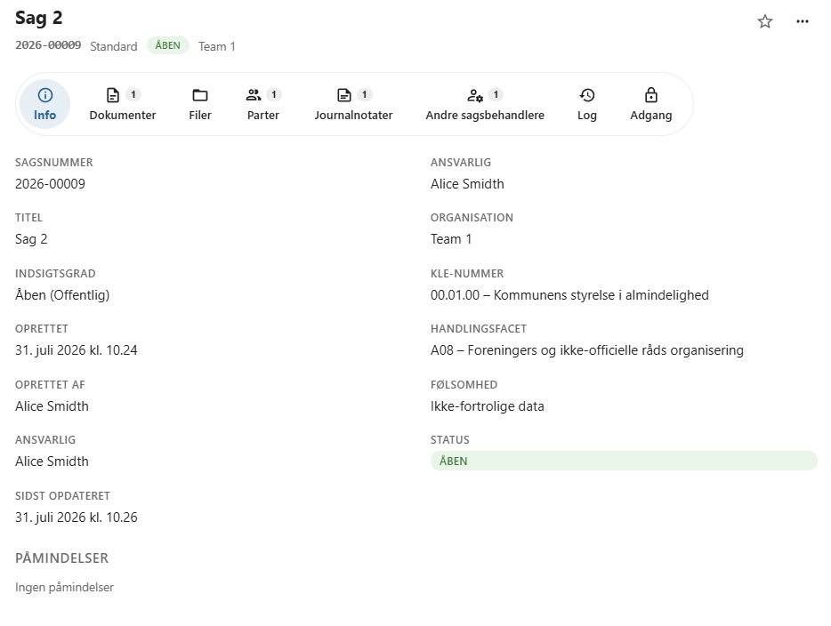

# Opret en sag

En ny sag oprettes fra OpenCases menulinje ved at klikke på **Opret ny sag**.

Når du opretter en sag, skal du vælge en sagstype og udfylde de nødvendige oplysninger. Afhængigt af den valgte sagstype kan der være yderligere oplysninger, som skal angives.

---

## Vælg sagstype

OpenCase understøtter flere forskellige sagstyper, som er tilpasset forskellige arbejdsgange.

| Sagstype | Beskrivelse |
|----------|-------------|
| **Standard** | Anvendes til generelle administrative sager. |
| **Borgersag** | Anvendes til sager vedrørende en borger. |
| **Virksomhedssag** | Anvendes til sager vedrørende en virksomhed. |
| **Personalesag** | Anvendes til sager vedrørende en medarbejder. |
| **Ejendomssag** | Anvendes til sager vedrørende en ejendom. |

!!! warning "Sagstypen kan ikke ændres"

    Sagstypen vælges, når sagen oprettes, og kan **ikke** ændres efterfølgende. Vælg derfor den korrekte sagstype fra starten.

---

## Obligatoriske oplysninger

Følgende oplysninger skal udfyldes, før sagen kan oprettes.

### Titel

Angiv en kort og beskrivende titel, som gør det nemt at identificere sagen.

### Organisation

Vælg den organisation, som sagen tilhører.

Som standard vælges den organisation, du er logget ind under. Har du adgang til flere organisationer, kan du vælge en anden.

### KLE-nummer

Vælg det relevante **KLE-nummer** til klassificering af sagen.

KLE (Kommunernes Landsforenings Emnesystematik) anvendes til at klassificere kommunale sager og dokumenter.

### Følsomhed

Angiv den højeste forventede følsomhedsgrad for sagen.

Du kan vælge mellem:

- **Ikke-fortrolige data**
- **Almindelige personoplysninger**
- **Følsomme personoplysninger**
- **Særligt beskyttede oplysninger**

Følsomhedsgraden anvendes blandt andet til korrekt håndtering og adgangsstyring af sagen.

### Ansvarlig

Den ansvarlige bruger for sagen.

Feltet udfyldes automatisk med den bruger, der opretter sagen, men kan ændres, hvis du har de nødvendige rettigheder.

---

## Øvrige oplysninger

### Indsigtsgrad

Indsigtsgraden bestemmer, hvem der kan få adgang til sagen.

Mulige værdier er:

| Indsigtsgrad | Beskrivelse |
|--------------|-------------|
| **Åben** | Sagen er offentlig. |
| **Intern** | Kun interne brugere har adgang. |
| **Begrænset** | Adgangen er begrænset til udvalgte brugere. |
| **Lukket** | Sagen indeholder stærkt fortrolige eller personlige oplysninger. |

Vælg den indsigtsgrad, som passer til organisationens retningslinjer.

### Sagsresume

Her kan skrives det beskrives hvad sagen handler om.

---

## Borgersag

En borgersag skal have en **primær part**, som er den borger sagen vedrører.

Du kan registrere:

- CPR-nummer
- Navn
- Adresse

!!! info "Enterprise"

    I Enterprise-versionen kan borgere fremsøges direkte i det centrale personregister. Oplysningerne udfyldes automatisk.

---

## Virksomhedssag

En virksomhedssag skal have en **primær part**, som er den virksomhed sagen vedrører.

Du kan registrere:

- CVR-nummer
- Virksomhedsnavn
- Adresse

!!! info "Enterprise"

    I Enterprise-versionen kan virksomheder fremsøges direkte i det centrale virksomhedsregister.

---

## Personalesag

En personalesag skal have en **primær part**, som er den medarbejder sagen vedrører.

Afhængigt af organisationens opsætning kan medarbejderen vælges blandt organisationens brugere.

---

## Ejendomssag

En ejendomssag skal have en **Primær ejendom** tilknyttet, som er den ejendom sagen vedrører.

Du kan oprette en ny ejendom i OpenCase ved at vælge Opret -> Ejendom

Her kan kan registrere:

- Ejendomstype
- BFE Nummer
- Adresse

!!! info "Enterprise"

    I Enterprise-versionen kan ejendomme fremsøges direkte i det centrale ejendomsregister.

---

## Sagens opbygning

Når en sag er oprettet, åbnes sagens oversigt.

Sagens oplysninger er opdelt på en række faner, som gør det nemt at navigere mellem de forskellige dele af sagen. Hver fane samler oplysninger og funktioner inden for et bestemt område, så du hurtigt kan finde det, du søger.

Afhængigt af sagens type og organisationens konfiguration kan følgende faner være tilgængelige:

| Fane | Beskrivelse |
|-------|-------------|
| **Dokumenter** | Opret, upload og administrer sagens dokumenter. |
| **Parter** | Registrer borgere, virksomheder og andre parter, der er tilknyttet sagen. |
| **Journalnotater** | Dokumentér sagens forløb med journalnotater. |
| **Andre sagsbehandlere** | Tilføj kolleger, der skal deltage i sagsbehandlingen. |
| **Adgang** | Se sagens adgangsprofil og administrer midlertidige adgange. |
| **Sagshierarki** | Vis og administrer relationer til overordnede sager og undersager. |
| **Sagslog** | Se historikken over handlinger, der er udført på sagen. |

De enkelte faner beskrives nærmere i de følgende afsnit af brugervejledningen.

