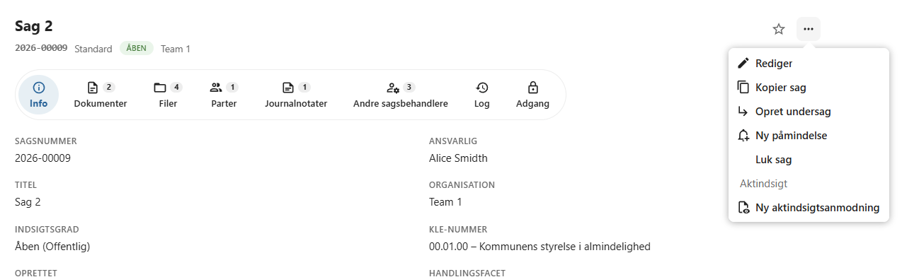
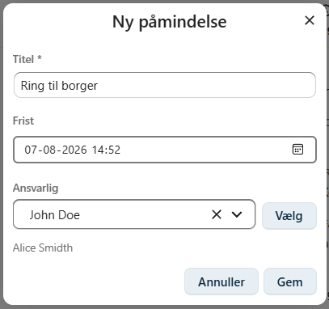
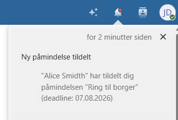
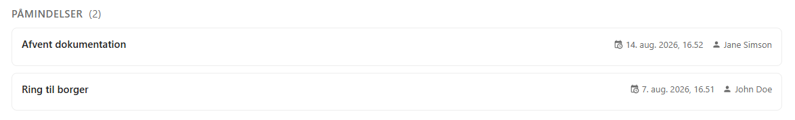
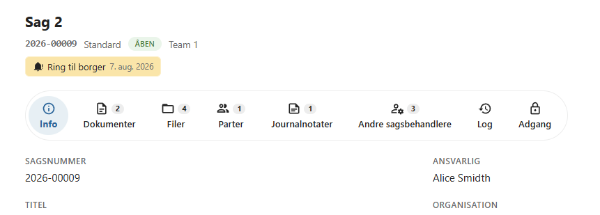
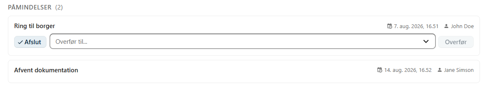

# Påmindelser

Påmindelser gør det muligt at følge op på en sag på et bestemt tidspunkt.

En påmindelse kan tildeles en bruger med en frist, så det er tydeligt, hvem der har ansvaret for den næste handling på sagen.

Påmindelser er velegnede til opgaver som eksempelvis opfølgning på borgere, kontrol af manglende oplysninger eller kommende sagsfrister.

---

## Opret en påmindelse

Åbn sagens **kontekstmenu** og vælg **Ny påmindelse**.

Der åbnes en dialog, hvor påmindelsen oprettes.

---

## Oplysninger

Ved oprettelse af en påmindelse angives følgende oplysninger:

- **Titel** – en kort beskrivelse af opgaven.
- **Frist** – datoen, hvor opgaven skal være udført.
- **Ansvarlig bruger** – den bruger, som skal følge op på påmindelsen.

Titlen bør kort beskrive, hvilken handling der skal udføres.

Eksempler:

- Ring til borger
- Afvent dokumentation
- Følg op på høring
- Send afgørelse
- Kontroller frist

---

## Notifikation

Når påmindelsen oprettes, modtager den ansvarlige bruger automatisk en notifikation i Nextcloud.

Notifikationen gør det nemt at åbne sagen og udføre den opgave, som påmindelsen vedrører.

---

## Oversigt over påmindelser

Alle aktive påmindelser kan ses på sagens **Info**-fane.

Her vises en oversigt over sagens kommende påmindelser.

Den påmindelse med den nærmeste frist vises desuden direkte i sagens header, så den altid er synlig, når sagen åbnes.

---

## Afslut en påmindelse

Når opgaven er udført, kan den ansvarlige bruger vælge **Afslut**.

Den afsluttede påmindelse markeres som gennemført og vises ikke længere blandt sagens aktive påmindelser.

---

## Overdrag en påmindelse

Hvis en anden bruger skal overtage opgaven, kan påmindelsen **overdrages**.

Den nye ansvarlige bruger modtager herefter en notifikation i Nextcloud og bliver ansvarlig for den videre opfølgning.

---

## God praksis

Påmindelser kan blandt andet bruges til:

- opfølgning på borgere eller virksomheder
- kontrol af manglende oplysninger
- overholdelse af lovbestemte eller interne frister
- planlægning af næste trin i sagsbehandlingen
- opfølgning på aftaler og møder

!!! tip

    Brug påmindelser til opgaver, der skal udføres på et bestemt tidspunkt. Det gør det lettere at sikre, at vigtige frister og opfølgninger ikke overses.

---

## Se også

- [Journalnotater](../sager/journalnotater.md)
- [Sagslog](../sager/sagslog.md)
- [Opret en sag](../sager/opret-sag.md)