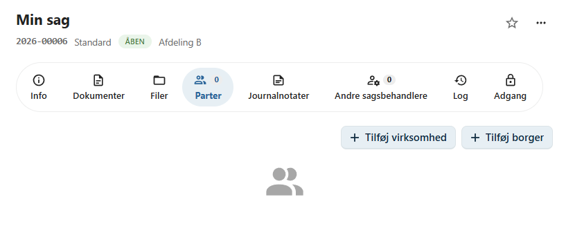
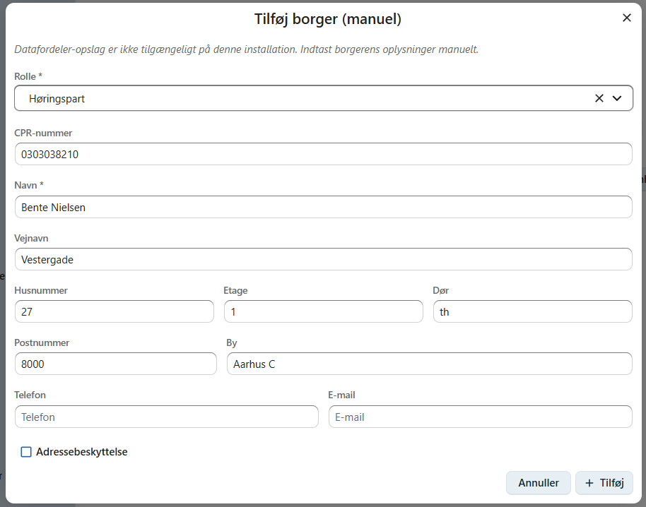
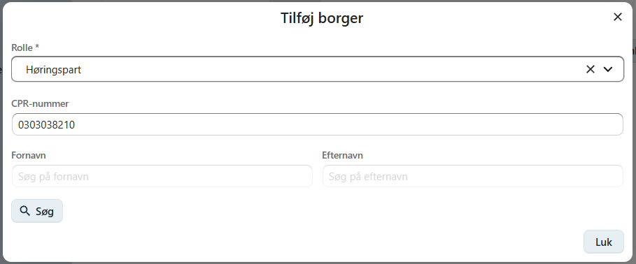
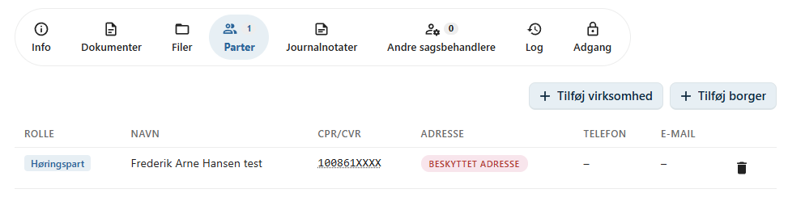
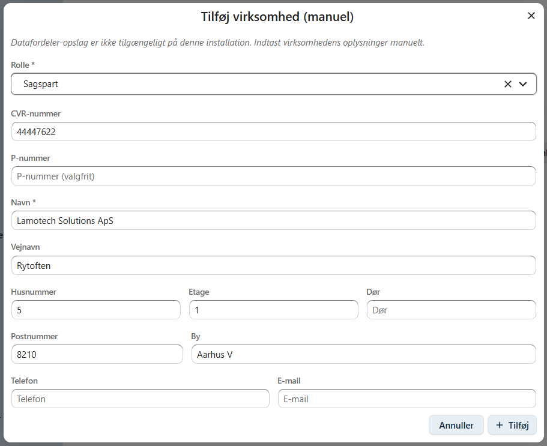
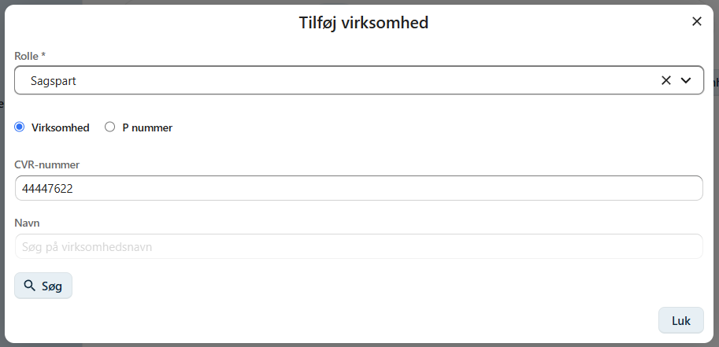

# Parter

På fanen **Parter** registreres de personer og virksomheder, som er tilknyttet en sag.

En part kan have forskellige roller afhængigt af sagens karakter, og en sag kan have både én eller flere parter.

OpenCase understøtter to typer af parter:

- **Borger**
- **Virksomhed**

---

## Tilføj en borger

Klik på **Tilføj borger** for at registrere en borger som part på sagen.

I dialogen skal du vælge partens **rolle** og indtaste borgerens oplysninger.

### Roller

En borger kan eksempelvis have følgende roller:

- Sagspart
- Ansøger
- Klager
- Høringspart

Organisationen kan have yderligere roller afhængigt af konfigurationen.

### Oplysninger

Du kan registrere blandt andet:

- CPR-nummer
- Navn
- Adresse
- Eventuelle kontaktoplysninger

!!! info "Enterprise"

    I Enterprise-versionen kan borgere fremsøges direkte i det centrale personregister ved hjælp af **CPR-nummer** eller **navn**.

    Når en borger vælges fra registret, udfyldes de relevante oplysninger automatisk.

    

    Hvis borgeren har **adressebeskyttelse**, registreres dette automatisk i OpenCase.

    

---

## Tilføj en virksomhed

Klik på **Tilføj virksomhed** for at registrere en virksomhed som part på sagen.

I dialogen skal du vælge virksomhedens **rolle** og registrere virksomhedens oplysninger.

### Roller

En virksomhed kan blandt andet registreres som:

- Sagspart
- Ansøger
- Klager
- Høringspart

### Oplysninger

Du kan registrere:

- CVR-nummer
- Virksomhedsnavn
- Adresse

!!! info "Enterprise"

    I Enterprise-versionen kan virksomheder fremsøges direkte i det centrale virksomhedsregister.

    Du kan søge efter virksomheden ved hjælp af:

    - CVR-nummer
    - P-nummer
    - Virksomhedsnavn

    Når virksomheden vælges, udfyldes oplysningerne automatisk.

    

---

## Primær part

Nogle sagstyper kræver, at sagen har en **primær part**.

Eksempelvis:

- En **borgersag** skal have en borger som primær part.
- En **virksomhedssag** skal have en virksomhed som primær part.
- En **personalesag** skal have en medarbejder som primær part.

Den primære part identificerer, hvem eller hvad sagen vedrører.

---

## Næste skridt

Når sagens parter er registreret, kan du fortsætte med at oprette dokumenter eller registrere journalnotater.

- [Dokumenter](../dokumenter/index.md)
- [Journalnotater](../sager/journalnotater.md)
