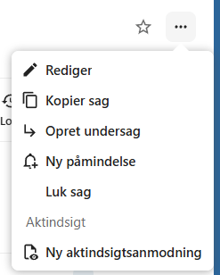
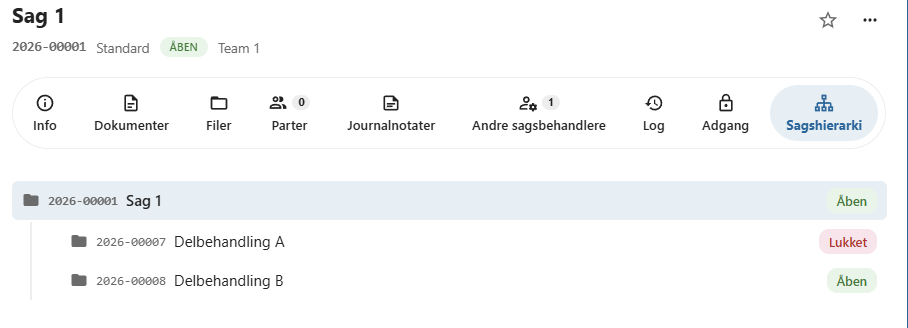

# Sagshierarki

OpenCase giver mulighed for at organisere sager i et **sagshierarki**, hvor en sag kan indeholde én eller flere undersager.

Et sagshierarki gør det muligt at opdele større eller komplekse sager i mindre og mere overskuelige delopgaver, samtidig med at sammenhængen mellem sagerne bevares.

---

## Hvornår bruges et sagshierarki?

Et sagshierarki er særligt nyttigt, når en sag omfatter flere selvstændige arbejdsområder eller delprojekter.

Eksempler kan være:

- Et større byggeprojekt med en undersag for hver etape.
- En virksomhedssag med separate undersager for forskellige afdelinger.
- En personalesag med særskilte undersager for forskellige hændelser.
- En borgersag med flere selvstændige sagsforløb.

Ved at opdele arbejdet i undersager bliver det lettere at organisere dokumenter, journalnotater og sagsbehandling.

---

## Opret en undersag

En undersag oprettes med udgangspunkt i en eksisterende sag.

Den nye sag bliver automatisk knyttet til den overordnede sag og indgår i sagshierarkiet.

En undersag fungerer på samme måde som enhver anden sag og kan blandt andet indeholde:

- Dokumenter
- Journalnotater
- Parter
- Andre sagsbehandlere
- Påmindelser

Der er ingen begrænsning på, hvor mange niveauer et sagshierarki kan indeholde.

---

## Oversigt over hierarkiet

På sagen vises relationerne mellem den aktuelle sag, dens overordnede sag og eventuelle undersager.

Dette giver et hurtigt overblik over, hvordan sagen indgår i det samlede sagsforløb.

---

## Adgang til undersager

En undersag har sin **egen adgangsprofil**.

Det betyder, at en undersag kan have:

- en anden organisation
- et andet KLE-nummer
- en anden følsomhed

end den overordnede sag.

Dermed kan adgangen til en undersag være forskellig fra adgangen til hovedsagen.

!!! info "Selvstændig adgangsstyring"

    Hver sag i et sagshierarki vurderes individuelt af den fælleskommunale adgangsstyring ud fra sin egen adgangsprofil.

Det gør det muligt at beskytte følsomme oplysninger i en undersag uden at begrænse adgangen til resten af sagshierarkiet.

---

## God praksis

Et sagshierarki bør anvendes, når en sag bliver så omfattende, at den med fordel kan opdeles i mindre, selvstændige sager.

En opdeling kan gøre det lettere at:

- organisere dokumenter
- fordele arbejdet mellem flere sagsbehandlere
- anvende forskellige adgangsprofiler
- bevare et godt overblik over større sagsforløb

Undgå at oprette undersager, hvis oplysningerne naturligt hører hjemme i én samlet sag.

---

## Se også

- [Opret en sag](../sager/opret-sag.md)
- [Adgang](../sager/adgang.md)
- [Dokumenter](../dokumenter/index.md)