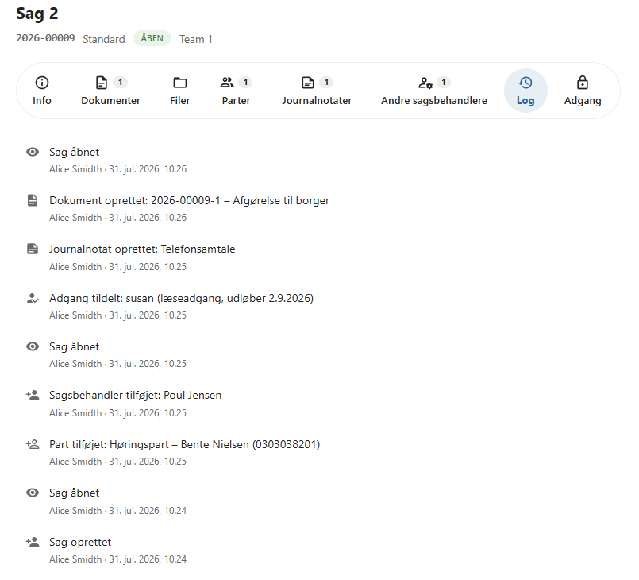

# Sagslog

OpenCase registrerer automatisk en **sagslog**, som dokumenterer de handlinger, der udføres på en sag.

Sagsloggen giver et komplet overblik over sagens historik og bidrager til sporbarhed, dokumentation og revision.

Alle væsentlige handlinger registreres automatisk og kan ikke oprettes eller ændres manuelt.

---

## Hvad registreres?

Sagsloggen indeholder oplysninger om de handlinger, der udføres på sagen.

Eksempler på registrerede hændelser er:

- Sag oprettet.
- Sag åbnet.
- Sagsstatus ændret.
- Part tilføjet eller fjernet.
- Sagsbehandler tilføjet eller fjernet.
- Adgang givet eller fjernet.
- Journalnotat oprettet.
- Dokument oprettet på sagen.
- Andre væsentlige ændringer af sagen.

---

## Oplysninger i loggen

For hver hændelse registreres blandt andet:

- tidspunkt
- handling
- bruger
- eventuelle relevante oplysninger om handlingen

Dermed kan det altid dokumenteres, hvem der har udført en bestemt handling, og hvornår den er udført.

---

## Sporbarhed

Sagsloggen gør det muligt at følge hele sagens livscyklus.

Eksempelvis kan du se:

- hvornår sagen blev oprettet
- hvem der har åbnet sagen
- hvornår en part blev tilføjet
- hvem der har givet adgang til sagen
- hvornår et dokument eller journalnotat blev oprettet

Dette giver et samlet overblik over sagens udvikling gennem hele sagsforløbet.

!!! info "Automatisk logning"

    Logningen sker automatisk og kræver ingen handling fra brugeren.

---

## Logning på tværs af sager

Ud over sagsloggen indeholder OpenCase en central log over brugeraktiviteter.

I **Administratormodulet** kan en administrator søge efter en bruger og se de handlinger, som brugeren har udført på tværs af alle sager.

Dette gør det muligt at undersøge hændelser, følge et sagsforløb eller dokumentere brugeraktiviteter på tværs af systemet.

---

## Revision og compliance

Den centrale logning understøtter organisationens krav til:

- sporbarhed
- dokumentation
- revision
- informationssikkerhed

Ved behov kan administratorer dokumentere, hvilke handlinger der er udført, hvem der har udført dem, og hvornår de fandt sted.

!!! tip "God praksis"

    Sagsloggen er et vigtigt værktøj ved intern kontrol, revision og fejlsøgning. Hvis der opstår tvivl om et sagsforløb, vil sagsloggen normalt være det første sted at undersøge.

---

## Se også

- [Journalnotater](../sager/journalnotater.md)
- [Adgang](../sager/adgang.md)
- [Andre sagsbehandlere](../sager/andre-sagsbehandlere.md)