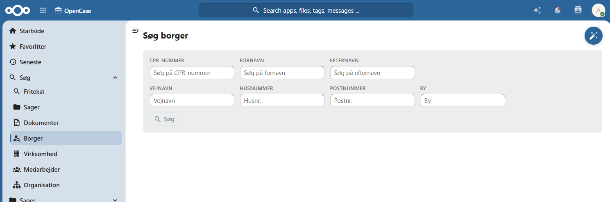
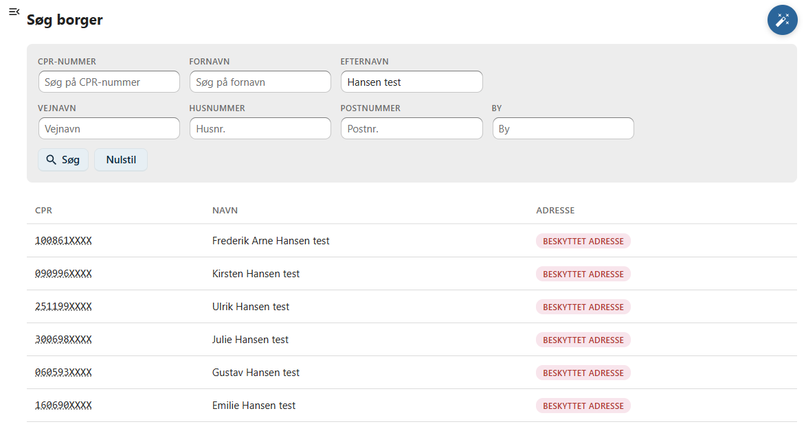
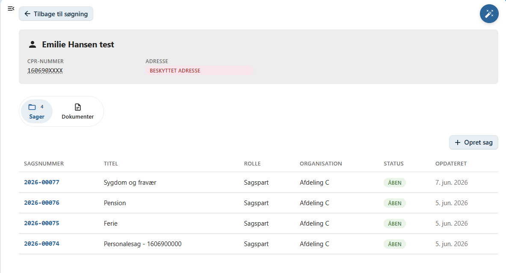
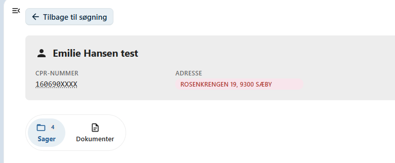

# Borgere

Denne side beskriver, hvordan du søger efter borgere i OpenCase.

Søgning efter borgere gør det muligt hurtigt at finde en borger og få et samlet overblik over de sager og dokumenter, der er knyttet til personen.

Du kan søge på borgerens:

- CPR-nummer
- navn
- adresse

Når en borger er fundet, vises en oversigt over de sager og dokumenter, der er registreret på borgeren i OpenCase.

---

## Udfør en søgning

Indtast et eller flere søgekriterier i søgefeltet og tryk **Enter** eller klik på **Søg**.

Du kan eksempelvis søge på:

- CPR-nummer
- fornavn
- efternavn
- vejnavn
- postnummer eller by

Der vises en liste over de borgere, der matcher søgekriterierne.

---

## Standardversion

I standardversionen af OpenCase søges blandt de borgere, som allerede er registreret på sager eller dokumenter i OpenCase.

Det betyder, at søgeresultatet omfatter borgere, der tidligere har været oprettet som:

- part på en sag
- afsender eller modtager på et dokument

---

## Enterprise

!!! info "Enterprise"

    I Enterprise-versionen foretages søgningen direkte i det centrale CPR-register.

    Det betyder, at du kan finde borgere, selv om de endnu ikke er registreret i OpenCase.

    Når en borger vælges, hentes de aktuelle oplysninger automatisk fra CPR-registeret.

---

## Borgeroversigt

Når du vælger en borger, vises en samlet oversigt over borgerens oplysninger.

Herfra kan du blandt andet se:

- borgerens grundoplysninger
- sager, hvor borgeren er registreret
- dokumenter, hvor borgeren indgår

Har en borger adressebeskyttelse kan du klikke på adressen for at se oplysningerne.

---

## Sager og dokumenter

Fra borgeroversigten kan du åbne de sager og dokumenter, der er knyttet til borgeren.

Listerne giver et hurtigt overblik over borgerens tilknytning til OpenCase.

Klik på en sag eller et dokument for at åbne det.

---

## Opret en ny sag

Fra borgeroversigten kan du vælge **Opret ny sag**.

Borgeren bliver automatisk registreret som **primær part** på den nye sag, så du ikke behøver at registrere borgeren igen.

Dette gør det hurtigt at oprette nye sager for borgere, der allerede findes i OpenCase eller CPR-registeret.

---

## God praksis

Hvis borgeren allerede findes i OpenCase eller CPR-registeret, bør du anvende søgefunktionen i stedet for at indtaste oplysningerne manuelt.

Det sikrer:

- korrekte stamdata
- ensartet registrering
- mindre risiko for tastefejl
- hurtigere oprettelse af nye sager

!!! tip

    Hvis du kender borgerens CPR-nummer, giver det normalt det mest præcise søgeresultat.

---

## Se også

- [Søg efter virksomheder](./virksomhed.md)
- [Søg efter sager](./sag.md)
- [Opret en sag](../sager/opret-sag.md)