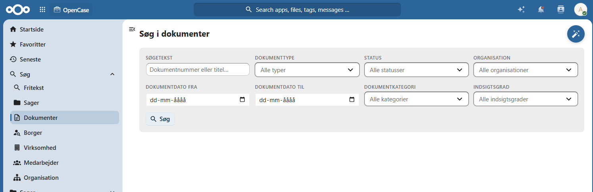
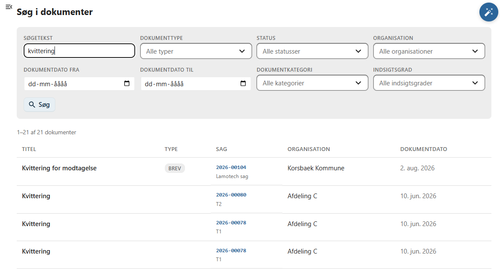

# Dokumenter

Denne side beskriver, hvordan du søger efter dokumenter i OpenCase.

Søgning efter dokumenter gør det muligt hurtigt at finde et dokument ud fra dets registrerede oplysninger.

I modsætning til **Fritekstsøgning**, som også søger i dokumenternes indhold, søger denne funktion kun i dokumenternes metadata.

Dette gør søgningen hurtig og velegnet, når du kender oplysninger om det dokument, du leder efter.

---

## Udfør en søgning

Indtast et eller flere søgekriterier i søgefeltet og tryk **Enter** eller klik på **Søg**.

OpenCase søger blandt andet i dokumentets metadata.

Du kan eksempelvis søge på:

- dokumenttitel
- dokumentnummer
- dokumentkategori
- dokumenttype
- dokumentdato
- organisation

Hvis flere dokumenter matcher søgekriteriet, vises de alle i resultatlisten.

---

## Søgeresultater

Resultatet vises som en liste over de dokumenter, der matcher søgekriteriet.

For hvert dokument vises typisk oplysninger som:

- dokumenttitel
- dokumentkategori
- dokumenttype
- dokumentdato
- tilhørende sag
- organisation

Klik på et dokument for at åbne det.

---

## Hvornår skal denne søgning anvendes?

Søg efter dokumenter er velegnet, når du allerede kender oplysninger om dokumentet.

Eksempler:

- Find et dokument ud fra titlen.
- Find alle dokumenter af en bestemt dokumenttype.
- Find dokumenter oprettet på en bestemt dato.
- Find alle udgående dokumenter på en sag.

Hvis du i stedet ønsker at søge efter ord eller formuleringer inde i dokumenternes filer, bør du anvende **Fritekstsøgning**.

---

## God praksis

Du får ofte de bedste resultater ved at:

- anvende en beskrivende del af dokumentets titel
- kombinere flere søgekriterier

---

## Se også

- [Fritekstsøgning](../soegning/fritekst.md)
- [Dokumenter](../dokumenter/index.md)
- [Søg efter sager](../soegning/sag.md)