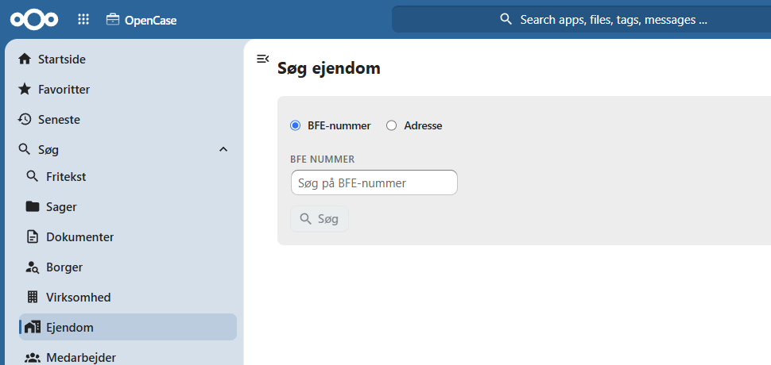
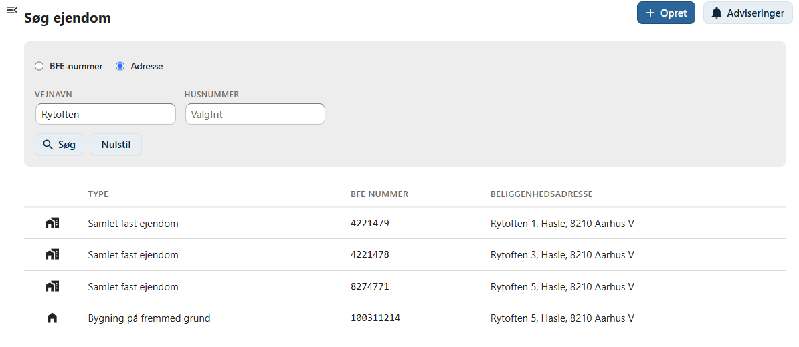
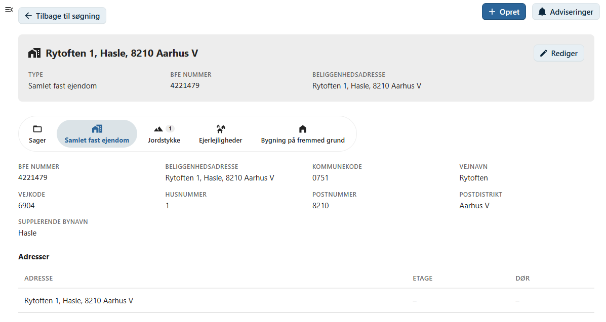
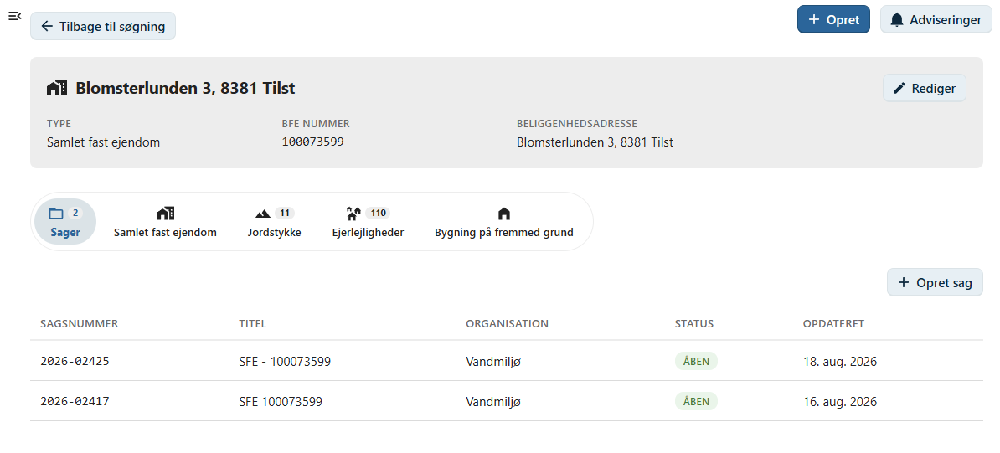

# Ejendomme

Denne side beskriver, hvordan du søger efter ejendomme i OpenCase.

Søgning efter ejendomme gør det muligt hurtigt at finde en ejendom og få et samlet overblik over de sager, der er knyttet til ejendommen.

Du kan søge på ejendommens:

- BFE Nummer
- adresse

Når en ejendom er fundet, vises en oversigt over ejendommens oplysninger og de sager, der er registreret på ejendomme i OpenCase.

---

## Udfør en søgning

Indtast et eller flere søgekriterier i søgefeltet og tryk **Enter** eller klik på **Søg**.

Du kan eksempelvis søge på:

- BFE Nummer
- Vejnavn
- Husnummer

Der vises en liste over de ejendomme, der matcher søgekriterierne.

---

## Standardversion

I standardversionen af OpenCase søges blandt de ejendomme, som allerede er oprettet OpenCase.

Det betyder, at søgeresultatet omfatter ejendomme, der tidligere har været oprettet. En ejendom oprettes med menuen:

---

## Enterprise

!!! info "Enterprise"

    I Enterprise-versionen foretages søgningen direkte i det centrale ejendoms-register.

    Det betyder, at du kan finde ejendomme, selv om de endnu ikke er registreret i OpenCase.

    Når en ejendom vælges, hentes de aktuelle oplysninger automatisk fra ejendoms-registeret.

---

## Ejendomsoversigt

Når du vælger en ejendom, vises en samlet oversigt over ejendommens oplysninger.

Herfra kan du blandt andet se:

- Samlet fast ejendom
- Jordstykker
- Ejerligheder
- Bygninger på fremmed grund

---

## Sager

Fra ejendomsoversigten kan du åbne de sager, der er knyttet til ejendommen.

Listen giver et hurtigt overblik over ejendommens tilknytning til OpenCase.

Klik på en sag for at åbne den.

---

## Opret en ny sag

Fra ejendomsoversigten kan du vælge **Opret ny sag**.

Ejendommen bliver automatisk registreret som **primær ejendom** på den nye sag, så du ikke behøver at registrere ejendommen igen.

Dette gør det hurtigt at oprette nye sager for ejendomme, der allerede findes i OpenCase eller ejendoms-registeret.

---

## God praksis

Hvis ejendommen allerede findes i OpenCase eller ejendoms-registeret, bør du anvende søgefunktionen i stedet for at indtaste oplysningerne manuelt.

Det sikrer:

- korrekte stamdata
- ensartet registrering
- mindre risiko for tastefejl
- hurtigere oprettelse af nye sager

!!! tip

    Hvis du kender ejendoms BFE nummer, giver det normalt det mest præcise søgeresultat.

---

## Se også

- [Søg efter virksomheder](./virksomhed.md)
- [Søg efter sager](./sag.md)
- [Opret en sag](../sager/opret-sag.md)