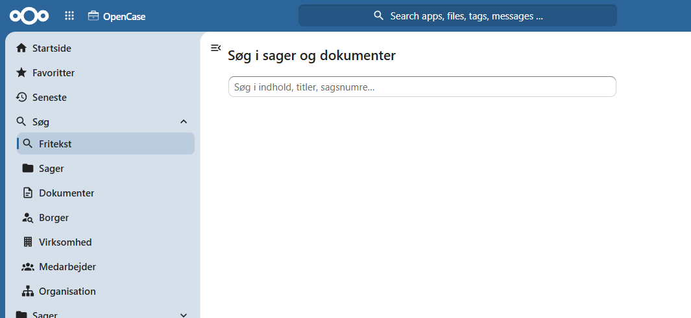
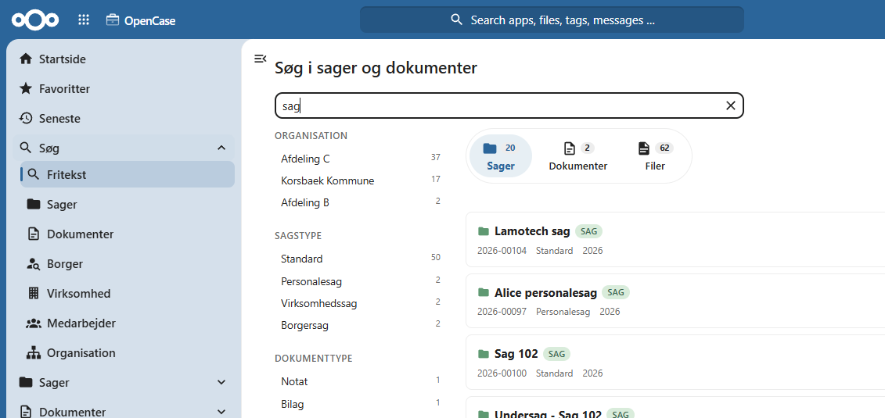
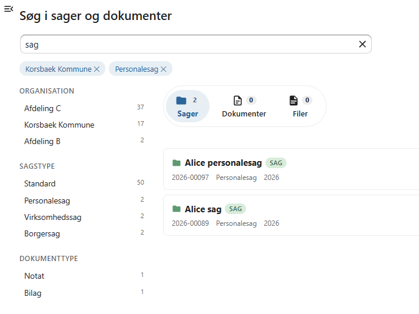

# Fritekstsøgning

Fritekstsøgning gør det muligt hurtigt at finde oplysninger på tværs af hele OpenCase.

Med én søgning kan du søge i:

- sager
- dokumenter
- indholdet af dokumenternes filer

Søgeresultaterne opdeles i faner, så det er nemt at finde den type resultat, du leder efter.

---

## Udfør en søgning

Indtast et eller flere søgeord i søgefeltet og tryk **Enter** eller klik på **Søg**.

OpenCase søger samtidig i:

- sagstitler
- dokumenttitler
- tekstindholdet i dokumenternes filer

Hvis søgeordet findes flere steder, vises alle relevante resultater.

Eksempelvis kan du søge efter:

- et navn
- et sagsnummer
- en adresse
- et KLE-nummer
- et ord eller en sætning fra et dokument

---

## Søgeresultater

Resultaterne opdeles automatisk i faner.

Eksempel:

- **Sager**
- **Dokumenter**
- **Filindhold**

På den måde kan du hurtigt skifte mellem de forskellige typer søgeresultater.

---

## Søgning i filindhold

OpenCase indekserer dokumenternes indhold, så du kan søge efter tekst, der findes inde i filerne.

Det betyder, at du ikke behøver at kende dokumentets titel eller placering.

Eksempel:

Du kan søge efter:

- et journalnummer
- et CPR-nummer
- et kundenavn
- en bestemt formulering

Hvis teksten findes i et dokument, vises dokumentet blandt søgeresultaterne.

!!! info

    Søgning i filindhold forudsætter, at dokumentets fil kan indekseres af OpenCase.

---

## Filtrer resultaterne

Efter søgningen kan resultaterne begrænses ved hjælp af filtre.

Du kan blandt andet filtrere efter:

- **Organisation**
- **Sagstype**
- **Dokumenttype**

Filtrene gør det lettere at finde de mest relevante resultater, især hvis søgningen giver mange træffere.

---

## Åbn et søgeresultat

Klik på et søgeresultat for at åbne sagen eller dokumentet.

Hvis resultatet stammer fra en fils indhold, åbnes det tilhørende dokument.

---

## Gode råd til søgning

Du opnår ofte de bedste resultater ved at:

- søge på flere ord
- anvende præcise navne eller numre
- kombinere søgning med filtrering
- anvende filtre, hvis der findes mange resultater

!!! tip

    Hvis en søgning giver mange resultater, kan du ofte finde det ønskede hurtigere ved først at vælge den relevante fane og derefter anvende filtrene.

---

## Se også

- [Sager](../sager/index.md)
- [Dokumenter](../dokumenter/index.md)
- [Favoritter](../favoritter.md)