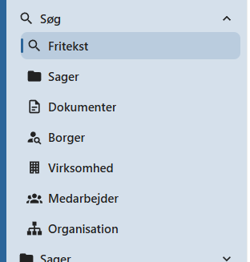

# Søgning

OpenCase indeholder en række søgefunktioner, som gør det hurtigt at finde sager, dokumenter, personer, virksomheder og organisatoriske oplysninger.

Hver søgefunktion er udviklet til et bestemt formål. Ved at vælge den rigtige søgning kan du hurtigere finde de oplysninger, du leder efter.

---

## Søgefunktioner

OpenCase indeholder følgende søgefunktioner:

| Søgefunktion | Anvendelse |
|--------------|------------|
| **Fritekstsøgning** | Søg på tværs af sager, dokumenter og filindhold. |
| **Søg efter sager** | Find sager ud fra sagens metadata, f.eks. titel, sagsnummer eller KLE-nummer. |
| **Søg efter dokumenter** | Find dokumenter ud fra dokumentets metadata. |
| **Søg efter borgere** | Find en borger og se tilknyttede sager og dokumenter. |
| **Søg efter virksomheder** | Find en virksomhed og se tilknyttede sager og dokumenter. |
| **Søg efter medarbejdere** | Find en medarbejder og se organisation, sager og adgangsrettigheder. |
| **Søg efter organisationer** | Find en organisation og se organisationsstruktur og tilknyttede medarbejdere. |

---

## Hvornår skal jeg bruge hvilken søgning?

| Hvis du vil... | Brug denne søgning |
|----------------|--------------------|
| Finde et ord eller en sætning i dokumenter | **Fritekstsøgning** |
| Finde en bestemt sag | **Søg efter sager** |
| Finde et bestemt dokument | **Søg efter dokumenter** |
| Finde en borger | **Søg efter borgere** |
| Finde en virksomhed | **Søg efter virksomheder** |
| Finde en medarbejder | **Søg efter medarbejdere** |
| Finde en organisation | **Søg efter organisationer** |

---

## Søgning i OpenCase

Alle søgefunktioner er udviklet til hurtigt at give adgang til de oplysninger, du har brug for.

Afhængigt af søgningen kan du blandt andet:

- åbne en sag eller et dokument
- se relationer mellem sager og dokumenter
- oprette nye sager
- se tilknyttede borgere eller virksomheder
- få overblik over medarbejdere og organisationer
- undersøge adgangsrettigheder

De fleste søgeresultater fungerer samtidig som udgangspunkt for det videre arbejde i OpenCase.

---

## Enterprise

!!! info "Enterprise"

    Nogle søgefunktioner har udvidet funktionalitet i Enterprise-versionen.

    Eksempelvis kan **Søg efter borgere** og **Søg efter virksomheder** søge direkte i de centrale CPR- og CVR-registre, så oplysningerne altid er opdaterede.

---

## Gode råd

For at få de bedste søgeresultater anbefales det at:

- anvende så præcise søgekriterier som muligt
- benytte filtre, når der findes mange resultater
- anvende specialiserede søgninger frem for fritekstsøgning, når du kender den type oplysninger, du søger efter

!!! tip

    Hvis du er i tvivl om, hvilken søgefunktion du skal bruge, kan du begynde med **Fritekstsøgning**. Hvis du kender typen af det, du leder efter, vil de specialiserede søgninger ofte give hurtigere og mere præcise resultater.

---

## Se også

- [Fritekstsøgning](fritekst.md)
- [Søg efter sager](sag.md)
- [Søg efter dokumenter](dokument.md)
- [Søg efter borgere](borger.md)
- [Søg efter virksomheder](virksomhed.md)
- [Søg efter medarbejdere](medarbejder.md)
- [Søg efter organisationer](organisation.md)