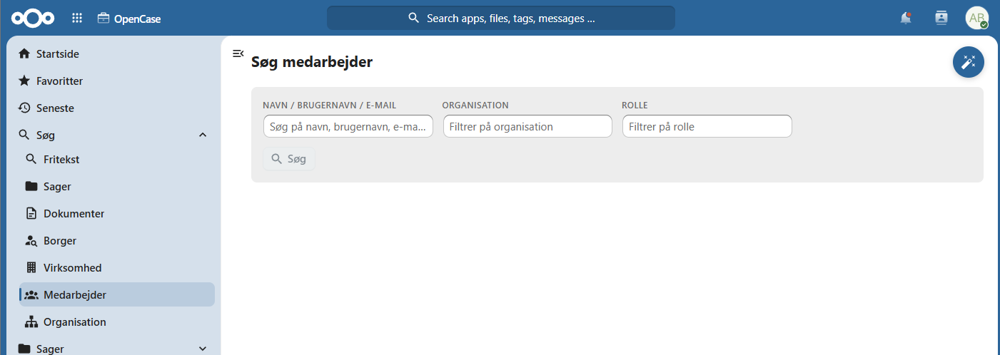
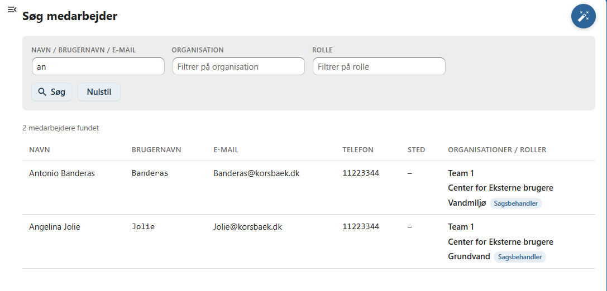
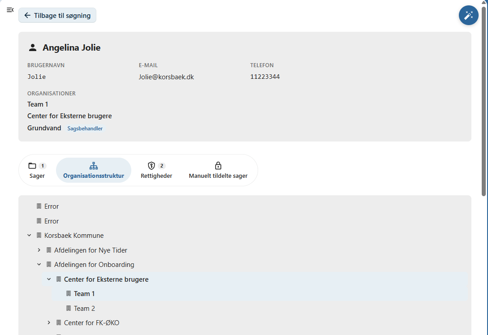
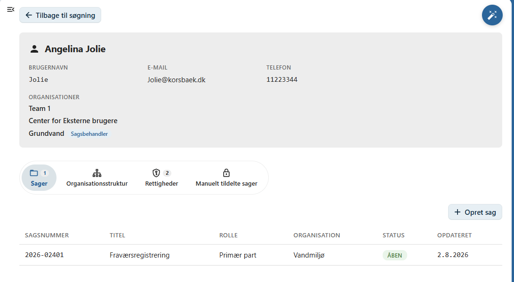
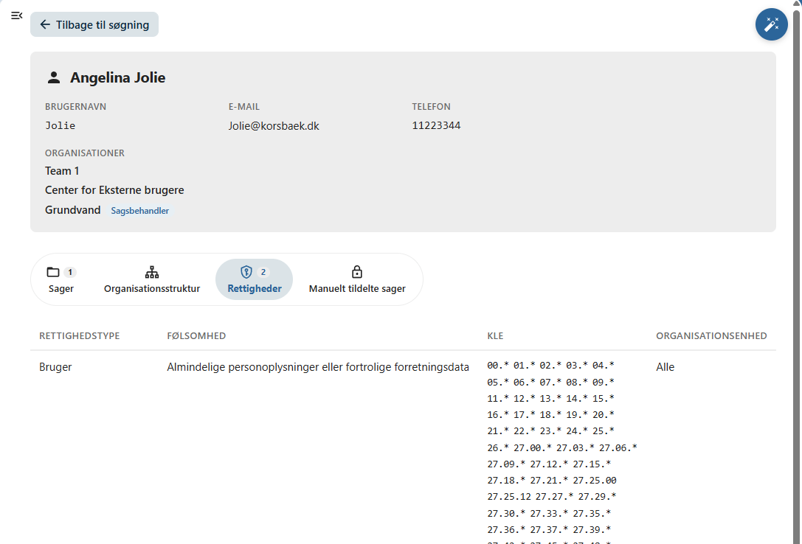
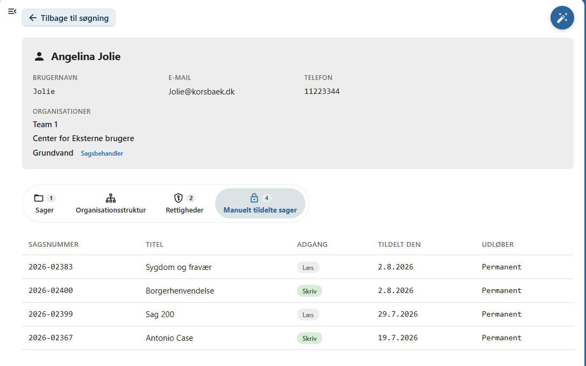

# Medarbejdere

Denne side beskriver, hvordan du søger efter medarbejdere i OpenCase.

Søgning efter medarbejdere gør det muligt hurtigt at finde en medarbejder og få et samlet overblik over medarbejderens placering i organisationen, tilknyttede sager og adgangsrettigheder.

Du kan søge på medarbejderens:

- navn
- organisation
- rolle

Når en medarbejder er valgt, vises en detaljeret oversigt med oplysninger om medarbejderen og vedkommendes relation til OpenCase.

---

## Udfør en søgning

Indtast et eller flere søgekriterier i søgefeltet og tryk **Enter** eller klik på **Søg**.

Du kan eksempelvis søge på:

- medarbejderens navn
- organisation
- rolle

Der vises en liste over de medarbejdere, der matcher søgekriterierne.

---

## Medarbejderoversigt

Når du vælger en medarbejder, åbnes medarbejderens oversigt.

Her kan du blandt andet se:

- medarbejderens navn
- organisation
- rolle

Desuden vises medarbejderens placering i organisationens organisationsstruktur.

---

## Organisationsstruktur

På oversigtssiden vises, hvor medarbejderen er placeret i organisationen.

Det giver et hurtigt overblik over den organisatoriske tilknytning og gør det lettere at identificere den korrekte medarbejder.

---

## Fanen Sager

På fanen **Sager** vises de sager, hvor medarbejderen er registreret som part.

Herfra kan du:

- åbne en eksisterende sag
- se medarbejderens tilknytning til sagen
- oprette en ny sag på medarbejderen

Når der oprettes en ny sag fra medarbejderoversigten, registreres medarbejderen automatisk som **primær part** på sagen.

---

## Fanen Rettigheder

På fanen **Rettigheder** vises de adgangsrettigheder, medarbejderen har fået tildelt gennem den fælleskommunale adgangsstyring.

Her kan du blandt andet se:

- brugersystemrolle
- adgangsprofiler

Oversigten giver et samlet billede af medarbejderens adgang til OpenCase.

!!! info

    Rettighederne beregnes ud fra den fælleskommunale adgangsstyring og organisationens konfiguration.

---

## Fanen Manuelt tildelte sager

På fanen **Manuelt tildelte sager** vises de sager, hvor medarbejderen har fået adgang ved en manuel tildeling.

Dette omfatter sager, hvor en anden bruger har givet medarbejderen midlertidig eller permanent adgang ud over de rettigheder, der følger af adgangsstyringen.

Fra listen kan du åbne de enkelte sager.

---

## Hvornår anvendes medarbejdersøgning?

Søgning efter medarbejdere er især nyttig, når du ønsker at:

- finde en bestemt medarbejder
- se medarbejderens organisatoriske placering
- få overblik over medarbejderens sager
- kontrollere medarbejderens adgangsrettigheder
- undersøge manuelt tildelte adgange

---

## God praksis

Hvis du er i tvivl om, hvorfor en medarbejder har adgang til en sag, kan du først kontrollere fanen **Rettigheder** og derefter fanen **Manuelt tildelte sager**.

Det gør det lettere at afgøre, om adgangen skyldes den fælleskommunale adgangsstyring eller en manuel tildeling.

!!! tip

    Medarbejdersøgning er et nyttigt værktøj for ledere og administratorer, som har behov for at få overblik over medarbejderes roller, sager og adgangsrettigheder.

---

## Se også

- [Adgang](../sager/adgang.md)
- [Andre sagsbehandlere](../sager/andre-sagsbehandlere.md)
- [Søg efter sager](sag.md)