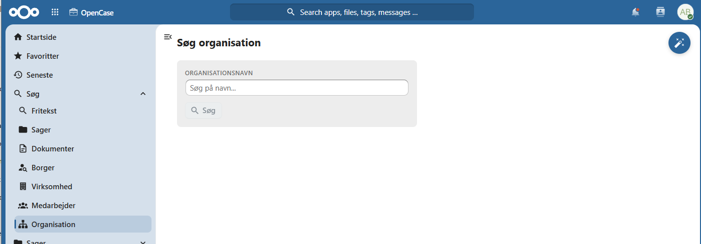
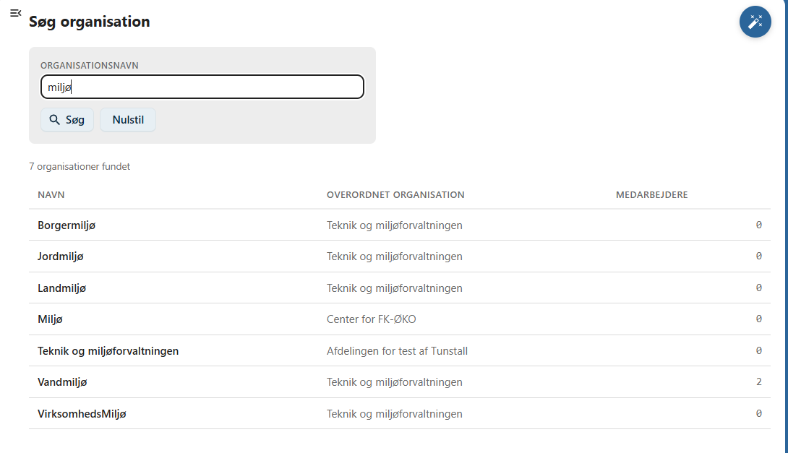
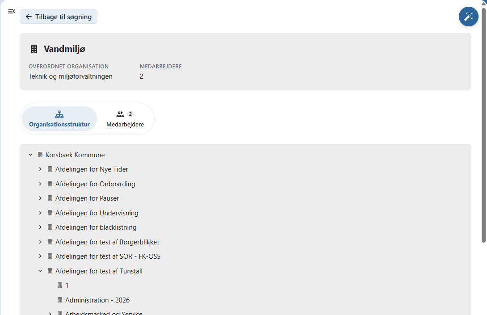
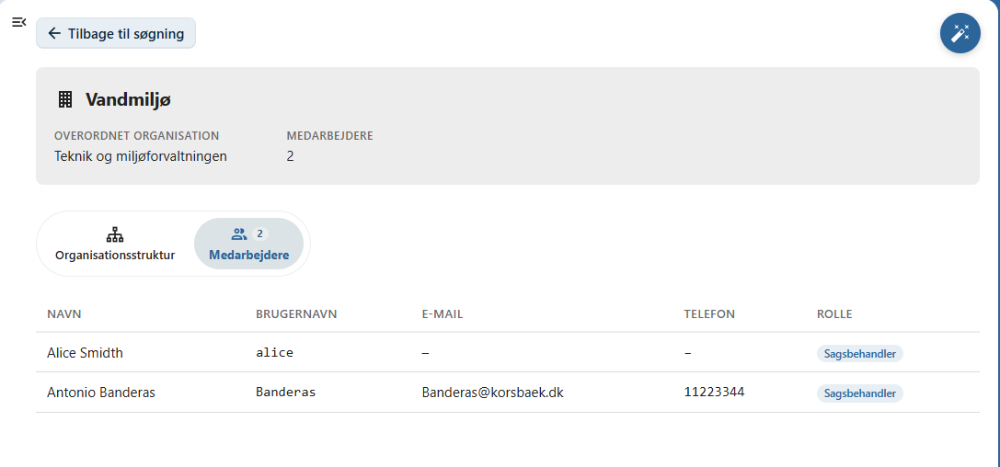

# Organisationer

Denne side beskriver, hvordan du søger efter organisationer i OpenCase.

Søgning efter organisationer gør det muligt hurtigt at finde en organisation og få et overblik over dens placering i organisationsstrukturen og de medarbejdere, der er tilknyttet organisationen.

Du kan søge på organisationens navn eller en del af navnet.

Når en organisation er valgt, vises en detaljeret oversigt over organisationen.

---

## Udfør en søgning

Indtast et søgekriterium i søgefeltet og tryk **Enter** eller klik på **Søg**.

Du kan eksempelvis søge på:

- organisationens navn
- en del af organisationsnavnet

Der vises en liste over de organisationer, der matcher søgekriteriet.

---

## Organisationsoversigt

Når du vælger en organisation, åbnes organisationens oversigt.

Her kan du blandt andet se:

- organisationens navn
- organisationskode (hvis anvendt)
- organisationens placering i organisationsstrukturen

---

## Organisationsstruktur

Oversigten viser organisationens placering i den samlede organisationsstruktur.

Her kan du se:

- overordnet organisation
- underliggende organisationer
- organisationens placering i hierarkiet

Dette gør det nemt at forstå organisationens sammenhæng med resten af organisationen.

---

## Fanen Medarbejdere

På fanen **Medarbejdere** vises de medarbejdere, der er tilknyttet organisationen.

For hver medarbejder vises typisk:

- navn
- rolle
- jobfunktion

Klik på en medarbejder for at åbne medarbejderens oversigt.

---

## Hvornår anvendes organisationssøgning?

Søgning efter organisationer er nyttig, når du ønsker at:

- finde en bestemt organisation
- få overblik over organisationsstrukturen
- se hvilke medarbejdere der er tilknyttet en organisation
- navigere videre til medarbejderoversigter

---

## God praksis

Hvis du er i tvivl om, hvilken organisation en medarbejder tilhører, kan du først finde organisationen og derefter åbne fanen **Medarbejdere**.

Det giver et hurtigt overblik over organisationens bemanding.

!!! tip

    Hvis organisationens navn er langt, er det ofte tilstrækkeligt at søge på en del af navnet.

---

## Se også

- [Søg efter medarbejder](medarbejder.md)
- [Søg efter sager](sag.md)
- [Adgang](../sager/adgang.md)