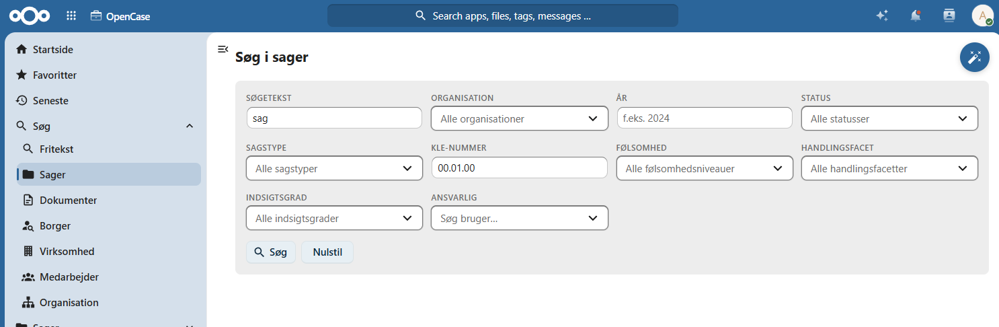
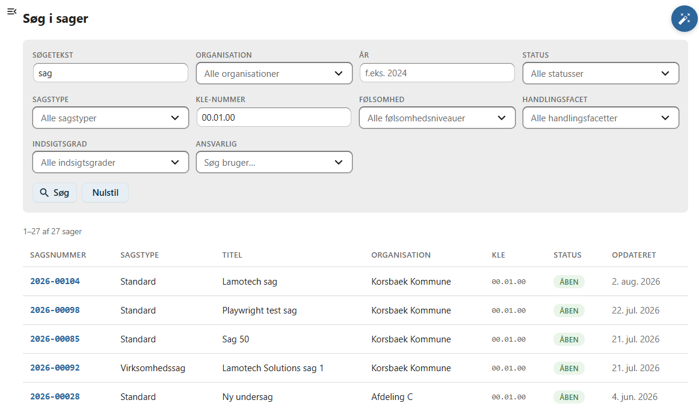

# Sager

Denne side beskriver, hvordan du søger efter sager i OpenCase.

Søgning efter sager gør det muligt hurtigt at finde en bestemt sag ud fra sagens registrerede oplysninger.

I modsætning til **Fritekstsøgning**, som også søger i dokumenter og filindhold, søger denne funktion kun i sagers metadata.

Det gør søgningen hurtig og velegnet, når du kender oplysninger om den ønskede sag.

---

## Udfør en søgning

Indtast et eller flere søgekriterier i søgefeltet og tryk **Enter** eller klik på **Søg**.

OpenCase søger blandt andet i sagens metadata.

Eksempelvis kan du søge på:

- sagsnummer
- titel
- organisation
- KLE-nummer
- sagstype
- ansvarlig sagsbehandler

Hvis flere sager matcher søgekriteriet, vises de alle i resultatlisten.

---

## Søgeresultater

Resultatet vises som en liste over de sager, der matcher søgekriteriet.

For hver sag vises typisk oplysninger som:

- sagsnummer
- titel
- sagstype
- organisation
- ansvarlig sagsbehandler
- status

Klik på en sag for at åbne den.

---

## Hvornår skal denne søgning anvendes?

Søg efter sager er velegnet, når du allerede kender oplysninger om den ønskede sag.

Eksempler:

- Find en sag ud fra sagsnummer.
- Find alle sager med en bestemt sagstype.
- Find sager inden for en bestemt organisation.
- Find en sag ud fra dens titel.

Hvis du i stedet ønsker at søge i dokumenter eller indholdet af dokumenternes filer, bør du anvende **Fritekstsøgning**.

---

## God praksis

Du får ofte de mest præcise resultater ved at:

- søge på sagsnummer, hvis det er kendt
- anvende en beskrivende del af sagens titel
- kombinere søgning med filtre

---

## Se også

- [Fritekstsøgning](../soegning/fritekst.md)
- [Sager](../sager/index.md)
- [Søg efter borgere](../soegning/borger.md)
- [Søg efter virksomheder](../soegning/virksomhed.md)