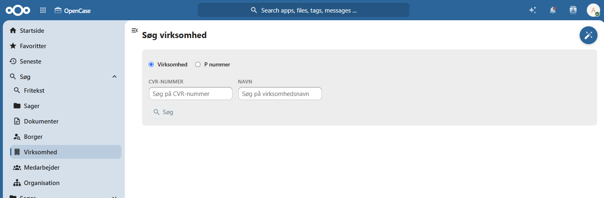
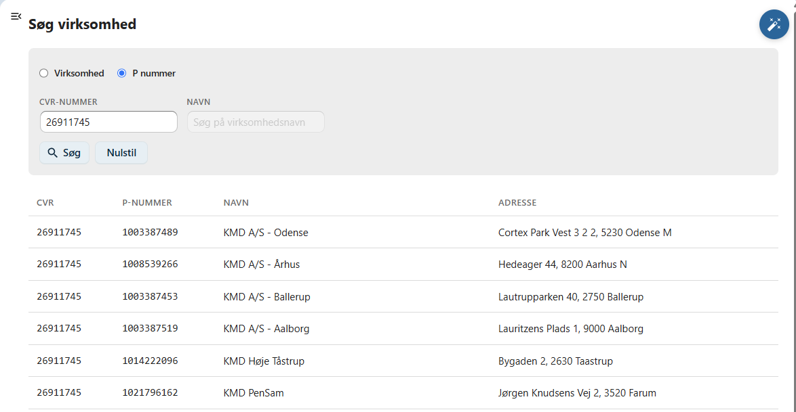
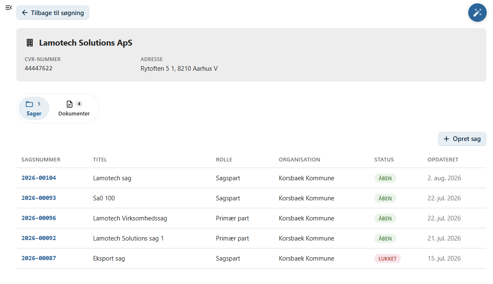

# Virksomheder

Denne side beskriver, hvordan du søger efter Virksomheder i OpenCase.

Søgning efter virksomheder gør det muligt hurtigt at finde en virksomhed og få et samlet overblik over de sager og dokumenter, der er knyttet til virksomheden.

Du kan søge på virksomhedens:

- CVR-nummer
- virksomhedsnavn

Når en virksomhed er fundet, vises en oversigt over de sager og dokumenter, der er registreret på virksomheden i OpenCase.

---

## Udfør en søgning

Indtast et eller flere søgekriterier i søgefeltet og tryk **Enter** eller klik på **Søg**.

Du kan eksempelvis søge på:

- CVR-nummer
- virksomhedsnavn

Der vises en liste over de virksomheder, der matcher søgekriterierne.

---

## Standardversion

I standardversionen af OpenCase søges blandt de virksomheder, som allerede er registreret på sager eller dokumenter i OpenCase.

Det betyder, at søgeresultatet omfatter virksomheder, der tidligere har været registreret som:

- part på en sag
- afsender på et dokument
- modtager på et dokument

---

## Enterprise

!!! info "Enterprise"

    I Enterprise-versionen foretages søgningen direkte i CVR-registeret.

    Det betyder, at du kan finde virksomheder, selv om de endnu ikke er registreret i OpenCase.

    Når en virksomhed vælges, hentes de aktuelle virksomhedsoplysninger automatisk fra CVR-registeret.

---

## Virksomhedsoversigt

Når du vælger en virksomhed, vises en samlet oversigt over virksomhedens oplysninger.

Herfra kan du blandt andet se:

- virksomhedens stamoplysninger
- CVR-nummer
- adresse
- de sager, hvor virksomheden er registreret
- de dokumenter, hvor virksomheden indgår

---

## Sager og dokumenter

Fra virksomhedsoversigten kan du åbne de sager og dokumenter, der er knyttet til virksomheden.

Listerne giver et hurtigt overblik over virksomhedens tilknytning til OpenCase.

Klik på en sag eller et dokument for at åbne det.

---

## Opret en ny sag

Fra virksomhedsoversigten kan du vælge **Opret ny sag**.

Virksomheden bliver automatisk registreret som **primær part** på den nye sag, så virksomhedens oplysninger ikke skal registreres igen.

Dette gør det hurtigt at oprette nye virksomhedssager.

---

## God praksis

Hvis virksomheden allerede findes i OpenCase eller CVR-registeret, bør du anvende søgefunktionen frem for at oprette virksomheden manuelt.

Det sikrer:

- korrekte stamoplysninger
- ensartet registrering
- mindre risiko for tastefejl
- hurtigere oprettelse af nye sager

!!! tip

    Hvis du kender virksomhedens CVR-nummer, giver det normalt det mest præcise søgeresultat.

---

## Se også

- [Søg efter borgere](borger.md)
- [Søg efter sager](sag.md)
- [Opret en sag](../sager/opret-sag.md)